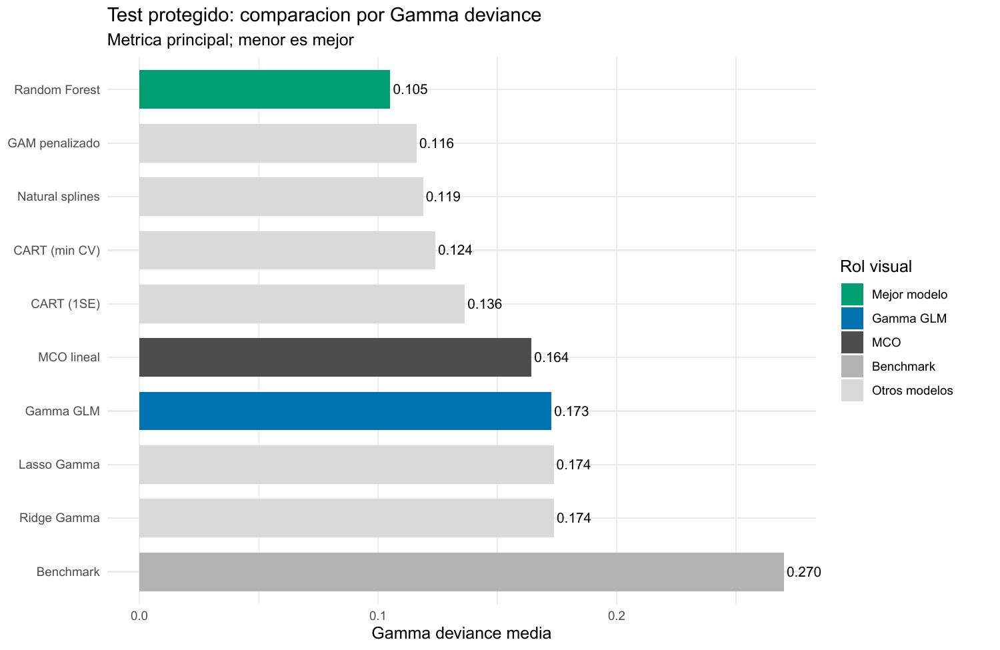
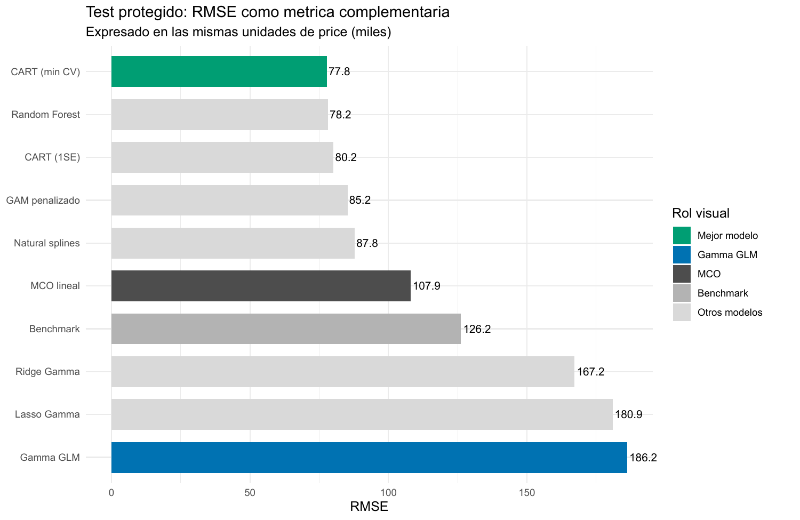

::: {.breadcrumb}
[Machine Learning](../index.qmd) / [Outcomes, pérdidas y objetivos predictivos](../index.qmd#outcomes-perdidas-y-objetivos-predictivos)
:::

::: {.eyebrow}
E02 · Outcome continuo positivo · Gamma y pérdidas predictivas
:::

::: {.hero-box}
# Precios positivos: cuando el error relativo importa

::: {.hero-box__lead}
Un precio de vivienda es continuo, pero no puede ser negativo y concentra una cola alta. En `loanapp`, Random Forest reduce la pérdida Gamma hasta **0,1051**; bajo RMSE, en cambio, CART queda primero. La elección depende de qué error importa para la decisión.
:::
:::

:::: {.metric-grid}
::: {.metric-card}
**1.971**

precios en la muestra analítica
:::
::: {.metric-card}
**0,1051**

Gamma deviance de Random Forest en test
:::
::: {.metric-card}
**77,77**

RMSE de CART en test
:::
::: {.metric-card}
**394**

observaciones protegidas para test
:::
::::

## La escala del precio cambia el problema predictivo

La tarea es predecir `price`, el precio de compra de una vivienda medido en miles. En los 1.971 casos completos, la media es 196,65 y la mediana 163; el percentil 95 alcanza 402,5, el 99 llega a 726,5 y el máximo es 1.535. La asimetría muestral, 3,98, confirma que unos pocos precios ocupan una escala muy distinta del centro de la distribución.

El benchmark constante aprende la media de desarrollo, 195,74, y obtiene Gamma deviance 0,2701 en test. MCO en niveles es un segundo comparador familiar: usa los predictores, pero no garantiza positividad ni define por sí mismo qué costo asignar a los errores a distintas escalas. En esta partición concreta todas sus predicciones resultaron positivas; la limitación de soporte existe, aunque no se materializó en el test.

## Cuatro decisiones que no deben confundirse

El outcome es continuo y estrictamente positivo. Un GLM Gamma con enlace log representa su media mediante

$$
\log \mu(x)=X\beta, \qquad \mu(x)=\exp(X\beta)>0.
$$

La familia y el enlace describen una forma paramétrica de la media. La Gamma deviance, en cambio, es una pérdida basada en la razón entre el valor observado y el predicho; dos errores absolutos iguales pesan distinto si ocurren sobre viviendas de escalas diferentes. RMSE eleva al cuadrado el error en niveles y concentra su costo en desviaciones monetarias grandes. MAE mide el error absoluto típico.

Estas distinciones también atraviesan los algoritmos. Ridge, Lasso, splines y GAM incorporan familia Gamma durante el ajuste. CART usa cortes de varianza estándar y Random Forest árboles de regresión estándar; la adaptación al objetivo Gamma aparece al seleccionar la poda o `mtry` y al evaluar las predicciones. Ninguno de esos bosques estima por ello una distribución Gamma completa.

## El test compara reglas ya cerradas

La muestra se divide en 1.577 observaciones de desarrollo y 394 de test. Ridge, Lasso, natural splines y CART seleccionan complejidad mediante CV de cinco folds con Gamma deviance; GAM aprende suavidad por REML; Random Forest elige `mtry` con predicciones OOB. El test no participa de esas decisiones.

La misma fórmula de deviance cumple funciones estadísticas distintas según los datos: dentro de CV u OOB selecciona una configuración; en el conjunto protegido evalúa esa selección. No corresponde comparar esos valores como si fueran mediciones intercambiables ni cambiar de objetivo después de abrir el test.

## El tuning separa contracción, curvatura e interacciones

Ridge y Lasso alcanzan deviances de CV casi idénticas, 0,17593 y 0,17598, con penalización débil. Lasso conserva los once predictores en `lambda.min`. La evidencia no señala un problema dominante de exceso de varianza o selección de variables; ambos métodos mantienen la misma log-media lineal.

Natural splines evalúa 250 combinaciones y elige grados de libertad $(6,2,3)$ para ingreso, *housing expense ratio* y *obligations ratio*, con deviance CV 0,12778. Varias configuraciones vecinas quedan casi empatadas, señal de una meseta estable. El GAM usa 12,00, 4,67 y 3,63 grados de libertad efectivos: también concentra la mayor curvatura en ingreso.

CART selecciona 11 hojas y deviance CV 0,14275; la regla 1SE baja a 8 hojas con 0,15442. Random Forest prueba los once valores posibles de `mtry`; el mínimo OOB, 0,12352, aparece en `mtry = 6`, aunque la curva es relativamente plana entre 3 y 10. El número seleccionado aplica una regla definida, pero no representa una constante universal.

## Cambiar la pérdida cambia qué modelo es mejor

::: {.table-box}
| Modelo | Gamma deviance | RMSE | MAE | Mejora vs. benchmark |
|---|---:|---:|---:|---:|
| Random Forest (`mtry = 6`) | **0,1051** | 78,16 | **45,02** | **61,1 %** |
| GAM penalizado | 0,1162 | 85,21 | 45,15 | 57,0 % |
| Natural splines Gamma | 0,1189 | 87,83 | 46,76 | 56,0 % |
| CART mínimo CV | 0,1240 | **77,77** | 49,69 | 54,1 % |
| CART 1SE | 0,1363 | 80,19 | 52,37 | 49,5 % |
| MCO lineal | 0,1643 | 107,95 | 64,29 | 39,2 % |
| GLM Gamma log-lineal | 0,1727 | 186,21 | 74,18 | 36,1 % |
| Lasso Gamma | 0,1736 | 180,92 | 73,83 | 35,7 % |
| Ridge Gamma | 0,1737 | 167,23 | 72,66 | 35,7 % |
| Media de desarrollo | 0,2701 | 126,20 | 80,11 | 0,0 % |
:::

{#fig-e02-deviance fig-alt="Gráfico de barras de Gamma deviance en test: Random Forest 0,1051; GAM 0,1162; splines 0,1189; CART 0,1240; GLM Gamma 0,1727; Ridge 0,1737; Lasso 0,1736." width="100%"}

Random Forest reduce 61,1 % la deviance del benchmark y 39,1 % la del GLM Gamma. GAM y splines también reducen más de 30 % la pérdida del GLM. Ridge y Lasso quedan levemente peor que el modelo sin penalizar: contraer la misma forma exponencial no corrige su extrapolación.

{#fig-e02-rmse fig-alt="Gráfico de barras de RMSE en test: CART 77,77; Random Forest 78,16; GAM 85,21; splines 87,83; Ridge 167,23; Lasso 180,92; GLM Gamma 186,21." width="100%"}

RMSE cambia el ganador. CART mínimo CV alcanza 77,77 y supera por apenas 0,39 a Random Forest. La diferencia no respalda una superioridad amplia, pero sí muestra que la recomendación depende del costo elegido. CART queda cuarto bajo Gamma deviance y primero bajo RMSE; además, su MAE es peor que el de RF, GAM y splines. Su ventaja cuadrática se concentra en controlar algunos errores grandes, no en mejorar uniformemente cada predicción.

El GLM Gamma expone la tensión extrema: mejora al benchmark bajo deviance, pero su RMSE de 186,21 es incluso peor que el de la media constante. La pérdida relativa y la cuadrática están evaluando consecuencias distintas de la cola alta.

## Positividad no controla la extrapolación superior

El enlace log evita medias negativas, pero una log-media lineal transforma el ingreso en crecimiento exponencial continuo. En un perfil condicionado, el GLM supera 1.300 cuando el ingreso llega al extremo alto, mientras GAM y splines se aplanan o retroceden. En el test, la predicción máxima del GLM alcanza 2.859,87 frente a un máximo observado de 1.450.

Ridge y Lasso conservan máximos de 2.466,74 y 2.759,51. Natural splines, GAM y Random Forest moderan esa cola a 490,33, 534,87 y 610,51; CART llega a 790,07. La mejora flexible tiene así una explicación concreta: aprender saturación, cambios de pendiente y particiones evita que una relación multiplicativa rígida domine la parte alta.

La calibración conserva un límite. RF sigue bien la diagonal en buena parte del rango, pero en el decil superior predice 394,69 frente a 442,10 observados; GAM y splines también subestiman arriba. El GLM alterna subpredicción y sobrepredicción entre deciles. Ningún promedio agregado elimina la necesidad de examinar dónde falla el modelo.

## La recomendación debe nombrar el error que intenta reducir

::: {.section-box}
### Decisión bajo objetivos distintos

Si el objetivo es reducir errores relativos sobre una respuesta positiva, Random Forest es la opción preferible por Gamma deviance y también obtiene el menor MAE. Si la decisión penaliza especialmente grandes diferencias monetarias en niveles, CART mínimo CV presenta el menor RMSE observado, por un margen muy pequeño frente al bosque. La elección de pérdida forma parte del problema y debe preceder al ranking.
:::

La evidencia proviene de una única partición con 394 casos de test, por lo que no cuantifica la estabilidad del ranking ante otras divisiones. El mínimo de `mtry` es poco pronunciado; los modelos flexibles subestiman parte de la cola; los perfiles condicionados pueden recorrer combinaciones poco frecuentes. Dos avisos de convergencia de `glmnet` no afectaron las curvas ni predicciones seleccionadas, pero merecerían una auditoría numérica antes de producción. Los resultados e importancias son predictivos, no causales.

::: {.section-box}
:::

*Fuente: informe curado del Taller E02, `loanapp`. Los resultados son predictivos y se reportan sobre el test protegido del ejercicio.*
