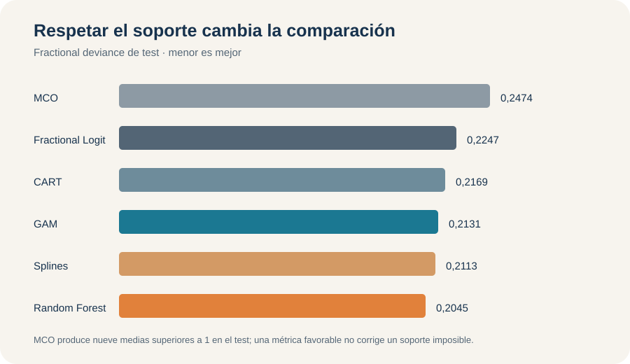

E03 · Outcome fraccional · Soporte y pérdida

::: {.hero-box}
# Participación 401(k): predecir una fracción sin salir de [0, 1]

::: {.hero-box__lead}
La tasa de participación de trabajadores elegibles no es una etiqueta binaria. En `401k`, Random Forest alcanza la menor deviance fraccional (**0,2045**), pero la primera condición de cualquier regla es devolver una media válida entre cero y uno.
:::
:::

:::: {.metric-grid}
::: {.metric-card}
**1.534**

planes o empresas en la muestra analítica
:::
::: {.metric-card}
**44,46 %**

observaciones exactamente en participación plena
:::
::: {.metric-card}
**0,2045**

deviance fraccional de Random Forest en test
:::
::: {.metric-card}
**9**

predicciones MCO por encima de uno en test
:::
::::

## El target es una tasa observada, no una etiqueta

El outcome es `prate / 100`: la fracción de trabajadores elegibles que participa en un plan 401(k). Las 1.534 observaciones están entre 0,03 y 1, con media 0,8736 y mediana 0,957. No hay ceros, pero 682 planes —44,46 %— presentan participación exactamente igual a uno.

Una fila con 0,87 registra una tasa efectivamente observada; no es una clase binaria ni la probabilidad de que esa fila pertenezca a una categoría. El objeto predictivo es $\mu(x)=E(Y\mid X=x)$, una media fraccional. No hay threshold, accuracy ni matriz de confusión.

El benchmark constante aprende la media de desarrollo, 0,8728, y obtiene deviance fraccional 0,2455 en test. MCO utiliza los cuatro predictores y ofrece una referencia lineal, pero no obliga a que $\widehat\mu(x)$ permanezca entre cero y uno.

## Soporte, enlace, pérdida y métrica cumplen funciones distintas

Fractional Logit especifica una media logística:

$$
\mu(x)=\frac{\exp(X\beta)}{1+\exp(X\beta)}, \qquad 0<\mu(x)<1.
$$

El criterio Bernoulli funciona como cuasi-verosimilitud para una respuesta fraccional, incluidos los extremos. No afirma que cada tasa sea una realización Bernoulli. Esta diferencia permite utilizar el enlace logit sin convertir la tarea en clasificación.

La deviance fraccional es la pérdida principal de selección y evaluación. Cross-entropy contiene la misma información para ordenar modelos: en una muestra fija ambas difieren solo por una constante y una escala. RMSE y MAE sí representan pérdidas distintas, expresadas directamente en unidades de la tasa.

La masa en uno también descarta una regresión beta estándar, cuyo soporte es el intervalo abierto $(0,1)$. Reemplazar los unos por valores artificialmente menores modificaría el outcome para acomodarlo al modelo; extensiones con masa en el extremo serían otro problema.

## Hay dos caminos para producir medias válidas

Fractional Logit, Ridge, Lasso, natural splines y GAM respetan el soporte mediante un enlace logit. CART y Random Forest no usan ese enlace ni optimizan la cuasi-verosimilitud Bernoulli en cada corte: promedian respuestas de entrenamiento que ya están dentro de $[0,1]$. Una media de hoja y un promedio de árboles permanecen, por construcción, en el mismo intervalo.

Así, el soporte correcto no identifica una única familia de modelos. Primero se exige una predicción admisible; después se compara si una forma logit lineal, una curva aditiva, una partición o un ensamble representa mejor la relación con los predictores.

## El test evalúa configuraciones cerradas

La división reserva 1.227 observaciones para desarrollo y 307 para test. Ridge, Lasso, natural splines y CART comparten una CV de cinco folds; GAM selecciona suavidad por REML; Random Forest elige `mtry` con predicciones OOB. No se necesita CV anidada porque existe un test final separado.

La misma deviance puede aparecer en CV, OOB y test, pero los números no cumplen la misma función: los dos primeros seleccionan complejidad; el último evalúa generalización. El test no decide $\lambda$, grados de libertad, poda ni `mtry`.

## El tuning muestra que regularizar no alcanza

Ridge y Lasso seleccionan penalizaciones débiles, con deviances CV 0,2030 y 0,2031. Lasso mantiene activos los cuatro predictores incluso bajo la regla 1SE. La contracción cambia magnitudes, pero no descubre una estructura dispersa ni crea curvatura.

Natural splines evalúa 216 configuraciones y selecciona tres grados de libertad para `mrate`, `age` y `ltotemp`, con deviance CV 0,1957. El GAM llega por otro mecanismo a complejidades similares: 3,27, 2,12 y 3,43 grados de libertad efectivos. Sus diagnósticos no indican bases insuficientes. La coincidencia refuerza la lectura de flexibilidad moderada, en lugar de un ajuste accidentalmente sinuoso.

CART selecciona seis hojas y deviance CV 0,2102; la regla 1SE reduce el árbol a cuatro hojas, con 0,2136. En Random Forest, la trayectoria OOB aumenta de manera monotónica al ampliar `mtry`: 0,2022 con una variable candidata, 0,2130 con dos, 0,2177 con tres y 0,2212 con cuatro. Por eso se elige `mtry = 1`: la máxima aleatorización disponible mejora el ensamble en esta aplicación, sin constituir una regla general.

## La evidencia externa separa soporte y flexibilidad

::: {.table-box}
| Modelo | Deviance fraccional | RMSE | MAE |
|---|---:|---:|---:|
| Random Forest (`mtry = 1`) | **0,2045** | **0,1510** | 0,1156 |
| Natural Splines Fractional Logit | 0,2113 | 0,1534 | **0,1146** |
| GAM penalizado Fractional Logit | 0,2131 | 0,1541 | 0,1152 |
| CART mínimo CV | 0,2169 | 0,1546 | 0,1165 |
| CART 1SE | 0,2221 | 0,1574 | 0,1179 |
| Ridge Fractional Logit | 0,2236 | 0,1573 | 0,1186 |
| Lasso Fractional Logit | 0,2239 | 0,1572 | 0,1184 |
| Fractional Logit | 0,2247 | 0,1573 | 0,1182 |
| Media de desarrollo | 0,2455 | 0,1647 | 0,1325 |
| MCO lineal | 0,2474 | 0,1589 | 0,1233 |
:::

{#fig-e03-deviance fig-alt="Deviance fraccional de test: MCO 0,2474; Fractional Logit 0,2247; CART 0,2169; GAM 0,2131; splines 0,2113; Random Forest 0,2045. MCO emite nueve predicciones mayores a uno." width="100%"}

Random Forest mejora 16,69 % la deviance del benchmark y 9,0 % la del Fractional Logit. Natural splines mejora 5,9 % frente a esa referencia acotada. Las ganancias existen, pero parten de un modelo que ya resuelve el soporte y captura buena parte de la señal.

Ridge y Lasso casi no alteran el resultado lineal. CART con seis hojas supera a los tres modelos logit lineales; simplificarlo a cuatro hojas eleva la deviance de test de 0,2169 a 0,2221. La evidencia favorece cambios de forma, localidad e interacciones por encima de la contracción.

## Una buena métrica no vuelve válida una tasa imposible

MCO alcanza RMSE 0,1589, mejor que el benchmark 0,1647, pero su deviance 0,2474 es ligeramente peor y produce nueve predicciones superiores a uno, con máximo 1,0795. Para calcular deviance y cross-entropy esas predicciones se recortan solo de forma numérica; RMSE y MAE conservan los valores crudos. El control evita que la corrección computacional oculte la violación original.

Entre los modelos válidos, el ranking también depende de la pérdida: RF obtiene la menor deviance y RMSE, mientras natural splines logra el menor MAE, 0,1146 frente a 0,1156. La diferencia es pequeña y no justifica un ganador universal.

## La calibración explica qué corrige la flexibilidad

Fractional Logit subestima el primer decil de participación —0,729 predicho frente a 0,785 observado— y sobrestima el décimo —0,981 frente a 0,940—. Natural splines sigue la diagonal con mayor regularidad. RF mejora el patrón general, aunque todavía subestima el noveno y décimo decil.

Los perfiles dan una explicación coherente. La media logit lineal aumenta continuamente con `mrate`; splines, GAM y RF encuentran crecimiento, saturación alrededor de 2,6–2,7 y una posible reversión posterior. Con la edad del plan aparece crecimiento con rendimientos decrecientes; con `ltotemp`, una relación negativa cuya intensidad cambia en el rango. Son cortes predictivos condicionados, no efectos de política.

::: {.section-box}
### Decisión bajo la pérdida declarada

Random Forest con `mtry = 1` es la opción con menor deviance y RMSE observados. Natural splines queda cerca, obtiene el menor MAE y permite describir las curvaturas con más claridad. La decisión profesional debe exigir primero una tasa válida y luego elegir entre desempeño, estabilidad e interpretabilidad.
:::

La evidencia proviene de una única partición de 307 casos y de una muestra muy concentrada cerca de uno. OOB participó en el tuning del bosque; CART y RF no son modelos fraccionales completos; los perfiles pueden atravesar combinaciones poco frecuentes. El taller no construye una configuración operativa posterior al test y ninguna asociación admite interpretación causal.

::: {.section-box}
**Cambio de objeto:** [Activos financieros: predecir escenarios, no solo un promedio](q01_401ksubs_quantiles.qmd) pasa de una media condicional a cuantiles condicionales.
:::

*Fuente: informe curado del Taller E03, `401k`. Los resultados son predictivos y corresponden al test protegido del ejercicio.*
