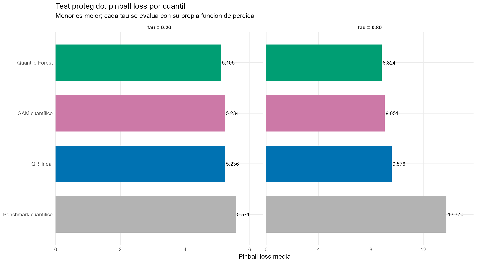
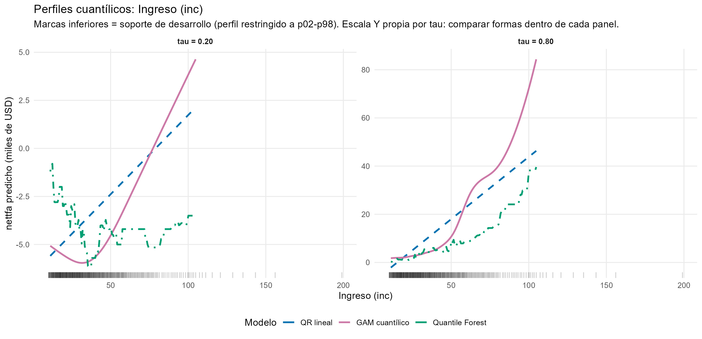

Q01 · Predicción cuantílica · Escenarios y calibración

::: {.hero-box}
# Activos financieros: predecir escenarios, no solo un promedio

::: {.hero-box__lead}
Para `nettfa`, la pregunta no es solamente cuánto activo neto esperar en promedio. Q01 trata $\tau=0{,}20$ y $\tau=0{,}80$ como **dos problemas predictivos independientes**: cada cuantil tiene su propia pérdida, su propio ajuste y, en Quantile Forest, su propio tuning. El bosque obtiene la menor *pinball loss* en ambos escenarios, pero la señal disponible aporta mucho más en la zona alta que en la baja de la distribución.
:::
:::

:::: {.metric-grid}
::: {.metric-card}
**9.275**

hogares en la muestra analítica
:::
::: {.metric-card}
**0,20 · 0,80**

cuantiles condicionales objetivo
:::
::: {.metric-card}
**8,36 % · 35,92 %**

mejora de QRF frente al benchmark
:::
::: {.metric-card}
**62,53 %**

cobertura del intervalo central QRF
:::
::::

## El cambio principal ocurre antes de elegir un modelo

{width="100%"}

`nettfa` mide activos financieros netos en miles de dólares. En desarrollo, la media es 19,07 y la mediana apenas 2,08; 28,9 % de los hogares presenta valores negativos y la distribución tiene una cola derecha muy larga. Una sola media condicional ocultaría diferencias importantes entre escenarios patrimoniales bajos y altos.

Q01 estima $Q_{0,20}(Y\mid X)$ y $Q_{0,80}(Y\mid X)$. Para un mismo hogar, ambos números describen posiciones distintas de su distribución condicional predicha. No son grupos de personas ni una reconstrucción completa de toda la distribución.

El nivel $\tau$ lo fija la pregunta de decisión. Cambiar de $\tau=0,20$ a $0,80$ significa hacer otra pregunta para el mismo perfil de covariables. Esa diferencia guía toda la versión actualizada del taller: **cada $\tau$ se trata como un ejercicio predictivo propio** y ambos se reúnen solamente cuando una pregunta necesita simultáneamente los dos extremos, como *quantile crossing* o el intervalo central del 60 %.

## Cada cuantil requiere su propia pérdida

La *pinball* o *check loss* utiliza $u=y-q$ y penaliza de forma asimétrica:

$$
\rho_\tau(u)=u\left(\tau-\mathbf{1}\{u<0\}\right).
$$

Para $\tau=0,20$, sobrepredecir recibe peso 0,80 y quedar corto peso 0,20. En $\tau=0,80$ ocurre lo inverso. Esa asimetría hace que el mínimo esperado sea precisamente el cuantil solicitado.

MSE apuntaría a la media condicional y respondería otra pregunta. Por eso la métrica externa de Q01 es la *pinball loss* correspondiente a cada $\tau$. En esta versión **no se promedian las pérdidas de 0,20 y 0,80** ni se construye un ranking global: son dos objetos predictivos y dos funciones de pérdida diferentes. Promediarlas introduciría una tercera pregunta compuesta que el taller no necesita.

## El benchmark también debe predecir cuantiles

La referencia ignora los predictores y aprende en desarrollo los cuantiles marginales de `nettfa`: -1,50 para $\tau=0,20$ y 25,65 para $\tau=0,80$. Un benchmark basado en la media no sería coherente con los objetos evaluados. En el test, esos valores constantes producen *pinball losses* de 5,5713 y 13,7704, respectivamente.

La muestra separa 7.420 hogares para desarrollo y 1.855 para test protegido. La respuesta del test no interviene en exploración, ajuste ni tuning. Sus cuantiles realizados —-1,379 y 29,310— se calculan únicamente después de fijar todas las configuraciones.

## Tres modelos levantan restricciones diferentes

QR lineal estima un vector de coeficientes separado para cada $\tau$. Permite que la asociación cambie entre zonas de la distribución, pero mantiene linealidad y aditividad dentro de cada cuantil. Por ejemplo, el coeficiente predictivo de ingreso aumenta de 0,082 en $\tau=0,20$ a 0,517 en $\tau=0,80$; los asociados a `p401k` e `pira` también crecen con fuerza hacia arriba. Esa heterogeneidad es predictiva, no causal.

El GAM cuantílico flexibiliza ingreso, edad y tamaño del hogar con funciones suaves, pero también se ajusta **independientemente para cada cuantil**. Los grados de libertad efectivos de ingreso pasan de 4,31 a 7,85 y los de edad de 2,29 a 4,09; `fsize` permanece prácticamente lineal. En $\tau=0,20$, `k.check` deja una alerta para ingreso y edad que debe conservarse como diagnóstico, sin sustituir la evaluación externa.

Quantile Forest abandona además la aditividad y aprende vecindades mediante árboles con particiones especializadas para cuantiles. La honestidad del bosque separa dentro de cada árbol la información que decide los cortes de la que estima lo ocurrido en las hojas; no reemplaza el test externo.

## Cada cuantil tiene su propio tuning

QR no requiere hiperparámetros. Cada GAM determina su suavidad usando únicamente desarrollo. Para Quantile Forest se prueban ocho valores de `mtry` con 1.000 árboles, pero ahora el criterio está alineado con cada tarea por separado:

$$
\widehat m_\tau
=
\arg\min_{m\in\{1,\ldots,8\}}
\widehat L^{\mathrm{OOB}}_\tau(m).
$$

{#fig-q01-tuning width="100%"}

En $\tau=0,20$, la pérdida OOB cae de 5,4541 con `mtry = 1` a un mínimo de 5,2031 con `mtry = 6`. En $\tau=0,80$, desciende de 9,5042 a 8,9808, también con `mtry = 6`.

Que ambos ejercicios seleccionen `mtry = 6` es un **resultado de dos optimizaciones independientes**, no una restricción impuesta para compartir configuración. Las curvas, además, son relativamente planas alrededor del mínimo, de modo que la elección no parece extremadamente frágil. Cerrado el tuning, se ajusta un bosque final de 2.000 árboles para cada $\tau$. OOB selecciona; el test evalúa.

La propia composición de la importancia cambia entre bosques: `pira` domina en ambos —54,2 % en $\tau=0,20$ y 53,7 % en $\tau=0,80$—, pero `inc` casi duplica su participación, de 12,5 % a 23,4 %, mientras `p401k` y `age` pierden peso relativo. La lectura es predictiva: no indica signo, tamaño de efecto ni causalidad.

## La información disponible rinde distinto en cada escenario

::: {.table-box}
| Cuantil | Modelo | Pinball en test | Mejora vs. benchmark | Ranking |
|---:|---|---:|---:|---:|
| 0,20 | Quantile Forest | **5,1054** | **8,36 %** | 1 |
|  | GAM cuantílico | 5,2342 | 6,05 % | 2 |
|  | QR lineal | 5,2356 | 6,03 % | 3 |
|  | Benchmark | 5,5713 | 0,00 % | 4 |
| 0,80 | Quantile Forest | **8,8245** | **35,92 %** | 1 |
|  | GAM cuantílico | 9,0509 | 34,27 % | 2 |
|  | QR lineal | 9,5763 | 30,46 % | 3 |
|  | Benchmark | 13,7704 | 0,00 % | 4 |
:::

{#fig-q01-pinball width="100%"}

Quantile Forest queda primero en ambos ejercicios, pero la magnitud cuenta una historia más útil que el ranking. En el cuantil bajo, condicionar en ocho variables mejora apenas 8,36 % frente al cuantil marginal. En el cuantil alto, la mejora alcanza 35,92 %. La información disponible distingue mucho mejor posiciones patrimoniales altas que la zona baja de activos.

La ganancia de flexibilidad tampoco es uniforme. GAM y QR son prácticamente indistinguibles en $\tau=0,20$ —5,2342 frente a 5,2356—, mientras en $\tau=0,80$ el GAM reduce la pérdida de 9,5763 a 9,0509. Es justamente en la zona alta donde ingreso y edad utilizan más grados de libertad efectivos.

## Cobertura correcta no implica una predicción útil

La cobertura global pregunta qué fracción del test queda por debajo del cuantil predicho. Quantile Forest obtiene 18,11 % y 80,65 %, cerca de los niveles nominales. QR alcanza 19,19 % y 80,22 %; GAM, 15,96 % y 82,91 %.

El benchmark constante también logra coberturas razonables —19,57 % y 78,17 %— sin distinguir un hogar de otro. La cobertura marginal es, por tanto, una condición necesaria débil: puede acertar la frecuencia total y compensar errores entre regiones. La *pinball loss* añade cuánto cuesta localizar mal cada cuantil.

El diagnóstico por deciles se acerca a la calibración condicional sin recuperarla por completo. QRF muestra el patrón local más estable en ambos niveles; QR y GAM presentan oscilaciones mayores. Como el benchmark predice un valor constante dentro de cada $\tau$, formar “deciles de predicción” para él sería artificial.

## El intervalo combina los dos cuantiles, pero no es confianza paramétrica

![Cobertura y ancho del intervalo central $[Q_{0,20},Q_{0,80}]$.](../assets/ml_q01_08_intervalo_central_60_cobertura_ancho.png){width="100%"}

Los extremos forman la banda predictiva $[\widehat Q_{0,20}(x),\widehat Q_{0,80}(x)]$, con cobertura nominal central de 60 %. Describe una región para una respuesta futura condicionada en $x$; no es un intervalo de confianza para un coeficiente o una función estimada.

::: {.table-box}
| Modelo | Cobertura central | Ancho medio | Mediana del ancho |
|---|---:|---:|---:|
| Benchmark | 58,71 % | 27,15 | 27,15 |
| QR lineal | 61,02 % | 28,39 | 18,95 |
| GAM cuantílico | 66,95 % | 29,98 | 19,30 |
| Quantile Forest | **62,53 %** | 27,30 | **13,49** |
:::

QRF combina cobertura 62,53 % con ancho medio 27,30 y la menor mediana de ancho entre los modelos condicionados. QR queda más cerca del 60 % nominal, aunque con mayor ancho medio. GAM sobrecubre y presenta la banda más amplia.

Los cuantiles se estiman independientemente, por lo que el orden $\widehat Q_{0,20}(x)\leq\widehat Q_{0,80}(x)$ no está garantizado por construcción. En esta ejecución, sin embargo, **ningún método presenta *quantile crossing*** en las 1.855 observaciones de test.

## Las formas cambian a lo largo de la distribución

{width="100%"}

Ingreso es la variable donde la diferencia entre clases funcionales resulta más visible. QR impone una recta creciente en ambos cuantiles, con una pendiente mucho mayor en $\tau=0,80$. El GAM utiliza una forma moderadamente no lineal en el cuantil bajo y una convexidad mucho más fuerte en el alto. Quantile Forest produce perfiles más locales y escalonados; en $\tau=0,80$ crece de forma marcada, pero menos explosiva que el GAM hacia el extremo superior del soporte.

Los otros perfiles del informe muestran una historia compatible: edad utiliza más curvatura en $\tau=0,80$, mientras tamaño del hogar permanece casi lineal en GAM. Tanto esos perfiles como el de ingreso aquí mostrado mantienen las demás covariables en valores de referencia aprendidos de desarrollo. Ayudan a entender la superficie predicha, pero no son efectos promedio ni causales.

::: {.section-box}
### Decisión para dos escenarios

Quantile Forest es la regla preferible bajo *pinball loss* en ambos cuantiles. La mejora frente al benchmark es modesta en la zona baja y muy importante en la alta, de modo que la capacidad de discriminación no debe comunicarse como uniforme a lo largo de la distribución. GAM conserva valor cuando interesa una representación suave e interpretable de la forma funcional, especialmente en el cuantil alto.
:::

Q01 estima solo dos cuantiles, no toda la distribución. La cobertura global puede esconder errores condicionales; el GAM conserva una alerta de base en $\tau=0,20$; los cuantiles se ajustan independientemente y, aunque aquí no aparece crossing, no existe una restricción conjunta que lo impida en otras muestras. La evidencia procede de una única partición externa. El taller termina en evaluación: no se ajustó un modelo operativo con las 9.275 observaciones. Ningún coeficiente, perfil o ranking de importancia tiene interpretación causal.

::: {.section-box}
**Cierre del área:** E01–E03 cambian el soporte del outcome y la pérdida; Q01 cambia directamente el objeto predictivo, de media condicional a escenarios cuantílicos.
:::

*Fuente: informe actualizado del Taller Q01, `401ksubs`. Los resultados son predictivos y corresponden al test protegido del ejercicio.*
