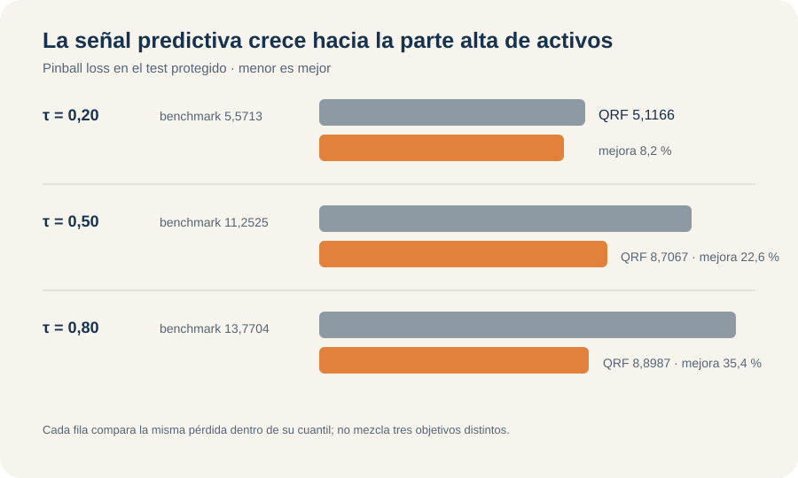

Q01 · Predicción cuantílica · Escenarios y calibración

::: {.hero-box}
# Activos financieros: predecir escenarios, no solo un promedio

::: {.hero-box__lead}
Para `nettfa`, la pregunta no es solamente cuánto activo neto esperar en promedio. Quantile Forest obtiene la menor *pinball loss* en los cuantiles 0,20, 0,50 y 0,80; la señal disponible es mucho más útil para distinguir la parte alta que la baja de la distribución.
:::
:::

:::: {.metric-grid}
::: {.metric-card}
**9.275**

hogares en la muestra analítica
:::
::: {.metric-card}
**0,20 · 0,50 · 0,80**

cuantiles condicionales objetivo
:::
::: {.metric-card}
**7,5740**

pinball promedio de Quantile Forest en test
:::
::: {.metric-card}
**62,75 %**

cobertura del intervalo central QRF
:::
::::

## El cambio principal ocurre antes de elegir un modelo

`nettfa` mide activos financieros netos en miles de dólares. En desarrollo, la media es 19,07 y la mediana apenas 2,08; 28,89 % de los hogares presenta valores negativos, 6,05 % exactamente cero y la cola se extiende desde -502,30 hasta 1.536,80. Una sola media condicional ocultaría diferencias importantes entre escenarios bajos, centrales y altos.

Q01 estima $Q_{0,20}(Y\mid X)$, $Q_{0,50}(Y\mid X)$ y $Q_{0,80}(Y\mid X)$. Para un mismo hogar, los tres números describen posiciones distintas de su distribución condicional predicha. No son grupos de personas, clases ni una estimación continua de toda la distribución entre esos puntos.

El nivel $\tau$ lo fija la pregunta de decisión. Un escenario bajo puede servir para evaluar vulnerabilidad patrimonial; la mediana resume una posición central robusta; el cuantil alto describe un escenario favorable. Cambiar $\tau$ cambia el objeto que se intenta localizar.

## Cada cuantil requiere su propia pérdida

La *pinball* o *check loss* utiliza $u=y-q$ y penaliza de manera asimétrica. Para $\tau=0,20$, sobrepredecir recibe peso 0,80 y quedar corto peso 0,20. En $\tau=0,80$ ocurre lo inverso. En la mediana, la pérdida es proporcional al error absoluto. Esa asimetría hace que el mínimo esperado sea precisamente el cuantil solicitado.

MSE apuntaría a la media condicional y respondería otra pregunta. La métrica externa de Q01 es pinball loss para cada $\tau$. Promediar las tres pérdidas ofrece un resumen operativo con igual peso para los tres escenarios; no crea una pérdida universal ni una distribución completa.

## El benchmark también debe predecir cuantiles

La referencia ignora los predictores y aprende en desarrollo los cuantiles marginales: -1,50, 2,08 y 25,65. Un benchmark basado en la media no sería coherente con los objetos evaluados. En el test, esos tres valores constantes producen pinball losses 5,5713, 11,2525 y 13,7704.

La muestra separa 7.420 hogares para desarrollo y 1.855 para test. Los cuantiles realizados del test —$-1,379$, $1,770$ y $29,310$— se calculan después del tuning y no participan de ninguna decisión.

## Tres modelos levantan restricciones diferentes

QR lineal estima un vector de coeficientes separado para cada $\tau$. Permite que la asociación cambie a lo largo de la distribución, pero mantiene linealidad y aditividad dentro de cada cuantil. Por ejemplo, el coeficiente predictivo de ingreso aumenta de 0,082 en $\tau=0,20$ a 0,517 en $\tau=0,80$; los asociados a participación en 401(k) e IRA también crecen con fuerza hacia arriba. Esa heterogeneidad no es un efecto causal.

El GAM cuantílico flexibiliza ingreso, edad y tamaño del hogar con funciones suaves distintas por cuantil. Los grados de libertad efectivos de ingreso suben de 4,31 a 7,84 y los de edad de 2,29 a 4,11; `fsize` permanece prácticamente lineal. El diagnóstico `k.check`, sin embargo, advierte capacidad de base posiblemente insuficiente en $\tau=0,20$ y para edad en la mediana. El resultado se conserva tal como fue evaluado, con esa cautela explícita.

Quantile Forest aprende vecindades mediante árboles y extrae cuantiles de una distribución local ponderada. Usa particiones especializadas para cuantiles, no un bosque de media al que luego se le pide otro resumen. La honestidad del bosque separa dentro de cada árbol la información que decide los cortes de la que estima lo ocurrido en las hojas; no reemplaza el test externo.

## El tuning del bosque es un compromiso entre tres tareas

QR no requiere hiperparámetros. El GAM aprende suavidad usando solo desarrollo. Para Quantile Forest se prueban ocho valores de `mtry` con 1.000 árboles y se minimiza el promedio simple de las pinball losses OOB de los tres cuantiles.

El mínimo aparece en `mtry = 5`, con pérdida OOB promedio 7,6634. La curva cae con fuerza hasta cuatro o cinco variables y luego entra en una meseta: `mtry` 6, 7 y 8 rondan 7,677. La selección es real, aunque poco sensible a valores vecinos.

Usar un único `mtry` obliga a ponderar por igual las tres tareas. La configuración elegida no es necesariamente la mejor para cada cuantil por separado; es un compromiso común que mantiene una sola arquitectura. Cerrado el tuning, el bosque final utiliza 2.000 árboles. OOB selecciona y el test evalúa.

## La información disponible rinde distinto en cada escenario

::: {.table-box}
| Cuantil | Modelo con menor pérdida | Pinball en test | Benchmark constante | Mejora |
|---:|---|---:|---:|---:|
| 0,20 | Quantile Forest | **5,1166** | 5,5713 | 8,16 % |
| 0,50 | Quantile Forest | **8,7067** | 11,2525 | 22,62 % |
| 0,80 | Quantile Forest | **8,8987** | 13,7704 | 35,38 % |
:::

{#fig-q01-pinball fig-alt="Pinball loss de test de Quantile Forest frente al benchmark: 5,1166 frente a 5,5713 en tau 0,20; 8,7067 frente a 11,2525 en 0,50; 8,8987 frente a 13,7704 en 0,80." width="100%"}

::: {.table-box}
| Modelo | Pinball 0,20 | Pinball 0,50 | Pinball 0,80 | Promedio |
|---|---:|---:|---:|---:|
| Quantile Forest | **5,1166** | **8,7067** | **8,8987** | **7,5740** |
| GAM cuantílico | 5,2342 | 9,1521 | 9,0513 | 7,8125 |
| QR lineal | 5,2356 | 9,2810 | 9,5763 | 8,0310 |
| Benchmark | 5,5713 | 11,2525 | 13,7704 | 10,1980 |
:::

Quantile Forest queda primero en los tres escenarios, pero la magnitud cuenta una historia más útil que el ranking. En el cuantil bajo, condicionar en ocho variables mejora apenas 8,16 % frente al cuantil marginal. En la mediana la mejora alcanza 22,62 % y arriba 35,38 %. La información disponible diferencia mucho mejor posiciones patrimoniales altas que la vulnerabilidad de la parte baja.

La ganancia de no linealidad tampoco es uniforme. GAM y QR son casi idénticos en $\tau=0,20$ —5,2342 frente a 5,2356—, mientras en $\tau=0,80$ el GAM baja la pérdida de 9,5763 a 9,0513. La flexibilidad suave aporta más precisamente donde ingreso y edad utilizan más grados de libertad.

El bosque mejora el promedio del GAM de 7,8125 a 7,5740, una ventaja moderada. Su importancia se concentra en `pira` (48,1 %), ingreso (24,4 %) y `p401k` (12,3 %). Son variables útiles para formar vecindades predictivas, no mecanismos causales.

## Cobertura correcta no implica una predicción útil

La cobertura global pregunta qué fracción del test queda por debajo del cuantil predicho. Quantile Forest obtiene 18,27 %, 51,00 % y 81,02 %, cerca de los niveles nominales. QR alcanza 19,19 %, 49,22 % y 80,22 %; GAM, 15,96 %, 46,95 % y 82,91 %.

El benchmark constante también logra coberturas razonables —19,57 %, 51,59 % y 78,17 %— sin distinguir un hogar de otro. La cobertura marginal es una condición necesaria débil: puede acertar la frecuencia total y compensar errores entre regiones. Pinball loss añade cuánto cuesta localizar mal cada cuantil.

El diagnóstico por deciles se acerca a la calibración condicional sin recuperarla por completo. QRF es especialmente estable en los cuantiles 0,20 y 0,80; la mediana resulta más difícil para los tres modelos. En el benchmark, formar deciles a partir de predicciones idénticas solo reparte empates y no revela estructura local.

## El intervalo combina cuantiles, pero no es confianza paramétrica

Los extremos forman la banda predictiva $[\widehat Q_{0,20}(x),\widehat Q_{0,80}(x)]$, con cobertura nominal central de 60 %. Describe una región para una respuesta futura condicionada en $x$; no es un intervalo de confianza para un coeficiente o una función estimada.

::: {.table-box}
| Modelo | Cobertura 0,20 | Cobertura 0,50 | Cobertura 0,80 | Banda central: cobertura | Ancho medio |
|---|---:|---:|---:|---:|---:|
| QR lineal | 19,19 % | 49,22 % | 80,22 % | 61,02 % | 28,39 |
| GAM cuantílico | 15,96 % | 46,95 % | 82,91 % | 66,95 % | 29,98 |
| Quantile Forest | 18,27 % | 51,00 % | 81,02 % | 62,75 % | **26,86** |
:::

QRF combina cobertura 62,75 % con el menor ancho medio y una mediana de ancho de 13,70. GAM sobrecubre con la banda más amplia. QR queda más cerca de 60 %, pero presenta 16 cruces entre la mediana y $Q_{0,80}$, 0,86 % del test. No se reordenaron esas predicciones: el cruce se conserva como inconsistencia real de estimar ecuaciones separadas. Los extremos nunca se cruzan, por lo que las bandas mantienen ancho no negativo.

## Las formas cambian a lo largo de la distribución

En QR, ingreso crece linealmente y su pendiente se intensifica con $\tau$. El GAM aprende una forma en U en el cuantil bajo y fuerte convexidad en mediana y cuantil alto. QRF mantiene perfiles más locales y escalonados, con crecimiento alto menos explosivo. La evidencia externa favorece esa flexibilidad local frente a una extrapolación suave muy pronunciada.

Edad presenta poca curvatura abajo y mucha más arriba; tamaño del hogar permanece casi lineal en GAM. Estos perfiles mantienen las demás covariables en un escenario de referencia: ayudan a explicar la superficie predicha, pero no son efectos promedio ni causales.

::: {.section-box}
### Decisión para tres escenarios

Quantile Forest es la regla preferible bajo pinball loss en los tres cuantiles y ofrece una banda central relativamente estrecha. GAM conserva valor cuando comunicar curvas suaves importa y su margen de pérdida resulta aceptable. Para decisiones concentradas en la zona baja, la mejora frente al benchmark es pequeña y aconseja expectativas más prudentes sobre la capacidad de discriminación.
:::

Q01 estima solo tres cuantiles, no toda la distribución. La cobertura global puede esconder errores condicionales; el GAM conserva alertas de base; el promedio OOB asigna igual valor a los tres escenarios; y la evidencia procede de una única partición externa. El taller termina en evaluación: no se ajustó un modelo operativo con las 9.275 observaciones. Ningún coeficiente, perfil o ranking de importancia tiene interpretación causal.

::: {.section-box}
**Cierre del área:** E01–E03 cambian el soporte del outcome y la pérdida; Q01 cambia directamente el objeto predictivo, de media condicional a escenarios cuantílicos.
:::

*Fuente: informe curado del Taller Q01, `401ksubs`. Los resultados son predictivos y corresponden al test protegido del ejercicio.*
