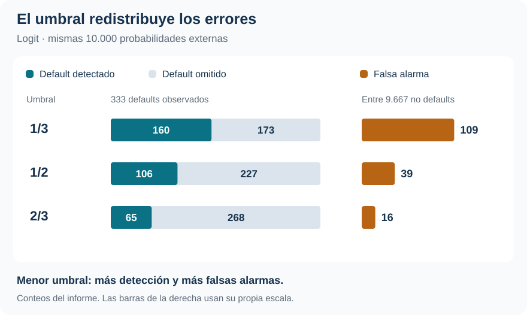

[Machine Learning](../index.qmd) / [Clasificación, probabilidades y decisión](../index.qmd#clasificacion)

Clasificación · Probabilidades · Costos de error

::: {.hero-box}
::: {.hero-title}
Logit generaliza mejor que KNN en esta aplicación. Pero elegir el modelo no resuelve cuánto riesgo de omitir un default estamos dispuestos a aceptar.
:::
::: {.hero-sub}
La comparación separa tres tareas: estimar la probabilidad de default, convertirla en una decisión y evaluar esa regla con observaciones que no participaron en su aprendizaje. Los costos de error cambian la acción, incluso cuando la probabilidad estimada permanece igual.
:::
:::

:::: {.metric-grid}
::: {.metric-card}
::: {.metric-label}
Defaults observados
:::
::: {.metric-value}
333
:::
::: {.metric-note}
En 10.000 observaciones: prevalencia de 3,33 %.
:::
:::
::: {.metric-card}
::: {.metric-label}
Error externo de Logit
:::
::: {.metric-value}
2,66 %
:::
::: {.metric-note}
Pérdida simétrica; KNN obtiene 2,85 %.
:::
:::
::: {.metric-card}
::: {.metric-label}
Detección con Logit
:::
::: {.metric-value}
31,8 %
:::
::: {.metric-note}
De los defaults, con umbral 1/2; sube a 48,0 % con umbral 1/3.
:::
:::
::: {.metric-card}
::: {.metric-label}
Log-loss de Logit
:::
::: {.metric-value}
0,0790
:::
::: {.metric-note}
Probabilidades externas; referencia de prevalencia: 0,1460.
:::
:::
::::

## El problema empieza antes de elegir el clasificador

¿Cómo identificar riesgo de default cuando el evento es poco frecuente y no todos los errores tienen la misma consecuencia? En **Default, del paquete ISLR2**, una regla que siempre responde «no default» alcanza 96,67 % de aciertos. Una accuracy elevada, por sí sola, dice poco sobre la capacidad de detectar los casos de interés.

La información disponible es la misma para ambos métodos: condición de estudiante (`student`), saldo (`balance`) e ingreso (`income`). Logit estima una relación global lineal en los log-odds; KNN calcula una probabilidad local como la proporción de defaults entre los $K$ vecinos más cercanos. La comparación pregunta si esa flexibilidad local agrega valor con estos tres predictores.

La aplicación es predictiva. Las asociaciones con saldo, ingreso o condición de estudiante no se interpretan como efectos causales ni como una política de crédito validada para una cartera real.

## Evaluar también la selección de K

Los dos procedimientos comparten **cinco folds externos estratificados**. En cada vuelta, aproximadamente 8.000 observaciones entrenan y 2.000 quedan reservadas. Al reunir las cinco vueltas se obtienen 10.000 predicciones fuera de fold —OOF—: cada caso fue predicho sin utilizarlo para aprender su regla.

Logit mantiene una especificación fija y no necesita tuning interno. En KNN, cada entrenamiento externo contiene otra validación de cinco folds para elegir entre $K=1,3,\ldots,51$. El riesgo externo evalúa, por tanto, el procedimiento completo que **selecciona K y después predice**, sin usar los resultados externos para escogerlo.

El escalado también se aprende dentro de cada entrenamiento. Saldo e ingreso se estandarizan con sus medias y desvíos de entrenamiento; la indicadora de estudiante permanece en 0/1. Tras elegir $K$, se reaprende el escalado con todo el entrenamiento externo y se aplica al fold reservado. Estandarizar previamente con las 10.000 observaciones introduciría información de evaluación en el procedimiento.

## La función de pérdida define el umbral

Un falso positivo (FP) anuncia default donde no ocurre; un falso negativo (FN) omite un default. Si los aciertos tienen costo cero, la regla clasifica como default cuando

$$
\widehat p(x)>\frac{c_{FP}}{c_{FP}+c_{FN}},
\qquad
\widehat R=\frac{c_{FP}FP+c_{FN}FN}{n}.
$$

Los costos del ejercicio son **relativos y docentes**, no pérdidas monetarias observadas. Con costos iguales el umbral es 1/2; si omitir un default cuesta el doble, baja a 1/3; si la falsa alarma cuesta el doble, sube a 2/3.

Logit conserva las mismas probabilidades externas y cambia únicamente el umbral. En KNN, además, $K$ se selecciona por separado para cada función de pérdida: los tres escenarios pueden utilizar probabilidades diferentes.

::: {.table-box}
| Escenario | Umbral | Riesgo «siempre no» | Riesgo Logit | Riesgo KNN |
|---|---:|---:|---:|---:|
| Costos iguales | 1/2 | 0,0333 | **0,0266** | 0,0285 |
| FN cuesta el doble | 1/3 | 0,0666 | **0,0455** | 0,0481 |
| FP cuesta el doble | 2/3 | 0,0333 | **0,0300** | 0,0308 |
:::

Logit presenta menor riesgo externo en los tres escenarios, y ambos modelos mejoran la referencia decisional. **Las comparaciones se hacen dentro de cada fila:** cambiar los costos cambia la escala del riesgo. Solo con pérdida simétrica el riesgo coincide con la proporción de errores.

## Detectar más implica aceptar más falsas alarmas

La ventaja agregada no elimina el compromiso entre errores. Con umbral 1/2, Logit detecta 106 de 333 defaults y produce 39 falsas alarmas. Al bajar a 1/3, detecta 160 y las falsas alarmas aumentan a 109. La sensibilidad pasa de 31,8 % a 48,0 %, mientras la tasa de error aumenta de 2,66 % a 2,82 %: el objetivo cambió hacia evitar omisiones más costosas.

{#fig-default-umbrales fig-alt="Logit, 10.000 predicciones externas. Umbral 1/3: 160 defaults detectados, 173 omitidos y 109 falsas alarmas. Umbral 1/2: 106, 227 y 39. Umbral 2/3: 65, 268 y 16." width="100%"}

Con umbral 2/3, la precisión entre las alertas positivas llega a 80,2 %, pero se detecta solo 19,5 % de los defaults. Sensibilidad y precisión responden preguntas distintas: cuántos eventos se recuperan y cuántas alertas resultan correctas. El umbral adecuado depende de las consecuencias de equivocarse.

## Buenas decisiones y buenas probabilidades se evalúan por separado

El **log-loss** juzga directamente la probabilidad anunciada y penaliza mucho los pronósticos extremos equivocados. No es una tasa de error. En las mismas predicciones externas se obtiene:

::: {.table-box}
| Probabilidades evaluadas | Log-loss |
|---|---:|
| Prevalencia del entrenamiento externo | 0,1460 |
| Logit | **0,0790** |
| KNN, seleccionado por pérdida simétrica | 0,2655 |
:::

KNN mejora la clasificación frente a «siempre no», pero sus probabilidades empeoran la referencia que anuncia únicamente la prevalencia de entrenamiento. Bajo selección simétrica, 59 defaults reciben probabilidad KNN exactamente cero. El cálculo del log-loss limita numéricamente las probabilidades a $[10^{-15},1-10^{-15}]$ para evitar infinitos; no modifica las decisiones. Esa convención importa al leer la magnitud del castigo.

KNN fue seleccionado por riesgo de clasificación, no por log-loss. Este resultado es un diagnóstico adicional de sus probabilidades y no autoriza a reinterpretar retrospectivamente el tuning.

## Qué decisión permite sostener la evidencia

::: {.section-box}
### Modelo, umbral y alcance

Para esta base, estos predictores y este diseño, Logit es la alternativa mejor respaldada por riesgo externo y calidad probabilística. La decisión operativa todavía exige explicitar el costo de cada error: una alta accuracy puede coexistir con muchos defaults omitidos.
:::

La ventaja en error simétrico es modesta y no demuestra superioridad universal de Logit. Tampoco se compararon otras representaciones o distancias para KNN. Después de evaluar, el informe selecciona $K=25$ con toda la muestra bajo pérdida simétrica; su riesgo de tuning de 2,70 % **no sustituye** al 2,85 % externo que evalúa generalización.

La separación entre aprendizaje y evaluación reaparece en [Smarket](t02_smarket.qmd), donde debe respetar el tiempo. [Caravan](t03_caravan.qmd) muestra un límite más fuerte: una alta tasa de aciertos sin recuperar ningún evento positivo.

::: {.small-note}
**Fuente:** informe curado «Taller 1: Clasificación binaria con Default», ISLR2. SVG elaborado con los conteos externos reportados; tablas seleccionadas del informe. No se generaron estimaciones nuevas.
:::
