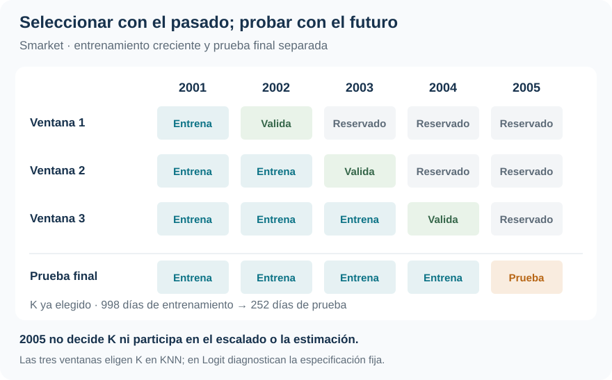

Clasificación · Validación temporal · Benchmark

::: {.hero-box}
::: {.hero-title}
Logit acierta el 55,95 % de las direcciones de 2005. Una regla que siempre anuncia suba, elegida con la historia anterior, logra exactamente lo mismo.
:::
::: {.hero-sub}
Superar a KNN no basta para demostrar valor predictivo. Al reservar el futuro para la prueba final e incluir una referencia ingenua, la evidencia muestra una señal débil en los dos retornos rezagados utilizados.
:::
:::

:::: {.metric-grid}
::: {.metric-card}
::: {.metric-label}
Desarrollo
:::
::: {.metric-value}
998 días
:::
::: {.metric-note}
2001–2004: estimación, escalado y selección de K.
:::
:::
::: {.metric-card}
::: {.metric-label}
Prueba fuera de tiempo
:::
::: {.metric-value}
252 días
:::
::: {.metric-note}
2005 se reserva íntegramente hasta la evaluación final.
:::
:::
::: {.metric-card}
::: {.metric-label}
Accuracy de Logit
:::
::: {.metric-value}
55,95 %
:::
::: {.metric-note}
Igual al benchmark; KNN alcanza 48,81 %.
:::
:::
::: {.metric-card}
::: {.metric-label}
Log-loss de Logit
:::
::: {.metric-value}
0,6898
:::
::: {.metric-note}
Benchmark histórico: 0,6914. Mejora muy pequeña.
:::
:::
::::

## La pregunta es de clasificación; la evaluación tiene calendario

¿Los retornos de los dos días previos permiten anticipar si el mercado subirá o bajará? **Smarket, del paquete ISLR2**, contiene 1.250 observaciones diarias de 2001–2005. La clase positiva es `Up`; ambos métodos utilizan exclusivamente `Lag1` y `Lag2`, fijados antes de la prueba final.

Logit impone una relación global lineal en los log-odds. KNN permite una respuesta local basada en distancias entre los dos retornos estandarizados. Compararlos con la misma información permite preguntar si esa flexibilidad mejora la clasificación, sin confundirla con haber entregado más predictores a uno de los métodos.

Un buen ajuste sobre observaciones usadas para estimar no demuestra que la regla prediga días futuros. La cronología determina qué información estaba disponible al tomar cada decisión: una partición aleatoria mezclaría pasado y futuro y no reproduciría esa situación. El informe no cuantifica una brecha entre accuracy de entrenamiento y de prueba; su evidencia central es la evaluación fuera de tiempo.

## El futuro queda fuera de todas las decisiones previas

Los años 2001–2004 forman el período de desarrollo. Dentro de él se evalúa hacia adelante con tres ventanas de entrenamiento crecientes. **2005 no participa** en la elección de $K$, el escalado ni la estimación del modelo sometido a la prueba.

{#fig-smarket-tiempo fig-alt="Calendario: entrenar con 2001 y validar 2002; entrenar con 2001–2002 y validar 2003; entrenar con 2001–2003 y validar 2004. Tras seleccionar K, entrenar con 2001–2004 y probar en 2005, sin usar ese año para tuning." width="100%"}

Para KNN se comparan los impares $K=1,3,\ldots,241$, factibles desde la primera ventana de 242 días. Cada candidato produce 756 predicciones de validación, correspondientes a 2002–2004. Las medias y desvíos se aprenden nuevamente con el pasado disponible en cada ventana. Una vez elegido $K$, se reaprende el escalado con las 998 observaciones de 2001–2004 y se predicen los 252 días de 2005.

Logit no selecciona hiperparámetros: las ventanas históricas diagnostican la misma especificación fija. El modelo evaluado en 2005 se estima únicamente con 2001–2004.

## El K seleccionado no es un óptimo preciso

Se consideran costos iguales, falsos negativos que cuestan el doble y falsos positivos que cuestan el doble. Aquí un FP anuncia suba cuando ocurre baja; un FN pierde una suba. Los respectivos umbrales son 1/2, 1/3 y 2/3.

::: {.table-box}
| Criterio de selección | K elegido | Riesgo de validación | Lectura del mínimo |
|---|---:|---:|---|
| Costos iguales | 25 | 0,4947 | Empata con 19 y 21 |
| FN cuesta el doble | 241 | 0,4841 | Empata con 33 y los impares de 75 a 241 |
| FP cuesta el doble | 61 | 0,5146 | Empata con 51 y 57 |
:::

La regla fijada de antemano elige el mayor $K$ entre mínimos exactos. Por eso 241 refleja una meseta y un desempate, no evidencia de un número de vecinos especialmente preciso. Estos riesgos sirven para seleccionar; la prueba siguiente juzga lo seleccionado.

## En 2005, la referencia cambia la conclusión

El benchmark anuncia a todos los días de 2005 la proporción de subas observada en **2001–2004: 507/998 = 0,5080**. No utiliza la prevalencia futura para decidir. Con umbral 1/2 predice siempre `Up` y acierta los 141 días de suba de 2005.

::: {.table-box}
| Procedimiento | Error en 2005 | Accuracy en 2005 |
|---|---:|---:|
| Benchmark histórico | **44,05 %** | **55,95 %** |
| Logit | **44,05 %** | **55,95 %** |
| KNN, K = 25 | 51,19 % | 48,81 % |
:::

Logit mejora sobre KNN, pero no obtiene una ganancia neta de aciertos sobre la referencia. Frente a «siempre suba», corrige 35 días de baja y pierde 35 días de suba: el saldo es cero. Igual accuracy no implica decisiones idénticas.

Con FN más costoso, los tres procedimientos tienen riesgo 0,4405; con FP más costoso, 0,5595. Logit predice siempre suba en el primer escenario y siempre baja en el segundo. KNN iguala esos riesgos, aunque en el segundo toma algunas decisiones diferentes. Las pérdidas asimétricas tampoco generan una ventaja frente al benchmark.

## Más variación probabilística no garantiza más información

Las probabilidades de Logit en 2005 se concentran aproximadamente entre 0,480 y 0,542. KNN con $K=25$ oscila más, entre 0,32 y 0,76, pero esa dispersión no mejora la evaluación probabilística: su log-loss es 0,7144, frente a 0,6898 de Logit y 0,6914 del benchmark. El log-loss es una pérdida de probabilidades, no un porcentaje de clasificaciones incorrectas.

Hay un matiz relevante: KNN con $K=241$ alcanza 0,6851, el menor log-loss reportado. Ese $K$ se eligió por el costo de omitir subas, **no por log-loss**. La cifra puede describirse como diagnóstico; no permite cambiar retrospectivamente el criterio de selección ni declarar una estrategia probabilística validada bajo ese objetivo.

## Un resultado negativo también orienta una decisión

::: {.section-box}
### La ventaja predictiva debe demostrarse

Con estos dos rezagos y esta prueba temporal, no hay una mejora convincente sobre la referencia histórica para la decisión de clase. La evaluación evita presentar como capacidad predictiva lo que el balance de clases ya permite conseguir.
:::

La conclusión se limita a dos predictores, tres ventanas de validación y una única prueba de 252 días. No demuestra que toda predicción de mercado sea imposible. Tampoco constituye una estrategia de inversión: no se evalúan rendimientos de cartera, costos de transacción ni ejecución; los costos de error son estadísticos y docentes.

Respecto de [Default](t01_default.qmd), cambia la forma de separar aprendizaje y evaluación: aquí la frontera es el tiempo. [Caravan](t03_caravan.qmd) introduce otra exigencia para juzgar el acierto: qué ocurre cuando casi todos los casos pertenecen a la misma clase.

::: {.small-note}
**Fuente:** informe curado «Taller 2: Clasificación binaria con Smarket», ISLR2. SVG adaptado del esquema temporal del informe; métricas y tablas tomadas de sus resultados. No se realizó una actualización posterior a 2005 ni un nuevo análisis.
:::
