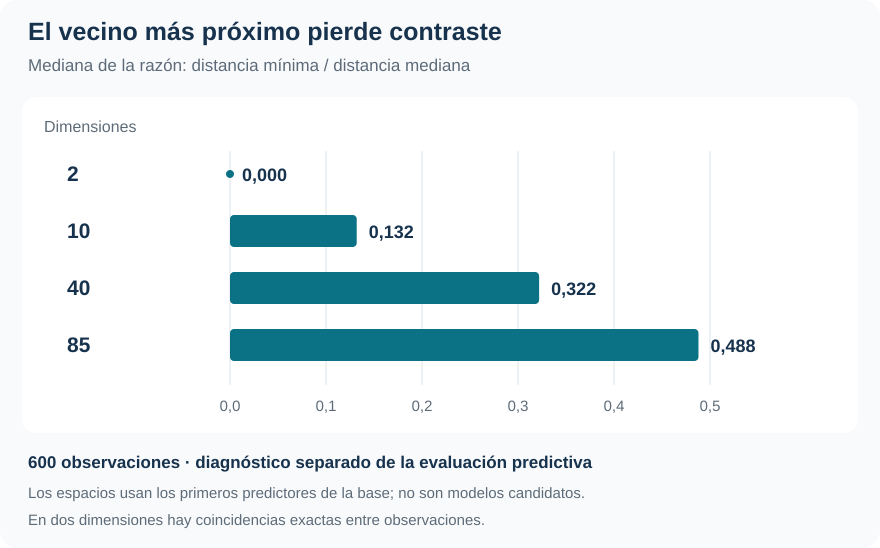

[Machine Learning](../index.qmd) / [Clasificación, probabilidades y decisión](../index.qmd#clasificacion)

Clasificación desbalanceada · KNN · Dimensionalidad

::: {.hero-box}
::: {.hero-title}
El clasificador ronda el 94 % de aciertos, pero no detecta ninguna de las 348 compras. Una regla que siempre responde «no» obtiene un resultado igual o mejor.
:::
::: {.hero-sub}
Caravan permite examinar una dificultad concreta de KNN: estimar probabilidades locales cuando el evento es raro y la distancia reúne 85 predictores. El valor del análisis está en identificar el límite del procedimiento y hacerlo visible con las métricas adecuadas.
:::
:::

:::: {.metric-grid}
::: {.metric-card}
::: {.metric-label}
Compras observadas
:::
::: {.metric-value}
5,98 %
:::
::: {.metric-note}
348 compras en 5.822 observaciones de Caravan.
:::
:::
::: {.metric-card}
::: {.metric-label}
Información candidata
:::
::: {.metric-value}
85
:::
::: {.metric-note}
Predictores numéricos; sin selección ni reducción de dimensión.
:::
:::
::: {.metric-card}
::: {.metric-label}
Compras detectadas
:::
::: {.metric-value}
0 de 348
:::
::: {.metric-note}
En la evaluación externa, bajo las tres pérdidas consideradas.
:::
:::
::: {.metric-card}
::: {.metric-label}
Acierto de «siempre no»
:::
::: {.metric-value}
94,02 %
:::
::: {.metric-note}
Referencia sin predictores: la accuracy alta ya viene del desbalance.
:::
:::
::::

## Detectar el evento, no solo acertar la mayoría

¿KNN aporta capacidad para identificar compras cuando casi todos los casos son negativos? **Caravan, del paquete ISLR2**, contiene 5.822 observaciones, 85 predictores numéricos y la respuesta `Purchase`. Solo 348 casos registran compra; hay aproximadamente 15,7 no compradores por cada comprador.

Si una decisión necesita reconocer compradores, una tasa agregada de aciertos cercana al 94 % puede ocultar que el modelo no recupera ninguno. Por eso el análisis compara contra «siempre no», abre los errores por clase y evalúa también las probabilidades anunciadas.

Aquí se estudia KNN en una configuración fija. No hay una competencia extensa de algoritmos ni una búsqueda de subconjuntos de variables: la pregunta es qué logra el método de vecinos con la información completa y cómo interpretar su límite.

## La distancia forma parte del modelo

KNN estima $P(\text{compra}\mid X=x)$ como la proporción de compradores entre los $K$ vecinos más cercanos. La distancia euclídea reúne las diferencias entre predictores **estandarizados**. Sin escalado, una variable medida en unidades grandes podría dominar la cercanía por su escala, sin aportar más información.

Estandarizar iguala unidades, pero no garantiza que las 85 coordenadas construyan vecindarios predictivamente útiles. Con $K$ pequeño, la estimación es más local y variable; con $K$ grande, se suaviza y puede aproximarse a la frecuencia de la clase mayoritaria.

La selección compara los impares $K=1,3,\ldots,101$ mediante **validación cruzada anidada y estratificada: cinco folds externos y cinco internos**. En cada entrenamiento externo, los internos eligen $K$ por la pérdida correspondiente. El fold externo evalúa el procedimiento sin participar en esa elección. Al reunir las cinco vueltas se obtienen 5.822 predicciones OOF.

Todo el preprocesamiento se aprende dentro del entrenamiento de cada nivel. Si una columna tiene varianza nula allí, se descarta solo en ese ajuste; esto ocurre con dos predictores en un entrenamiento externo. La regla no consulta los datos reservados.

## La matriz de errores revela el resultado

Los tres escenarios fijan umbrales de 1/2, 1/3 y 2/3 para costos iguales, FN doble y FP doble, respectivamente. Un falso negativo omite una compra; un falso positivo anuncia una compra inexistente. En KNN cambia también la selección de $K$ según el costo: no se trata de aplicar tres umbrales a un único vector de probabilidades.

::: {.table-box}
| Escenario | Compras detectadas | Compras omitidas | Falsas alarmas | Riesgo KNN | Riesgo «siempre no» |
|---|---:|---:|---:|---:|---:|
| Costos iguales | 0 | 348 | 2 | 0,06012 | **0,05977** |
| FN cuesta el doble | 0 | 348 | 12 | 0,12161 | **0,11955** |
| FP cuesta el doble | 0 | 348 | 0 | 0,05977 | 0,05977 |
:::

La **sensibilidad es cero** en los tres escenarios. Con costos iguales hay solo dos predicciones positivas y ambas fallan. Penalizar más las omisiones agrega diez falsas alarmas, sin recuperar compradores. Cuando el FP cuesta más, KNN predice «no» para todos y coincide con el benchmark.

El riesgo es el costo medio de los errores, $(c_{FP}FP+c_{FN}FN)/n$. Se compara dentro de cada escenario; solo con costos iguales equivale a la tasa de error. Los costos son docentes y no representan ingresos o gastos de una campaña comercial.

## Las probabilidades tampoco superan la referencia

Anunciar a todos la prevalencia de compra del **entrenamiento externo** produce un log-loss de 0,22634. Las probabilidades KNN evaluadas en esos mismos folds dan:

::: {.table-box}
| Criterio utilizado para elegir K | Log-loss externo |
|---|---:|
| Pérdida simétrica | 0,56818 |
| FN más costoso | 0,39829 |
| FP más costoso | 0,41495 |
:::

El diagnóstico es desfavorable en los tres casos. KNN se seleccionó por riesgo de clasificación, no por log-loss; esta comparación no modifica retrospectivamente el tuning. Para evitar infinitos, el cálculo limita numéricamente probabilidades a $[10^{-15},1-10^{-15}]$, sin alterar las clasificaciones.

Bajo la selección simétrica, 67 compradores reciben probabilidad exactamente cero. El máximo entre compradores es 0,5 y la regla exige **superar estrictamente** 0,5. En el escenario FN doble, el máximo entre compradores ronda 0,323, por debajo de 1/3. Los umbrales considerados no recuperan el evento, aunque las probabilidades promedio de compradores y no compradores difieran. Esto no permite concluir que cualquier umbral o criterio de ranking tendría idéntico resultado: esos otros objetivos no fueron evaluados.

## Cuando el vecino cercano pierde contraste

El informe agrega un diagnóstico geométrico separado de la evaluación predictiva. Sobre 600 observaciones compara espacios anidados de 2, 10, 40 y 85 predictores y calcula, para cada caso, la razón entre la distancia a su vecino más cercano y su distancia mediana al resto.

Una razón pequeña indica un vecino excepcionalmente próximo; al acercarse a uno, esa proximidad pierde contraste. La **mediana de las razones individuales** pasa de 0 en dos dimensiones a 0,488 con 85.

{#fig-caravan-distancias fig-alt="Mediana de la razón distancia mínima sobre distancia mediana en 600 observaciones: 2 dimensiones, 0; 10, 0,132; 40, 0,322; 85, 0,488. Diagnóstico geométrico, no comparación predictiva." width="100%"}

En dos dimensiones hay coincidencias exactas entre observaciones. Los espacios intermedios usan los primeros predictores en el orden de la base: **no son modelos candidatos ni una selección de variables**. El diagnóstico utiliza escalado de la base completa después de cerrar la evaluación; no interviene en las métricas OOF. Sus valores intermedios dependen de ese orden y no miden un efecto universal de agregar variables.

## Qué conclusión permite y cuál deja abierta

::: {.section-box}
### El benchmark impide confundir acierto con utilidad

En esta configuración, KNN no mejora la decisión respecto de ignorar los predictores, no detecta compradores y produce probabilidades peores que la referencia de prevalencia. El desbalance y la pérdida de contraste entre vecinos ayudan a interpretar el problema; no identifican una causa exclusiva del desempeño.
:::

En ocho de las quince combinaciones fold–pérdida se selecciona $K=101$, el extremo superior de la grilla. Como el desempate elige el mayor $K$ entre mínimos exactos, el patrón es compatible con curvas planas y selección débil. Los valores finales con toda la muestra —13, 17 y 7 según la pérdida— no reemplazan la evaluación externa ni demuestran que el problema haya quedado resuelto.

El resultado se limita a esta representación, distancia, grilla y pérdidas. No prueba una incapacidad universal de KNN, ni que reducir dimensiones por sí solo mejoraría las predicciones. Frente a [Default](t01_default.qmd), muestra un caso donde cambiar costos no recupera eventos; junto con [Smarket](t02_smarket.qmd), subraya que una comparación profesional necesita una referencia mínima y una evaluación adecuada al problema.

::: {.small-note}
**Fuente:** informe curado «Taller 3: Clasificación binaria con Caravan», ISLR2. SVG elaborado con las medianas del diagnóstico geométrico reportado; tablas seleccionadas de la evaluación externa. No se generaron resultados nuevos.
:::
