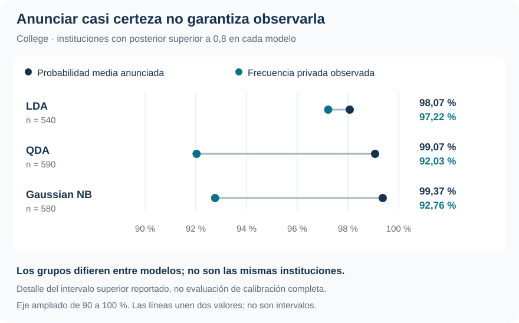

Clasificación binaria · Posteriores · Calibración

::: {.hero-box}
::: {.hero-title}
LDA identifica mejor a las instituciones no privadas y produce probabilidades más confiables. QDA y Naive Bayes mantienen un buen ordenamiento, pero exageran la certeza de algunos pronósticos.
:::
::: {.hero-sub}
Con la misma información y las mismas observaciones de evaluación, cambiar la estructura de covarianza modifica tanto los errores de clasificación como la magnitud de las probabilidades. La AUC alta no alcanza para juzgar ambas cosas.
:::
:::

:::: {.metric-grid}
::: {.metric-card}
::: {.metric-label}
Instituciones
:::
::: {.metric-value}
777
:::
::: {.metric-note}
565 privadas y 212 no privadas; 17 predictores cuantitativos.
:::
:::
::: {.metric-card}
::: {.metric-label}
Accuracy de LDA
:::
::: {.metric-value}
93,44 %
:::
::: {.metric-note}
Predicciones externas; referencia de clase mayoritaria: 72,72 %.
:::
:::
::: {.metric-card}
::: {.metric-label}
Especificidad de LDA
:::
::: {.metric-value}
84,43 %
:::
::: {.metric-note}
No privadas correctamente clasificadas; QDA y NB: 73,11 %.
:::
:::
::: {.metric-card}
::: {.metric-label}
Log-loss de LDA
:::
::: {.metric-value}
0,1936
:::
::: {.metric-note}
QDA: 0,7069; Gaussian Naive Bayes: 0,6434. Menor es mejor.
:::
:::
::::

## Una misma información, tres formas de modelar las clases

¿Las características de una institución permiten clasificarla como privada o no privada? **College, del paquete ISLR2**, permite comparar esta tarea con información sobre admisiones, matrícula, costos, personal académico y resultados institucionales. Los tres métodos reciben los mismos 17 predictores cuantitativos. La clase positiva es privada, que representa 72,72 % de la muestra.

LDA, QDA y Gaussian Naive Bayes construyen una distribución de los predictores dentro de cada clase y la combinan con la frecuencia previa de esa clase. Mediante Bayes obtienen la **probabilidad posterior de que la institución sea privada dadas sus características**. La posterior todavía no es una decisión.

Los métodos difieren en la estructura de dispersión que permiten:

::: {.table-box}
| Método | Distribución condicional supuesta | Qué permite o restringe |
|---|---|---|
| LDA | Gaussiana con covarianza completa común | Medias distintas, pero dispersión y covariaciones compartidas entre clases |
| QDA | Gaussiana con covarianza completa por clase | Cada clase puede tener su propia geometría de dispersión |
| Gaussian Naive Bayes | Gaussianas por predictor, independientes dentro de cada clase | Varianzas específicas, pero sin covarianzas entre predictores |
:::

En la implementación del informe, Gaussian NB equivale a QDA con covarianzas diagonales. Con 17 predictores, LDA estima 153 parámetros de covarianza, QDA 306 y NB 34. Más flexibilidad exige estimar más cantidades; simplificar elimina dependencias que pueden ser informativas. La evaluación decide qué compromiso funciona aquí.

## Cinco folds comunes, sin selección interna

Las especificaciones, las variables y los umbrales se fijan antes de evaluar. Se usan **cinco folds estratificados comunes**: cada vuelta reserva 155 o 156 instituciones y estima previas, medias y covarianzas solo con las restantes. Cada institución recibe una probabilidad fuera de fold —OOF— por método.

Las matrices de confusión, ROC, calibración y pérdidas probabilísticas reutilizan esas mismas 777 predicciones externas. No se calculan sobre el ajuste final con todos los datos ni constituyen evaluaciones independientes adicionales.

No hay una capa interna porque el procedimiento principal compara tres candidatos prefijados. Si se quisiera evaluar la regla adaptativa «comparar modelos y elegir el ganador», o aprender un umbral con los datos, esa selección tendría que quedar protegida dentro de la validación. La ausencia de hiperparámetros no elimina esa necesidad.

## La ventaja aparece al reconocer la clase menos frecuente

Con costos iguales, se anuncia «privada» cuando la posterior supera 0,5. Todos los métodos superan el 72,72 % de accuracy de predecir siempre la clase mayoritaria, pero los errores no se reparten igual.

::: {.table-box}
| Método | Accuracy | Sensibilidad: privadas | Especificidad: no privadas | Accuracy balanceada |
|---|---:|---:|---:|---:|
| LDA | **93,44 %** | 96,81 % | **84,43 %** | **90,62 %** |
| QDA | 90,48 % | 96,99 % | 73,11 % | 85,05 % |
| Gaussian NB | 90,09 % | 96,46 % | 73,11 % | 84,79 % |
:::

QDA detecta una institución privada más que LDA, pero clasifica erróneamente como privadas a 57 instituciones no privadas, frente a 33 de LDA. Esa diferencia domina el resultado: **LDA comete 51 errores; QDA, 74; NB, 77**. La accuracy balanceada promedia sensibilidad y especificidad con el mismo peso, evitando que la mayoría privada oculte la dificultad de la otra clase.

## Ordenar bien no asegura probabilidades de buena magnitud

La ROC recorre los intercambios entre verdaderos y falsos positivos al variar el umbral. Su AUC evalúa ordenamiento. Brier y log-loss evalúan la calidad global de las probabilidades y penalizan, entre otras cosas, anunciar mucha certeza cuando ocurre la clase contraria.

::: {.table-box}
| Método | AUC | Brier | Log-loss |
|---|---:|---:|---:|
| LDA | **0,9747** | **0,0484** | **0,1936** |
| QDA | 0,9553 | 0,0848 | 0,7069 |
| Gaussian NB | 0,9578 | 0,0844 | 0,6434 |
:::

QDA y NB conservan AUC próximas a 0,96, pero sus log-loss superan en más de tres veces al de LDA. Un buen ranking puede sobrevivir a probabilidades excesivamente extremas: el orden cambia poco, mientras el costo de equivocarse con mucha seguridad aumenta.

La calibración hace tangible esa diferencia. Entre las instituciones con posterior superior a 0,8, QDA anuncia en promedio 99,07 % de probabilidad de ser privada, pero solo 92,03 % lo son. En LDA, probabilidad media y frecuencia observada están mucho más próximas.

{#fig-college-calibracion fig-alt="Grupo con posterior mayor que 0,8: LDA anuncia 98,07 % y observa 97,22 %, n=540; QDA 99,07 % y 92,03 %, n=590; NB 99,37 % y 92,76 %, n=580." width="100%"}

Cada modelo forma su propio grupo: **no son exactamente las mismas instituciones**. Es un diagnóstico seleccionado de los cinco intervalos del informe, no una prueba de calibración perfecta en toda la distribución. Brier y log-loss tampoco son medidas puras de calibración. El recorte numérico empleado para evitar logaritmos de cero no recalibra las probabilidades.

## Cambiar el costo modifica la acción

El informe considera un escenario docente donde omitir una institución privada cuesta el doble que anunciar privada a una no privada. El umbral derivado de esos costos baja de 1/2 a 1/3, **sin reestimar los modelos**.

En LDA, los falsos negativos pasan de 18 a 10 y los falsos positivos de 33 a 44. Se recuperan ocho privadas a cambio de once falsas alarmas adicionales. Bajo esa pérdida, LDA obtiene riesgo 0,0824; QDA y NB, 0,1248. La comparación entre modelos vuelve a favorecer a LDA. No debe compararse 0,0824 con el riesgo simétrico como si conservaran la misma escala de costos.

Estos costos no representan una valoración monetaria o institucional documentada. Sirven para mostrar cómo una probabilidad se convierte en una decisión cuando los errores tienen consecuencias distintas.

## Una preferencia respaldada, con alcance concreto

::: {.section-box}
### LDA es la opción mejor respaldada entre los tres candidatos

Comparte una covarianza completa entre clases y logra el mejor resultado agregado de clasificación, ordenamiento y calidad probabilística. Ni liberar todas las covarianzas ni eliminarlas ofrece una mejora en esta aplicación.
:::

La preferencia práctica por LDA no convierte su riesgo OOF en una nueva evaluación independiente de haberlo escogido entre tres modelos. La conclusión se limita a esta muestra, los 17 predictores y las aproximaciones gaussianas, sin selección de variables ni regularización. Dos porcentajes superiores a 100 se conservaron en la base del informe; una aplicación operativa exigiría aclarar su origen.

[Auto](t05_auto.qmd) extiende la pregunta a tres clases y muestra una diferencia sustantiva: el modelo que clasifica mejor ya no es el que obtiene el mejor log-loss.

::: {.small-note}
**Fuente:** informe curado «Taller 4: Análisis discriminante binario con College», ISLR2. Tablas seleccionadas de la evaluación OOF; SVG elaborado con el intervalo superior de calibración reportado. No se generaron resultados nuevos.
:::
