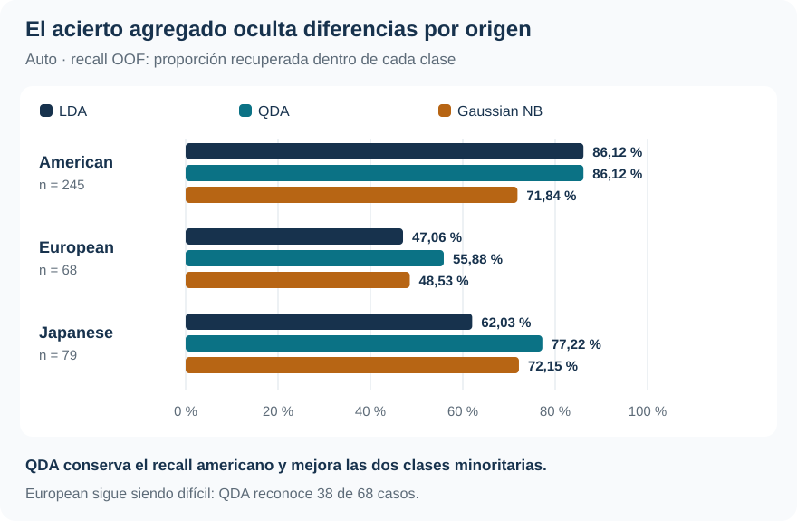

[Machine Learning](../index.qmd) / [Clasificación, probabilidades y decisión](../index.qmd#clasificacion)

Clasificación multiclase · Errores por origen · Decisión

::: {.hero-box}
::: {.hero-title}
QDA clasifica mejor el origen de los automóviles, pero LDA obtiene mejor log-loss. La elección depende de si necesitamos una categoría, un ranking o una probabilidad.
:::
::: {.hero-sub}
Pasar a tres clases obliga a mirar qué categorías se confunden y a decidir con un vector de probabilidades. El acierto agregado no basta: los automóviles europeos siguen siendo difíciles de reconocer incluso con el mejor clasificador.
:::
:::

:::: {.metric-grid}
::: {.metric-card}
::: {.metric-label}
Automóviles
:::
::: {.metric-value}
392
:::
::: {.metric-note}
245 americanos, 68 europeos y 79 japoneses; siete predictores.
:::
:::
::: {.metric-card}
::: {.metric-label}
Accuracy de QDA
:::
::: {.metric-value}
79,08 %
:::
::: {.metric-note}
310 aciertos externos; «siempre americano»: 62,50 %.
:::
:::
::: {.metric-card}
::: {.metric-label}
Recall europeo de QDA
:::
::: {.metric-value}
55,88 %
:::
::: {.metric-note}
Reconoce 38 de 68 europeos; omite 30.
:::
:::
::: {.metric-card}
::: {.metric-label}
Log-loss de LDA
:::
::: {.metric-value}
0,5571
:::
::: {.metric-note}
Menor que QDA, 0,6967, pese a tener menos aciertos de clase.
:::
:::
::::

## Tres orígenes, sin orden entre las categorías

¿Hasta qué punto las características técnicas de un automóvil permiten identificar su origen? **Auto, del paquete ISLR2**, contiene 392 observaciones completas clasificadas como American, European o Japanese. Son categorías nominales: codificarlas con números no crea una escala de menor a mayor.

LDA, QDA y Gaussian Naive Bayes utilizan los mismos siete predictores: rendimiento en millas por galón, cilindros, cilindrada, potencia, peso, aceleración y año. El nombre del automóvil queda fuera del ajuste. No se realiza selección de variables, transformación ni regularización de covarianzas.

La comparación mantiene una lógica generativa gaussiana: LDA comparte una covarianza completa entre orígenes; QDA estima una por origen; NB conserva varianzas por clase, pero supone independencia condicional entre predictores. La pregunta empírica es si representar la dispersión específica de cada origen mejora la clasificación y qué ocurre con sus probabilidades.

## Evaluar un vector posterior fuera de muestra

Cada automóvil recibe tres probabilidades que suman uno:

$$
\widehat{\mathbf p}(x)=(\widehat p_A,\widehat p_E,\widehat p_J).
$$

Con costos iguales, la decisión es la clase de mayor posterior —argmax—. No hay que superar un umbral de 0,5: basta con que una clase tenga más probabilidad que cada alternativa. Una categoría anunciada descarta parte de la información del vector, incluida la incertidumbre entre los otros dos orígenes.

Los tres métodos se fijan antes de evaluar y comparten **cinco folds externos estratificados por origen**. En cada vuelta se estiman previas, medias y covarianzas con cuatro folds y se predice el reservado. Al reunirlos, hay 392 vectores OOF por modelo. Todas las métricas posteriores provienen de esas predicciones externas.

No hay selección interna porque los candidatos, los predictores y la matriz de costos están prefijados. Elegir un modelo o aprender una regla con los datos y evaluar ese procedimiento adaptativo completo requeriría proteger la selección dentro de la validación.

## QDA gana aciertos, pero las clases no son igual de fáciles

Predecir siempre American alcanzaría 62,50 % de accuracy. Los tres modelos superan esa referencia, y QDA lidera también cuando cada clase recibe el mismo peso.

::: {.table-box}
| Método | Accuracy | Recall macro | F1 macro | Log-loss |
|---|---:|---:|---:|---:|
| LDA | 74,49 % | 65,07 % | 0,6425 | **0,5571** |
| QDA | **79,08 %** | **73,07 %** | **0,7122** | 0,6967 |
| Gaussian NB | 67,86 % | 64,17 % | 0,6068 | 1,7322 |
:::

El recall macro promedia la proporción recuperada de cada clase sin ponderar por tamaño. QDA supera a los otros métodos en accuracy en los cinco folds; su ventaja no depende únicamente de una partición favorable o de la mayoría americana.

{#fig-auto-recall fig-alt="Recall OOF por origen: LDA, QDA y NB. American: 86,12 %, 86,12 %, 71,84 %. European: 47,06 %, 55,88 %, 48,53 %. Japanese: 62,03 %, 77,22 %, 72,15 %." width="100%"}

En QDA, la diagonal de la matriz de confusión reúne 211 americanos, 38 europeos y 61 japoneses: 310 aciertos sobre 392 casos. La lectura por clase revela el límite que ese total oculta. **Treinta de los 68 europeos se asignan a otro origen**, mientras 27 automóviles no europeos se anuncian como europeos. El recall europeo es 55,88 % y la precisión de esas predicciones, 58,46 %.

Entre LDA y QDA, el recall americano queda en 86,12 %. La mejora más marcada aparece en japoneses, de 62,03 % a 77,22 %, y también aumenta el recall europeo, de 47,06 % a 55,88 %. Por tanto, la ganancia global contiene una mejora concreta en las clases minoritarias.

## Ganar en categorías y ranking no implica ganar en probabilidades

La evaluación one-vs-rest toma cada origen como positivo y agrupa los otros dos como negativos. QDA obtiene la mayor AUC en los tres contrastes; su AUC macro es 0,9037, frente a 0,8837 de LDA y 0,8424 de NB. Es una evaluación del ordenamiento por clase, no tres clasificadores binarios independientes que sustituyan la decisión multiclase.

El log-loss pregunta otra cosa: cuánta probabilidad se asignó a la clase que realmente ocurrió. Promedia $-\log\widehat p_{i,Y_i}$ sobre las observaciones externas. Un modelo puede acertar más veces mediante argmax y perder bajo log-loss si sus errores concentran demasiada confianza en una clase equivocada.

Eso ocurre en la comparación: **LDA obtiene 0,5571 y QDA 0,6967**. QDA genera posteriores más extremas; las equivocaciones seguras reciben mayor castigo. Gaussian NB queda más lejos, con 1,7322. El informe no estima una curva de calibración multiclase: el menor log-loss respalda mejor calidad probabilística bajo esa métrica, no una afirmación de calibración perfecta.

## Con costos desiguales, argmax deja de ser la regla adecuada

El segundo escenario asigna costo 3 a no reconocer un automóvil europeo y costo 1 a los demás errores. Es una matriz docente, no una valoración comercial documentada. Para cada vector posterior se calcula:

$$
\widehat R(A\mid x)=3\widehat p_E+\widehat p_J,\quad
\widehat R(E\mid x)=\widehat p_A+\widehat p_J,\quad
\widehat R(J\mid x)=\widehat p_A+3\widehat p_E.
$$

Se elige la acción con menor riesgo posterior estimado. **Las probabilidades y los modelos no cambian.** A diferencia del caso binario, la decisión compara el costo esperado de tres acciones usando todo el vector.

::: {.table-box}
| Método | Decisiones que cambian | Costo OOF si se conserva argmax | Costo OOF con regla de costos |
|---|---:|---:|---:|
| LDA | 97 | 0,4388 | 0,3495 |
| QDA | 48 | 0,3622 | **0,3444** |
| Gaussian NB | 63 | 0,5000 | 0,4719 |
:::

Ambas columnas evalúan **la misma matriz de pérdidas**. Conservar argmax es una referencia para medir qué ocurre si se ignoran los nuevos costos; no se compara una tasa de error con una pérdida de otra escala.

En LDA, el recall europeo sube de 47,06 % a 88,24 %, pero su precisión cae de 50,79 % a 37,50 %. Se recuperan más europeos aceptando más falsas asignaciones a esa clase. La accuracy global baja a 69,13 % mientras disminuye el costo: cambió el objetivo. La reducción del costo empírico es un resultado de esta muestra, no una garantía algebraica para toda muestra finita al usar probabilidades estimadas.

## Elegir según el objeto que se necesita

::: {.section-box}
### No hay un ganador único para todos los usos

QDA es la opción mejor respaldada si el criterio es el acierto de clase o el ranking; también registra el menor costo bajo la matriz docente, aunque queda próximo a LDA. Si la prioridad es el log-loss de las probabilidades, la evidencia favorece a LDA.
:::

Las aproximaciones gaussianas no describen literalmente variables discretas como cilindros o año. Además, estimar la covarianza europea descansa en solo 68 casos: la estratificación conserva la composición, pero no iguala la información entre clases. La conclusión pertenece a estos predictores y a esta evaluación, no a una jerarquía universal de métodos.

[College](t04_college.qmd) muestra una preferencia consistente por LDA en dos clases. Auto aporta una historia propia: tres orígenes exigen abrir los errores, evaluar el vector posterior y distinguir el criterio con el que se elige una estrategia.

::: {.small-note}
**Fuente:** informe curado «Taller 5: Análisis discriminante multiclase con Auto», ISLR2. SVG elaborado con el recall OOF por clase; tablas seleccionadas de los resultados reportados. No se generaron estimaciones nuevas.
:::
