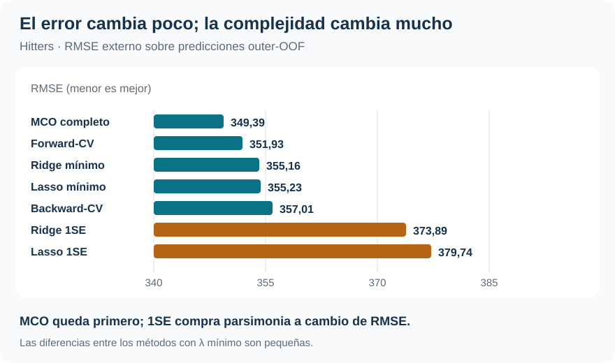
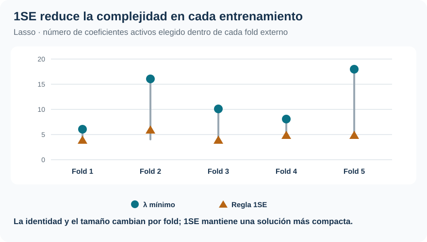

[Machine Learning](../index.qmd) / [Selección, regularización y alta dimensionalidad](../index.qmd#seleccion-regularizacion)

Selección · Regularización · Validación anidada

::: {.hero-box}
::: {.hero-title}
MCO obtiene el menor RMSE global; Forward, Lasso y Ridge quedan cerca, pero llegan allí con decisiones de complejidad muy diferentes.
:::
::: {.hero-sub}
Hitters separa tres decisiones que suelen mezclarse: qué variables conservar, cuánto contraer los coeficientes y cómo evaluar un procedimiento que aprendió su propia configuración.
:::
:::

:::: {.metric-grid}
::: {.metric-card}
::: {.metric-label}
Muestra efectiva
:::
::: {.metric-value}
263
:::
::: {.metric-note}
322 jugadores originales; 59 salarios faltantes quedan fuera del análisis supervisado.
:::
:::
::: {.metric-card}
::: {.metric-label}
Relación p/n
:::
::: {.metric-value}
19 / 263
:::
::: {.metric-note}
Régimen favorable para MCO, aunque con colinealidad de carrera importante.
:::
:::
::: {.metric-card}
::: {.metric-label}
Mejor RMSE externo
:::
::: {.metric-value}
349,39
:::
::: {.metric-note}
MCO completo; Forward alcanza 351,93 entre los métodos con tuning.
:::
:::
::: {.metric-card}
::: {.metric-label}
Lasso final
:::
::: {.metric-value}
13 → 6
:::
::: {.metric-note}
$\lambda_{min}$ frente a 1SE: menos variables a cambio de más error externo.
:::
:::
::::

## La decisión no es solo predecir el salario

El problema es anticipar el salario anual de un jugador con estadísticas de desempeño y carrera. **Hitters, de ISLR2**, deja 263 jugadores con salario observado y 19 columnas de diseño, incluidas indicadoras para variables categóricas. La respuesta está medida en niveles y tiene una cola derecha que llega a 2.460: por eso el RMSE da peso especial a los errores de salarios altos.

La pregunta aplicada es sencilla: ¿cuánta complejidad conviene conservar para predecir mejor un nuevo salario? Predecir siempre la media aprendida en cada entrenamiento deja un RMSE externo de 450,69. Ese benchmark fija el punto de partida: antes de discutir qué variables sobreviven, cualquier procedimiento debe demostrar que las estadísticas deportivas aportan información fuera de muestra.

La respuesta no se desprende de un único ajuste ni de una lista de coeficientes. Depende de comparar reglas completas que toman decisiones de complejidad con información de entrenamiento. La cola derecha de `Salary`, que alcanza 2.460, agrega una dificultad práctica: RMSE da mucho peso a los errores sobre los salarios más altos, precisamente donde las predicciones tienden a contraerse hacia el centro.

Las asociaciones seleccionadas son predictivas dentro de esta muestra. No identifican el efecto causal de una temporada, un equipo o una estadística sobre el salario.

## Cuatro maneras de controlar la complejidad

::: {.table-box}
| Procedimiento | Decisión que aprende | Qué conserva |
|---|---|---|
| MCO completo | Ninguna: la especificación queda fijada | Los 19 predictores |
| Forward / Backward | Tamaño del subconjunto $m$ | Un modelo de $m$ variables |
| Lasso | Intensidad $\lambda$ | Puede fijar coeficientes exactamente en cero |
| Ridge | Intensidad $\lambda$ | Todos los predictores, contraídos |
:::

Forward y Backward eligen un punto en una trayectoria de subconjuntos anidados. El taller no realiza *best subset*: con 19 predictores implicaría examinar (2^{19}=524.288) combinaciones. Forward agrega en cada paso la variable que más reduce el error de ajuste; Backward comienza con el modelo completo y elimina una por vez. Son búsquedas *greedy*: construyen qué modelo representa cada tamaño y la CV interna decide en qué tamaño detenerse, pero no garantizan el mejor subconjunto global.

Lasso y Ridge no recorren esa trayectoria discreta: cambian continuamente el tamaño de los coeficientes. Lasso agrega una penalización $L_1$ y puede anular variables; Ridge usa $L_2$ y conserva las 19 columnas mientras estabiliza direcciones mal determinadas. El valor de \(\lambda\) se selecciona después de aprender el escalado dentro de cada entrenamiento; calcular medias y desvíos con casos protegidos contaminaría la comparación.

Esa distinción importa en Hitters. Entre los predictores numéricos hay 23 pares con correlación absoluta superior a 0,80 y 12 por encima de 0,90. Dos especificaciones pueden asignar la señal a variables de carrera distintas y, aun así, entregar pronósticos parecidos.

## La prueba externa no participa de la búsqueda

Los cinco folds externos son comunes a todos los métodos. En cada vuelta se reserva un fold para predecir. Los cuatro procedimientos que requieren tuning usan los datos restantes para elegir su configuración: $m$ para Forward y Backward; $\lambda$ para Lasso y Ridge. El escalado de los métodos penalizados también se aprende dentro del entrenamiento correspondiente.

Así, cada predicción **outer-OOF** proviene de una vuelta en que el salario del jugador reservado no intervino ni en el ajuste ni en la elección de la configuración que lo predijo. La validación anidada evalúa el procedimiento completo: «construir candidatos → elegir complejidad → reajustar → predecir». MCO no necesita capa interna porque su fórmula ya está fijada, pero recibe la misma evaluación externa.

Las configuraciones elegidas confirman que el tuning forma parte de lo que se evalúa: no aparece un tamaño o una penalización inmutable que pueda decidirse una vez y darse por conocida.

::: {.table-box}
| Fold externo | Forward: variables | Backward: variables | Lasso mínimo: activos | Lasso 1SE: activos |
|---:|---:|---:|---:|---:|
| 1 | 8 | 9 | 6 | 4 |
| 2 | 11 | 9 | 16 | 6 |
| 3 | 18 | 7 | 10 | 4 |
| 4 | 6 | 6 | 8 | 5 |
| 5 | 11 | 10 | 18 | 5 |
:::

Forward oscila entre 6 y 18 variables; Backward, entre 6 y 10. Lasso bajo \(\lambda_{min}\) también cambia entre 6 y 18 activos, mientras 1SE permanece entre 4 y 6. Esta variación no invalida la evaluación: muestra cómo responde cada regla cuando cambia la muestra disponible para aprender.

Una CV final posterior puede construir un modelo operativo usando los 263 casos. No es una nueva prueba de generalización: los RMSE que comparan los procedimientos son los externos.

## El RMSE deja cerca a métodos muy distintos

::: {.table-box}
| Procedimiento | RMSE externo | Decisión práctica |
|---|---:|---|
| MCO completo | **349,39** | Mejor RMSE global; 19 predictores |
| Forward-CV | 351,93 | Mejor entre los métodos con tuning |
| Ridge-$\lambda_{min}$ | 355,16 | Contracción continua |
| Lasso-$\lambda_{min}$ | 355,23 | Selección penalizada |
| Backward-CV | 357,01 | Selección discreta alternativa |
| Ridge-1SE | 373,89 | Más contracción |
| Lasso-1SE | 379,74 | Más compacto |
| Media del outer-training | 450,69 | Referencia sin predictores |
:::

{#fig-hitters-rmse fig-alt="RMSE externo: MCO 349,39; Forward 351,93; Ridge mínimo 355,16; Lasso mínimo 355,23; Backward 357,01; Ridge 1SE 373,89; Lasso 1SE 379,74." width="100%"}

MCO queda primero cuando participa en la comparación. Eso es coherente con un problema de baja dimensión relativa: aquí $p \ll n$. Si la decisión se limita a procedimientos que aprenden una configuración, Forward es el mejor. Ridge y Lasso bajo $\lambda_{min}$ están separados por 0,07 RMSE, una diferencia demasiado pequeña para sostener una historia de superioridad fuerte.

La proximidad cambia la lectura profesional. Forward paga apenas 0,73 % de RMSE respecto de MCO; Ridge mínimo, 1,65 %; Lasso mínimo, 1,67 %; y Backward, 2,18 %. Es decir, estructuras muy distintas conservan casi toda la capacidad predictiva. Tampoco hay un ganador uniforme por fold: MCO lidera dos, Ridge mínimo uno, Ridge 1SE uno y Lasso mínimo uno. El ranking global surge de concatenar las 263 predicciones externas, no de contar victorias entre folds.

## La regla 1SE hace visible el precio de simplificar

Para Lasso, $\lambda_{min}$ minimiza el error de CV interno. La regla 1SE elige el mayor $\lambda$ cuyo error queda dentro de un error estándar estimado alrededor del mínimo. Es una regla de parsimonia predefinida: no es un test de hipótesis ni declara equivalentes los errores.

::: {.table-box}
| Configuración final de Lasso | $\lambda$ | Coeficientes activos |
|---|---:|---:|
| $\lambda_{min}$ | 3,359 | 13 |
| 1SE | 64,002 | **6** |
:::

{#fig-hitters-activos fig-alt="Número de coeficientes activos de Lasso por fold externo: lambda mínimo 6, 16, 10, 8 y 18; regla 1SE 4, 6, 4, 5 y 5." width="100%"}

La configuración final 1SE conserva seis coeficientes, frente a trece bajo $\lambda_{min}$. El patrón entre folds muestra la misma dirección: el número de activos cambia con la muestra de entrenamiento, pero 1SE deja soluciones más pequeñas y más regulares. A cambio, su RMSE externo sube de 355,23 a 379,74, un costo de 6,90 %. Ridge expone el mismo intercambio sin eliminar columnas: 1SE aumenta su RMSE de 355,16 a 373,89 mientras contrae con mucha mayor intensidad.

La decisión adecuada depende de cuánto valor se asigne a una representación compacta o estable frente a una pérdida de precisión. La regla 1SE cumple exactamente esa preferencia; no demuestra equivalencia estadística con el mínimo ni mejora por sí sola la generalización.

## Estabilidad de la representación no equivale a estabilidad predictiva

Con estadísticas de carrera tan correlacionadas, distintos folds pueden preferir variables diferentes o tamaños de modelo diferentes. La nested CV protege la evaluación del error, pero no convierte la identidad de cada coeficiente en una propiedad estable de la población.

La configuración final pedagógica hace visible la tensión. Forward conserva `AtBat`, `Hits`, `Walks`, `CRBI`, `DivisionW` y `PutOuts`; Backward incluye esas seis y agrega `CRuns` y `CWalks`; Lasso 1SE comparte cinco de sus seis variables con Forward. La coincidencia señala un núcleo predictivo recurrente, pero no identifica un conjunto verdadero: variables de carrera altamente correlacionadas pueden sustituirse entre sí.

Conviene separar dos preguntas. La primera es predictiva: cuánto se equivoca el procedimiento sobre observaciones que no participaban de su tuning. La segunda es de representación: qué variables y qué intensidad de regularización emergen de una muestra concreta. Hitters ofrece evidencia para la primera; para la segunda, muestra sensibilidad compatible con predictores sustitutos.

::: {.section-box}
### Qué dejaría preparado para uso operativo

Si el único criterio es RMSE y MCO integra la competencia, MCO es la referencia seleccionada. Si el flujo exige elegir entre procedimientos con tuning, Forward obtiene el menor error externo; una CV final sobre los 263 casos fijaría entonces $m^*=6$ antes de reajustar. En ambos casos, la configuración final sirve para operar, mientras el RMSE outer-OOF conserva la evidencia de generalización disponible.
:::

La CV final de Forward produce un MSE de selección de 114.189,73 para \(m=6\); no sustituye su MSE outer-OOF de 123.855,83. El primero elige la configuración operativa usando los 263 casos etiquetados; el segundo evalúa la regla completa en observaciones que quedaron fuera de esa selección. Del mismo modo, que Backward tenga un mínimo menor en su propia CV final no cambia que Forward haya generalizado mejor entre los procedimientos con tuning.

Comparar varios riesgos outer-OOF y escoger el menor es una regla razonable para decidir, pero ese mínimo no constituye una evaluación adicional e independiente del acto de elegir el algoritmo. Evaluar estrictamente ese meta-procedimiento exigiría reservar otro test o seleccionar conjuntamente algoritmo e hiperparámetro dentro de cada entrenamiento externo.

Los modelos lineales tampoco imponen soporte positivo. Forward, Lasso mínimo y Ridge mínimo producen una predicción negativa cada uno. No se truncaron retrospectivamente: hacerlo habría agregado una regla no evaluada. Junto con la dificultad sobre salarios altos, este límite recuerda que la comparación responde a la formulación en niveles y a RMSE, no a todas las decisiones posibles sobre una variable salarial.

[NIRsoil](t07_nirsoil.qmd) lleva la misma pregunta a un régimen diferente: $p>n$ y predictores casi duplicados, donde regularizar ya no es solo una opción de parsimonia sino parte de poder ajustar el modelo.

::: {.small-note}
**Fuente:** informe curado «Taller 6: Selección de variables y regularización con Hitters», ISLR2. Las figuras sintetizan resultados y diagnósticos ya reportados; no se generaron estimaciones nuevas.
:::
