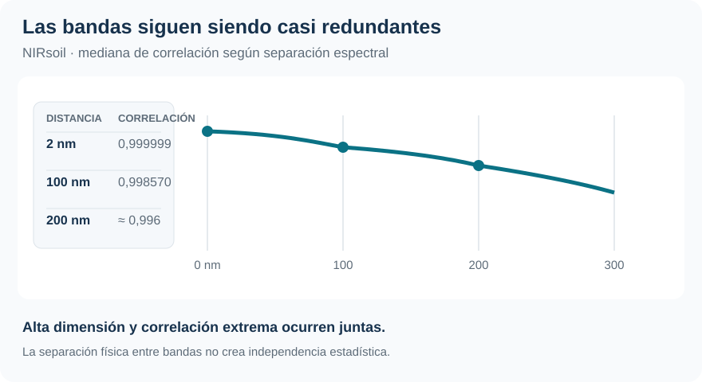
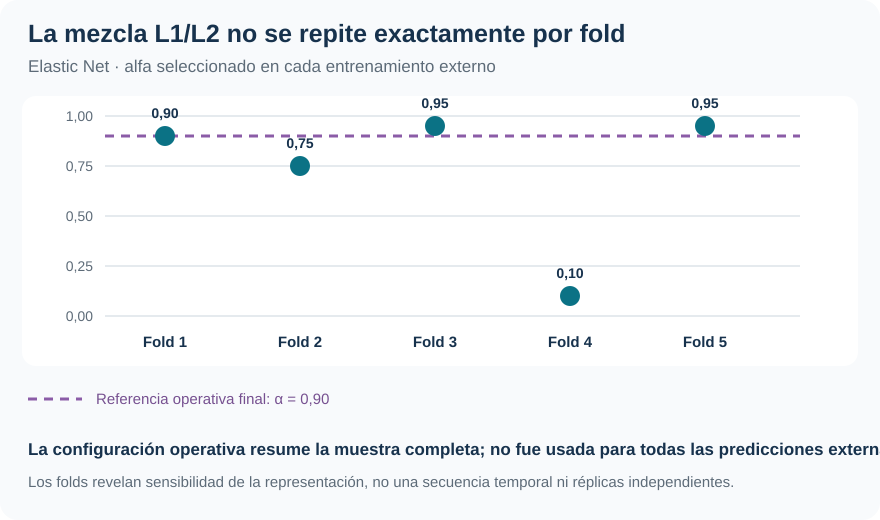
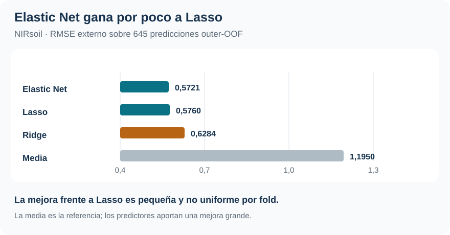

[Machine Learning](../index.qmd) / [Selección, regularización y alta dimensionalidad](../index.qmd#seleccion-regularizacion)

Alta dimensión · Correlación · Elastic Net

::: {.hero-box}
::: {.hero-title}
Con 700 predictores y 645 respuestas observadas, Elastic Net obtiene el menor RMSE. La diferencia frente a Lasso es pequeña y la solución sigue siendo poco escasa.
:::
::: {.hero-sub}
NIRsoil no es solo una tabla ancha: las bandas espectrales contienen información casi redundante. Eso obliga a separar la estabilidad de los coeficientes de la estabilidad de las predicciones.
:::
:::

:::: {.metric-grid}
::: {.metric-card}
::: {.metric-label}
Problema supervisado
:::
::: {.metric-value}
700 > 645
:::
::: {.metric-note}
700 bandas espectrales; 645 muestras con nitrógeno total observado.
:::
:::
::: {.metric-card}
::: {.metric-label}
Correlación a 2 nm
:::
::: {.metric-value}
0,999999
:::
::: {.metric-note}
La mediana sigue en 0,998570 aun con 100 nm de separación.
:::
:::
::: {.metric-card}
::: {.metric-label}
RMSE Elastic Net
:::
::: {.metric-value}
0,5721
:::
::: {.metric-note}
Outer-OOF; Lasso 0,5760 y Ridge 0,6284.
:::
:::
::: {.metric-card}
::: {.metric-label}
Configuración final EN
:::
::: {.metric-value}
660 / 700
:::
::: {.metric-note}
$\alpha=0,90$ y penalización débil: la solución no es altamente escasa.
:::
:::
::::

## El desafío combina alta dimensión y redundancia extrema

El objetivo es predecir nitrógeno total (`Nt`, en g/kg de suelo seco) a partir de absorbancias medidas entre 1100 y 2498 nm, cada 2 nm. **NIRsoil, del paquete prospectr**, empieza con 825 observaciones; 180 no tienen `Nt`, por lo que la muestra supervisada es de 645 casos y 700 predictores. La matriz centrada tiene rango 644: sin regularización, el problema lineal no tiene una solución única en el sentido usual.

Las bandas cercanas son casi copias estadísticas: la correlación mediana entre bandas separadas 2 nm es 0,999999 y sigue en 0,998570 a 100 nm. Por eso «seleccionar variables» no equivale necesariamente a encontrar unas pocas longitudes de onda decisivas. Bandas vecinas pueden sustituirse entre sí sin cambiar mucho el pronóstico.

{#fig-nirsoil-correlacion fig-alt="Correlación mediana entre predictores por separación: 2 nm 0,999999; 100 nm 0,998570; 200 nm 0,995985." width="100%"}

`Nt` es una respuesta positiva y asimétrica. RMSE, MAE y $R^2$ se calculan sobre predicciones externas; los coeficientes sirven para predecir en esta muestra, no para atribuir un efecto causal de una banda sobre el nitrógeno.

## Tres penalizaciones, dos hiperparámetros y una misma prueba

::: {.table-box}
| Método | Geometría | Consecuencia práctica |
|---|---|---|
| Ridge | $\alpha=0$, penalización $L_2$ | Contrae y conserva las 700 coordenadas |
| Lasso | $\alpha=1$, penalización $L_1$ | Puede anular coeficientes |
| Elastic Net | $0<\alpha<1$ | Combina selección y curvatura para predictores correlacionados |
:::

$\lambda$ define cuánto regularizar; $\alpha$ reparte la penalización entre los términos $L_1$ y $L_2$. No corresponde leer $\alpha=0,90$ como «90 % Lasso»: ambas normas miden objetos distintos, y su efecto depende también del $\lambda$ elegido en la trayectoria propia de cada $\alpha$.

La comparación usa cinco folds externos y cinco internos. Dentro de cada entrenamiento externo, Elastic Net recorre seis valores de $\alpha$ interiores ($0,10$ a $0,95$) y, para cada uno, una trayectoria de 81 valores de $\lambda$; Ridge y Lasso se evalúan como extremos. Cada \(\alpha\) tiene su propia escala de \(\lambda\), de modo que el tuning compara pares \((\alpha,\lambda)\), no valores de \(\alpha\) aislados.

El taller utiliza únicamente la regla de mínimo de CV. No aplica 1SE porque ordenar parsimonia en una superficie que cambia a la vez geometría, intensidad y número de activos exigiría otra decisión. Las medias, desvíos y parámetros se aprenden sin usar la respuesta del fold que se reserva para predecir.

La predicción **outer-OOF** evalúa la regla completa: «estandarizar → elegir $(\alpha,\lambda)$ → reajustar → predecir». Una CV final sobre los 645 casos ocurre después de esa comparación y solo prepara la configuración operativa; no reemplaza la evidencia externa.

## La mezcla seleccionada cambia con la muestra de entrenamiento

::: {.table-box}
| Fold externo | \(\alpha\) Elastic Net | Activos EN | Activos Lasso | RMSE EN | RMSE Lasso |
|---:|---:|---:|---:|---:|---:|
| 1 | 0,90 | 667 | 606 | **0,4351** | 0,4423 |
| 2 | 0,75 | 673 | 319 | **0,7553** | 0,7557 |
| 3 | 0,95 | 312 | 258 | **0,4023** | 0,4248 |
| 4 | 0,10 | 689 | 384 | 0,5190 | **0,5139** |
| 5 | 0,95 | 639 | 632 | 0,6675 | 0,6692 |
:::

{#fig-nirsoil-estabilidad fig-alt="Alfa seleccionado para Elastic Net en los cinco folds externos: 0,90; 0,75; 0,95; 0,10; 0,95. La configuración final posterior es 0,90." width="100%"}

\(\alpha\) recorre casi toda la grilla, de 0,10 a 0,95, y Elastic Net conserva entre 312 y 689 variables. Lasso conserva entre 258 y 632. Esta variación es parte del procedimiento: cada *outer-training* vuelve a decidir con sus propios datos. Los folds comparten observaciones y no son repeticiones independientes, por lo que el rango funciona como diagnóstico de sensibilidad, no como intervalo de incertidumbre.

## Elastic Net lidera, pero no por una distancia concluyente

::: {.table-box}
| Procedimiento | RMSE outer-OOF | MAE | $R^2_{OOF}$ |
|---|---:|---:|---:|
| Elastic Net | **0,5721** | 0,3351 | 0,7696 |
| Lasso | 0,5760 | 0,3369 | 0,7665 |
| Ridge | 0,6284 | 0,3833 | 0,7221 |
| Media de cada outer-training | 1,1950 | — | — |
:::

{#fig-nirsoil-rmse fig-alt="RMSE outer-OOF: Elastic Net 0,5721; Lasso 0,5760; Ridge 0,6284; benchmark de media 1,1950." width="100%"}

Elastic Net mejora el MSE aproximadamente 1,35 % frente a Lasso y 17,11 % frente a Ridge. Frente a predecir solo la media, la reducción del MSE es 77,08 %: el espectro contiene mucha señal, aunque dos formas de regularizarla queden casi empatadas. La comparación entre Elastic Net y Lasso exige más cautela: Elastic Net obtiene el menor RMSE global, pero Lasso gana un fold externo y Ridge otro. El resultado apoya Elastic Net para esta muestra y esta grilla, no una superioridad universal.

RMSE y MAE también cuentan una parte del problema. El RMSE de Elastic Net equivale aproximadamente al 48 % del desvío estándar de `Nt`; su MAE de 0,3351 g/kg describe un error absoluto promedio mucho menor. La distancia entre ambas métricas refleja el peso de unas pocas observaciones difíciles en la cola alta de nitrógeno.

## La configuración operativa es cercana a Lasso, pero poco escasa

Después de cerrar la evaluación, la CV final sobre las 645 observaciones selecciona Elastic Net con $\widehat\alpha=0,90$ y $\widehat\lambda=8,71\times10^{-7}$. Deja 660 coeficientes activos. Lasso conserva 654 y Ridge 700.

::: {.table-box}
| Ajuste final | $\alpha$ | $\lambda$ | RMSE-CV de selección | Activos |
|---|---:|---:|---:|---:|
| Ridge | 0 | \(1,58\times10^{-3}\) | 0,6284 | 700 |
| Elastic Net | 0,90 | \(8,71\times10^{-7}\) | **0,5565** | 660 |
| Lasso | 1 | \(7,84\times10^{-7}\) | 0,5598 | 654 |
:::

Los RMSE-CV de esta tabla seleccionan una configuración con todos los datos etiquetados; no actualizan los RMSE outer-OOF de 0,5721, 0,5760 y 0,6284 que evaluaron los procedimientos. Para todos los $\alpha>0$, la CV final escoge el extremo de penalización más débil de la trayectoria disponible. Esa evidencia describe una preferencia por regularización débil dentro de una grilla que ya recorre seis órdenes de magnitud, no un óptimo interior nítido ni una selección drástica.

La pareja debe leerse completa: \(\alpha=0,90\) define una geometría cercana a Lasso, mientras el \(\lambda\) muy pequeño hace débil la intensidad total. Comparar el valor absoluto de $\lambda$ entre distintos $\alpha$ tampoco es adecuado porque cada trayectoria tiene su propio $\lambda_{max}$.

## Representaciones distintas pueden predecir casi igual

El fold 2 expone el trade-off con especial claridad: Elastic Net conserva 673 predictores y Lasso 319, pero sus RMSE externos son 0,7553 y 0,7557. Los vectores de coeficientes y la cantidad de activos son muy diferentes; las predicciones, casi indistinguibles. En el fold 5, los tres RMSE quedan separados por menos de 0,005.

Esto es coherente con la redundancia espectral. Si dos columnas son casi copias, cambiar cuál queda activa o cómo se reparte su coeficiente puede modificar mucho la representación sin alterar demasiado \(X\widehat\beta\). La parte $L_2$ de Elastic Net favorece el agrupamiento de predictores correlacionados, mientras $L_1$ puede producir ceros, pero la identidad de una banda activa no equivale a importancia estable ni a mecanismo físico.

::: {.section-box}
### Qué modelo usaría bajo el criterio planteado

Si se elige entre los tres regularizados por RMSE outer-OOF, Elastic Net es la opción mejor respaldada. La configuración final combina un componente $L_2$ útil para bandas casi duplicadas con una selección $L_1$ moderada, aunque conserva 94,3 % de los predictores. La diferencia frente a Lasso es pequeña, por lo que el seguimiento de desempeño con nuevas muestras importa más que declarar un ganador permanente.
:::

Los modelos lineales penalizados no imponen positividad. En la evaluación externa, Elastic Net genera 4 predicciones negativas de 645 y Lasso 3; Ridge no genera ninguna. Es un límite de la especificación en niveles, separado de la decisión de regularización. Tampoco hay interpretación causal de los coeficientes ni evidencia de que esta grilla sea óptima fuera de la muestra estudiada.

[Hitters](t06_hitters.qmd) muestra el régimen complementario: $p\ll n$, donde MCO sigue siendo competitivo y regularizar expresa principalmente una decisión de estabilidad y parsimonia. Aquí $p>n$ hace que regularizar sea parte de la definición del ajuste.

::: {.small-note}
**Fuente:** informe curado «Taller 7: Alta dimensionalidad y Elastic Net con NIRsoil», prospectr. Las figuras sintetizan resultados y diagnósticos ya reportados; no se generaron estimaciones nuevas.
:::
