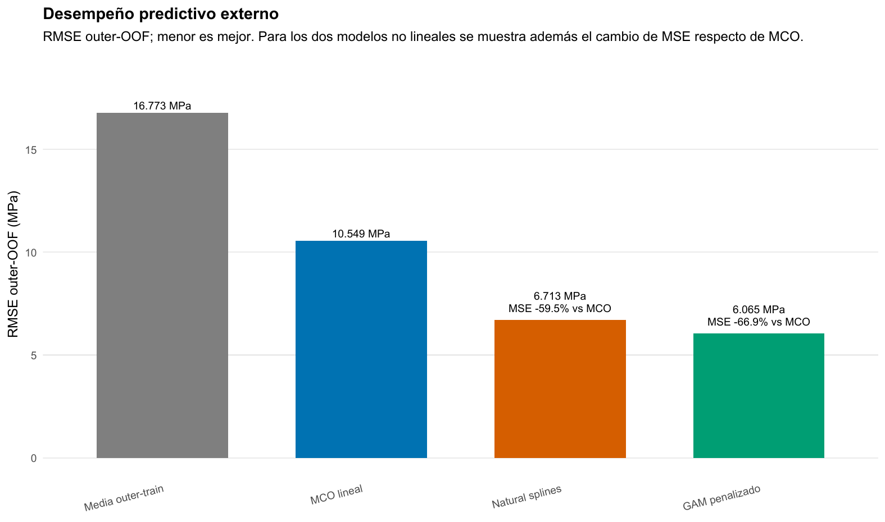
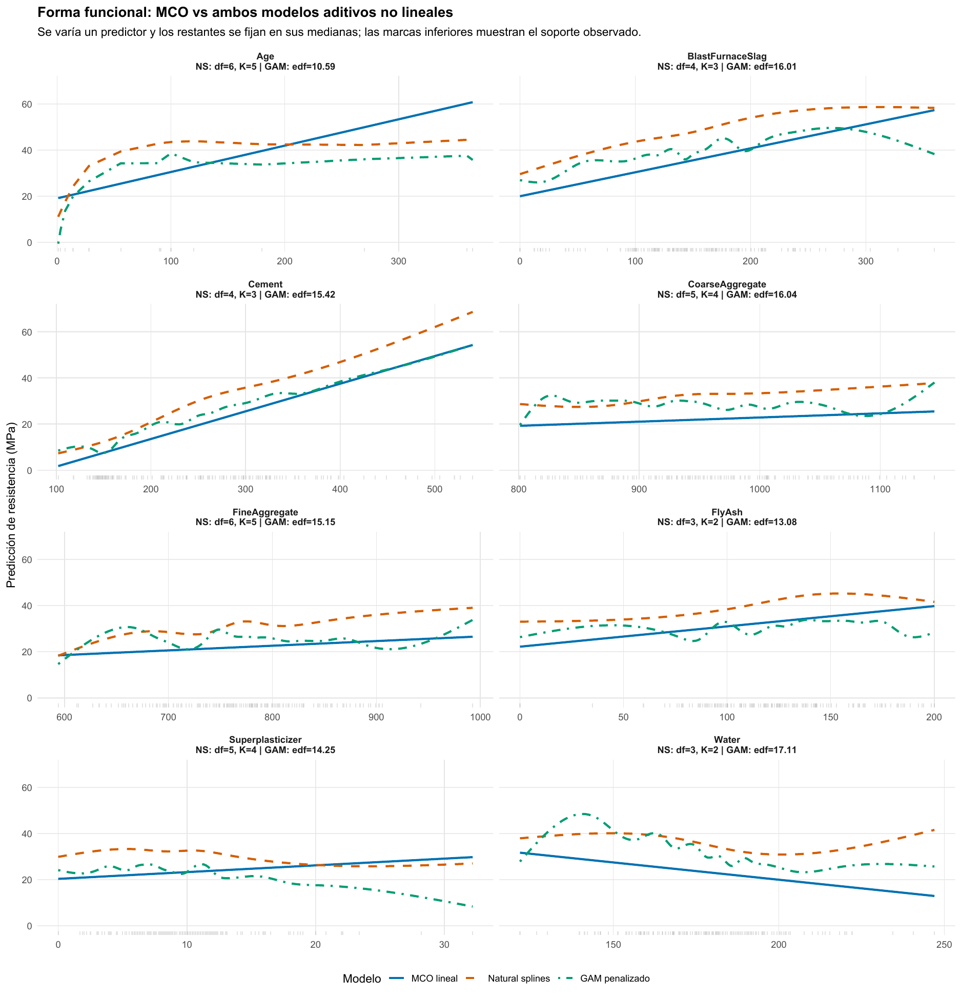
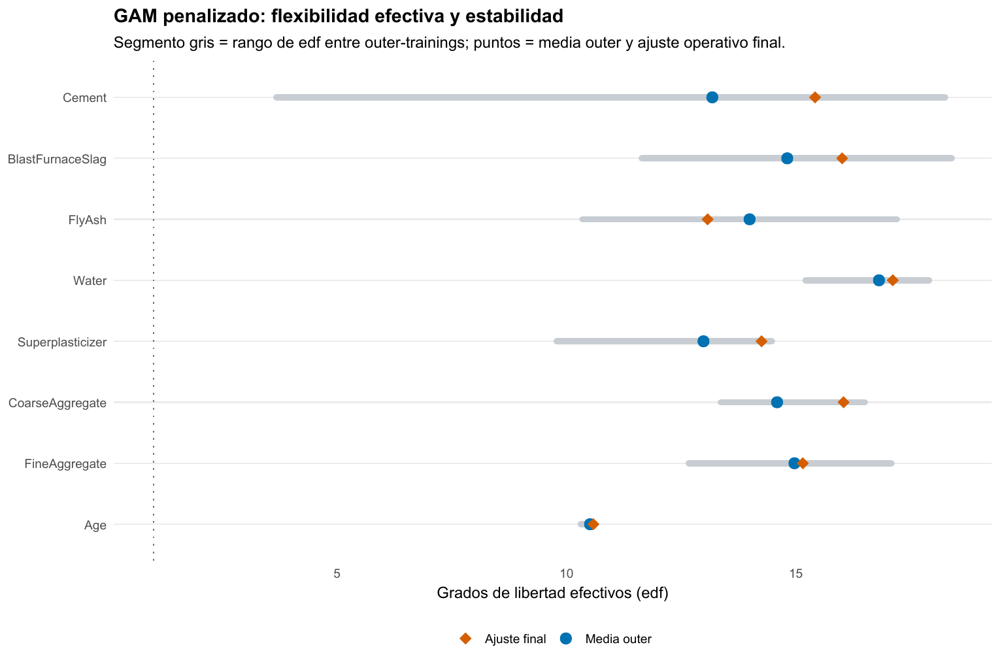

Regresión · Splines · GAM

::: {.hero-box}
::: {.hero-title}
Con los mismos ocho predictores, abandonar la recta reduce el RMSE externo de 10,55 a 6,06 MPa. La ganancia aparece porque los datos sostienen formas aditivas no lineales, no porque se agreguen variables.
:::
::: {.hero-sub}
Concrete permite responder una pregunta práctica: cuándo la flexibilidad compra predicción real y cómo evitar que una curva que luce convincente sea solo sobreajuste.
:::
:::

:::: {.metric-grid}
::: {.metric-card}
::: {.metric-label}
Muestra
:::
::: {.metric-value}
1.030
:::
::: {.metric-note}
Mezclas de concreto; siete ingredientes, edad de ensayo y resistencia en MPa.
:::
:::
::: {.metric-card}
::: {.metric-label}
Unidad protegida
:::
::: {.metric-value}
427 recetas
:::
::: {.metric-note}
181 se repiten: una receta nunca se divide entre entrenamiento y evaluación.
:::
:::
::: {.metric-card}
::: {.metric-label}
RMSE MCO
:::
::: {.metric-value}
10,55 MPa
:::
::: {.metric-note}
Referencia lineal con los mismos ocho predictores.
:::
:::
::: {.metric-card}
::: {.metric-label}
RMSE GAM
:::
::: {.metric-value}
6,06 MPa
:::
::: {.metric-note}
66,9 % menos MSE que MCO sobre predicciones externas.
:::
:::
::::

## La pregunta es cuándo una recta empieza a perder información

El objetivo es predecir la resistencia a compresión de una mezcla de concreto. **Concrete**, del paquete `AppliedPredictiveModeling`, registra siete ingredientes, la edad del ensayo y la resistencia en MPa. MCO impone que cada predictor tenga una pendiente constante. Esa forma puede ser demasiado restrictiva si, por ejemplo, el aumento de resistencia es rápido al comienzo de la maduración y luego se aplana, o si el agua altera la resistencia con pendientes diferentes según su nivel.

La comparación mantiene exactamente los mismos ocho predictores y cambia solo la forma funcional. La media del entrenamiento es el benchmark sin información; MCO es el benchmark lineal; natural splines y un GAM penalizado ofrecen dos maneras distintas de introducir curvatura sin abandonar una estructura aditiva interpretable.

Las curvas describen predicciones condicionales de esta especificación. No son efectos causales de cambiar un ingrediente aislado, ni sustituyen ensayos físicos de formulación.

## La receta, y no una fila, define la prueba externa

Muchas observaciones comparten la misma composición de siete ingredientes y difieren, por ejemplo, en la edad de ensayo. Una partición fila a fila podría dejar una formulación prácticamente idéntica en entrenamiento y evaluación. Para plantear una prueba más exigente, los cinco folds externos se agrupan por receta: una formulación completa queda en un único fold.

Natural splines selecciona dentro de cada entrenamiento externo los grados de libertad de sus ocho bases mediante CV interna también agrupada por receta. La búsqueda por coordenadas explora $df\in\{3,4,5,6\}$ para cada predictor desde dos puntos iniciales. En cada paso cambia una base y reevalúa el modelo aditivo completo; es una búsqueda operativa, no un recorrido exhaustivo de las 65.536 combinaciones. Los dos inicios y la convergencia rápida —entre dos y tres ciclos en las cinco vueltas— reducen el riesgo de una solución puramente accidental, pero no convierten el procedimiento en una búsqueda global.

El GAM penalizado parte de bases más amplias y selecciona conjuntamente sus ocho suavidades por GCV dentro del entrenamiento externo. GCV equilibra ajuste y flexibilidad efectiva: una reducción del residuo debe compensar el costo de conservar más curvatura. El fold externo no participa en esa decisión.

Cada una de las 1.030 predicciones **outer-OOF** se genera para una receta que no participó ni en el ajuste ni en la selección de complejidad que produjo esa predicción. Por eso el RMSE externo evalúa el procedimiento entero, no una curva elegida mirando su propia prueba.

## Dos controles de flexibilidad, una misma disciplina de evaluación

::: {.table-box}
| Modelo | Cómo permite curvatura | Cómo limita complejidad |
|---|---|---|
| MCO | No la permite | Pendiente constante por predictor |
| Natural splines | Bases cúbicas naturales | Elige $df$ discretos mediante CV interna |
| GAM penalizado | Bases cúbicas de mayor capacidad | GCV penaliza rugosidad y deja edf continuos |
:::

Un `df` mayor agrega capacidad discreta a una base de natural splines. En cambio, el GAM parte de una capacidad nominal y deja que la penalización decida qué fracción queda activa. Sus **grados de libertad efectivos** (edf) no son knots ni un conteo de columnas: resumen la flexibilidad que persiste después de suavizar. Un edf cercano a 1 sería aproximadamente lineal; aquí los edf finales son mucho mayores para la mayoría de los predictores.

La configuración operativa de natural splines, obtenida después de cerrar la evaluación externa, muestra cómo se distribuye la complejidad discreta:

::: {.table-box}
| Predictor | `df` final | Evidencia de estabilidad entre entrenamientos |
|---|---:|---|
| Cemento | 4 | complejidad variable |
| Escoria | 4 | `df = 6` en los cinco outer-training; baja en el ajuste final |
| Ceniza volante | 3 | `df = 3` en todas las vueltas y en el final |
| Agua | 3 | base final contenida |
| Superplastificante | 5 | curvatura intermedia-alta |
| Agregado grueso | 5 | curvatura intermedia-alta |
| Agregado fino | 6 | extremo superior de la grilla final |
| Edad | 6 | `df = 5` o `6` en todas las vueltas |
:::

La suma final es 36 columnas de base más un intercepto. No debe compararse directamente con la suma de edf del GAM penalizado: natural splines elige una dimensión disponible y luego ajusta sin penalización adicional; el GAM puede utilizar parcialmente cada dirección mediante suavizado continuo.

## La mejora aparece fuera de muestra y es material

::: {.table-box}
| Modelo | MSE | RMSE | MAE | $R^2$ outer-OOF |
|---|---:|---:|---:|---:|
| GAM penalizado | **36,784** | **6,065** | **4,713** | **0,8681** |
| Natural splines | 45,068 | 6,713 | 5,277 | 0,8384 |
| MCO lineal | 111,287 | 10,549 | 8,363 | 0,6009 |
| Media outer-training | 281,349 | 16,773 | 13,515 | −0,0091 |
:::

{#fig-concrete-desempeno fig-alt="RMSE outer-OOF: media 16,773 MPa; MCO 10,549; natural splines 6,713; GAM penalizado 6,065. Natural splines reduce el MSE frente a MCO 59,5 % y GAM penalizado 66,9 %." width="100%"}

Los predictores ya aportan señal bajo MCO: frente a la media, reducen el MSE 60,45 %. Pero la comparación decisiva es MCO contra formas no lineales. Natural splines reduce su MSE 59,5 % y el GAM penalizado 66,9 %. El GAM también baja el MSE 18,4 % frente a natural splines, equivalente a una reducción de 0,65 MPa —9,7 %— en RMSE. La magnitud y el carácter externo de esa mejora sostienen que la recta dejaba estructura predictiva sin representar.

La ventaja de los modelos no lineales aparece repetidamente al cambiar las recetas reservadas, no en un único fold conveniente. Esa estabilidad importa porque los folds tienen tamaños distintos: se priorizó mantener recetas completas, no fabricar cinco bloques de filas exactamente iguales.

## Las funciones estimadas muestran dónde estaba la restricción

{#fig-concrete-perfiles fig-alt="Ocho perfiles de predicción comparan MCO, natural splines y GAM penalizado para edad, ingredientes y agregados. Las curvas no lineales muestran cambios de pendiente, aplanamientos y relaciones no monotónicas que MCO no puede representar." width="100%"}

Los perfiles son cortes de la superficie aditiva: al variar una variable, las otras siete se fijan en sus medianas. La edad resume el caso más claro: la resistencia aumenta con fuerza a edades bajas y luego se aplana, mientras MCO extiende una pendiente constante. Cemento y escoria muestran pendientes que cambian; agua presenta una relación negativa marcadamente no lineal. Superplastificante y los agregados incorporan zonas débiles o no monotónicas que una única pendiente tampoco puede describir. En los extremos, las marcas de soporte obligan a no sobrerreaccionar a oscilaciones locales.

La figura también separa dos ideas. Natural splines y GAM pueden producir formas diferentes sin que una deba interpretarse como la función verdadera. Su utilidad aquí proviene de que esa flexibilidad se evaluó sobre recetas reservadas y redujo el error externo, no de que una curva sea visualmente más elaborada.

## La complejidad se aprende y se diagnostica

{#fig-concrete-edf fig-alt="Los edf finales del GAM van de 10,59 para edad a 17,11 para agua. Los rangos entre outer-trainings muestran que la flexibilidad no es idéntica en cada muestra." width="100%"}

El ajuste operativo final usa $k=20$ para los ingredientes y $k=12$ para edad. Los edf finales son 15,42 para cemento, 16,01 para escoria, 13,08 para ceniza volante, 17,11 para agua, 14,25 para superplastificante, 16,04 para agregado grueso, 15,15 para agregado fino y 10,59 para edad. La capacidad nominal no quedó vacía, y los edf altos son coherentes con la mejora predictiva.

La figura muestra también que la flexibilidad cambia entre entrenamientos: cemento es el componente más variable —cae a 3,68 edf en un fold y supera 14 en los otros cuatro—, mientras edad permanece cerca de 10,3–10,6. Esa diferencia evita hablar de una complejidad fija aprendida de una vez: GCV vuelve a decidir en cada muestra de entrenamiento.

`k.check()` y concurvity son diagnósticos complementarios para revisar si una base quedó demasiado limitada o si smooths distintos comparten patrón. Edad utiliza 10,59 de 11 grados disponibles después de la restricción del smooth y agua 17,11 de 19; son las funciones que más justifican cautela al interpretar detalles finos. Concurvity recuerda además que ingredientes que se mueven conjuntamente pueden compartir señal. Ninguno reordena los modelos: la evidencia principal sigue siendo el error outer-OOF.

Los residuos externos completan esa lectura. MCO conserva una forma sistemática y comprime parte de las resistencias altas; natural splines elimina buena parte del patrón y el GAM lo reduce todavía más, aunque no desaparece en los extremos. La mejora no autoriza a afirmar que el GAM recuperó la función verdadera: muestra que redujo un sesgo de forma bajo una restricción aditiva todavía exigente.

::: {.section-box}
### Qué decisión queda respaldada

Para predecir resistencia en nuevas formulaciones, el GAM penalizado es la alternativa mejor respaldada bajo esta arquitectura de validación. Natural splines también mejora de forma grande sobre MCO, por lo que la conclusión robusta es primero que la linealidad era demasiado restrictiva. La ventaja adicional del GAM justifica elegir su suavizado continuo en esta aplicación, no asumir que todo problema de regresión necesita un modelo más flexible.
:::

La evaluación y la configuración operativa permanecen separadas. Después de comparar las 1.030 predicciones externas, natural splines vuelve a seleccionar su vector de `df` con una CV agrupada sobre toda la muestra y el GAM vuelve a elegir suavidades por GCV. Esos ajustes preparan una regla para una receta nueva; no producen una segunda estimación independiente de generalización ni reemplazan los RMSE externos.

La conclusión depende de una pérdida cuadrática, una respuesta en niveles y una estructura aditiva. No se modelan interacciones entre ingredientes; la búsqueda de splines es greedy; y la extrapolación fuera del soporte de recetas observadas requiere cautela. Un mejor ajuste in-sample, por sí solo, no habría resuelto ninguna de esas limitaciones.

[OJ](t08b_oj.qmd) ofrece el contraste: allí el GAM recibe la misma oportunidad de curvar, pero la evidencia externa y los edf indican que la forma simple ya era suficiente.

::: {.small-note}
**Fuente:** informe curado «Taller 08A: Splines y GAM para regresión con Concrete». Figuras originales del informe convertidas a PNG para este análisis; no se generaron estimaciones nuevas.
:::
