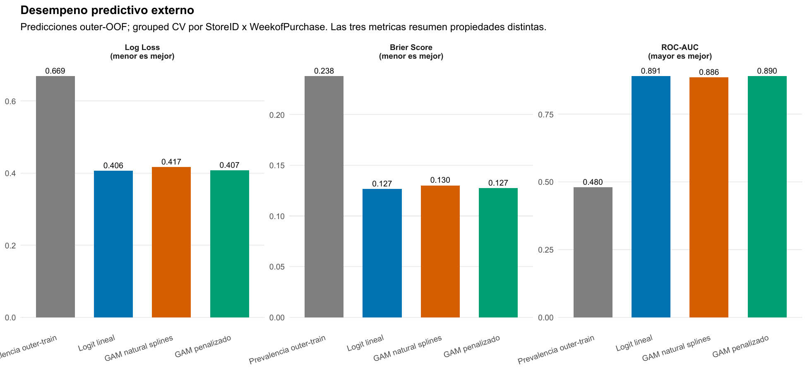
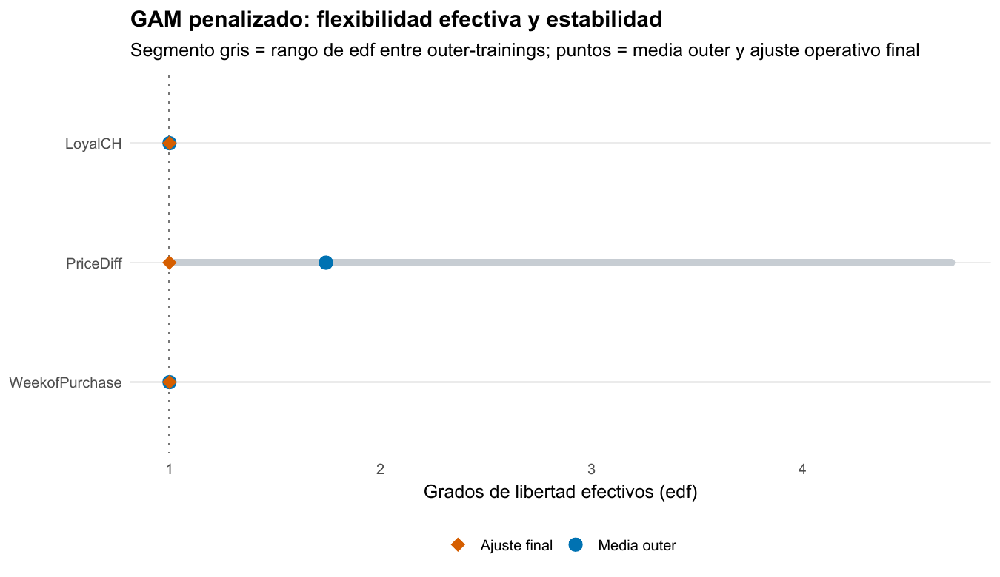
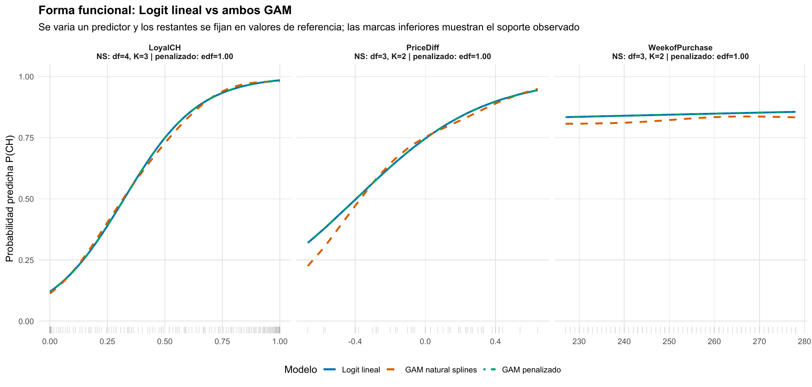

[Machine Learning](../index.qmd) / [No linealidad y modelos aditivos](../index.qmd#no-linealidad-y-modelos-aditivos)

Clasificación binaria · GAM logístico · Penalización

::: {.hero-box}
::: {.hero-title}
Permitir relaciones no lineales no obliga a utilizarlas: Logit y GAM penalizado empatan casi por completo, y la penalización devuelve los tres smooths a formas esencialmente lineales.
:::
::: {.hero-sub}
OJ muestra el valor de una flexibilidad bien controlada: dar al modelo la posibilidad de curvar y aceptar una especificación simple cuando la evidencia no recompensa complejidad adicional.
:::
:::

:::: {.metric-grid}
::: {.metric-card}
::: {.metric-label}
Problema binario
:::
::: {.metric-value}
CH vs MM
:::
::: {.metric-note}
1.070 compras: 653 Citrus Hill y 417 Minute Maid.
:::
:::
::: {.metric-card}
::: {.metric-label}
Grupos protegidos
:::
::: {.metric-value}
250
:::
::: {.metric-note}
Cada combinación tienda–semana queda completa en un único fold externo.
:::
:::
::: {.metric-card}
::: {.metric-label}
Log-loss Logit
:::
::: {.metric-value}
0,4060
:::
::: {.metric-note}
GAM penalizado: 0,4072; natural splines: 0,4168.
:::
:::
::: {.metric-card}
::: {.metric-label}
edf finales
:::
::: {.metric-value}
≈ 1,00
:::
::: {.metric-note}
Para lealtad, diferencia de precio y semana de compra.
:::
:::
::::

## El problema es estimar probabilidades, no solo acertar una etiqueta

La tarea es clasificar cada compra como **Citrus Hill (CH)** o **Minute Maid (MM)**. **OJ** contiene 1.070 compras y combina lealtad a CH (`LoyalCH`), diferencia de precio (`PriceDiff`), semana, tienda y promociones. El objetivo principal es producir probabilidades de CH que funcionen fuera de muestra; convertirlas en una etiqueta con umbral 0,5 es una decisión posterior.

Logit lineal es el benchmark: lealtad, diferencia de precio y semana entran como rectas en la escala de log-odds. Natural splines reemplaza esas rectas por bases de complejidad discreta. El GAM penalizado usa tres smooths con capacidad nominal $k=10$ y deja que REML decida cuánto de esa capacidad conservar.

La pregunta no es si una curva puede dibujarse. Es si la curvatura aporta probabilidades más útiles después de que el modelo enfrenta compras y contextos que no vio durante el aprendizaje.

## La validación protege contextos comerciales completos

Los cinco folds externos agrupan cada combinación `StoreID × WeekofPurchase`. Así, las compras de una misma tienda y semana no se reparten entre entrenamiento y evaluación. Es una prueba más exigente que separar filas al azar, aunque no equivale a una validación puramente temporal hacia semanas futuras.

Dentro de cada entrenamiento externo, natural splines vuelve a seleccionar una de 64 configuraciones de grados de libertad mediante CV agrupada interna. El GAM penalizado selecciona sus parámetros de suavizado por REML solo con ese entrenamiento. Las 1.070 probabilidades **outer-OOF** resultantes evalúan la regla completa: «aprender complejidad → ajustar → asignar probabilidad al grupo reservado».

La búsqueda de natural splines es exhaustiva porque solo tres predictores reciben `df` entre 3 y 6. A diferencia de Concrete, no hace falta una búsqueda por coordenadas: se comparan las \(4^3=64\) combinaciones completas bajo log-loss. La selección resultante se concentra en el extremo parsimonioso de esa grilla.

::: {.table-box}
| Outer fold | `df` LoyalCH | `df` PriceDiff | `df` semana | Log-loss interno |
|---:|---:|---:|---:|---:|
| 1 | 4 | 3 | 3 | 0,4318 |
| 2 | 3 | 3 | 3 | 0,4000 |
| 3 | 3 | 3 | 3 | 0,4073 |
| 4 | 3 | 3 | 6 | 0,4295 |
| 5 | 3 | 3 | 3 | 0,4000 |
:::

`PriceDiff` queda en `df = 3` en las cinco vueltas; `LoyalCH` sube a 4 una vez y la semana llega a 6 una vez. Elegir `df = 3` significa usar la base menos flexible de la grilla, pero sigue siendo un natural spline: no equivale a una recta. Esa diferencia será central frente al GAM penalizado, cuyo suavizado sí puede contraer el componente hasta edf cercano a 1.

## Logit conserva una ventaja pequeña en las métricas que importan

::: {.table-box}
| Modelo | Log-loss | Brier | ROC-AUC | Accuracy a 0,5 |
|---|---:|---:|---:|---:|
| Logit lineal | **0,4060** | **0,1267** | **0,8909** | **82,62 %** |
| GAM penalizado | 0,4072 | 0,1274 | 0,8900 | 82,34 % |
| GAM natural splines | 0,4168 | 0,1301 | 0,8855 | 81,96 % |
| Prevalencia outer-training | 0,6691 | 0,2381 | 0,4796 | 61,03 % |
:::

{#fig-oj-metricas fig-alt="Logit tiene Log Loss 0,4060, Brier 0,1267 y AUC 0,8909; GAM penalizado, 0,4072, 0,1274 y 0,8900; natural splines, 0,4168, 0,1301 y 0,8855." width="100%"}

Log-loss castiga con fuerza una probabilidad muy segura que resulta equivocada; Brier evalúa el error cuadrático de la probabilidad; AUC evalúa ordenamiento, no calibración. Logit queda primero en las tres. Sin embargo, la diferencia frente a GAM penalizado es de solo 0,0012 en log-loss y 0,0009 en AUC: la conclusión no es que el GAM fracase, sino que la flexibilidad adicional no entrega una mejora apreciable.

Con umbral fijo 0,5, Logit alcanza sensibilidad de CH de 87,75 %, especificidad de MM de 74,58 % y accuracy balanceada de 81,16 %. Son métricas complementarias de una regla de decisión concreta. No deben desplazar a log-loss y Brier cuando la pregunta central es la calidad de probabilidades.

Las diferencias tampoco descansan en un único fold externo: Logit y GAM penalizado permanecen próximos al cambiar los grupos reservados, mientras natural splines tiende a quedar algo por encima en log-loss. Los folds no son períodos consecutivos ni réplicas independientes; esta consistencia sirve como diagnóstico, mientras la comparación principal se calcula sobre las 1.070 probabilidades concatenadas.

## Ranking, calibración y clasificación responden preguntas distintas

Las AUC casi idénticas muestran que Logit y GAM penalizado ordenan las compras de manera muy parecida. La pequeña ventaja de Logit en log-loss y Brier proviene de la magnitud de las probabilidades, no de una separación radicalmente mejor entre clases.

La calibración por grupos de probabilidad sigue de cerca la diagonal para los tres modelos. Natural splines presenta desviaciones algo mayores en zonas intermedias, pero no un fracaso general de calibración. El informe estima además intercepto y pendiente de calibración sobre las probabilidades externas; ese diagnóstico se calcula después de predecir y no se usa para recalibrar ni alterar el ranking.

Accuracy, sensibilidad y especificidad agregan una tercera capa: describen qué ocurre al convertir la probabilidad en acción con umbral 0,5. Cambiar el costo comercial de confundir CH con MM podría cambiar ese umbral sin modificar el modelo probabilístico. Por eso una misma probabilidad puede evaluarse bien como ranking y, al mismo tiempo, requerir otra regla de decisión.

## Una base rica puede terminar en un modelo simple

El GAM no recibe una forma lineal impuesta: cada smooth parte con $k=10$ y REML cobra por curvatura. Los grados de libertad efectivos muestran qué parte de esa capacidad quedó realmente activa. Un edf próximo a 1 implica una relación casi lineal en la escala logit.

{#fig-oj-edf fig-alt="LoyalCH y WeekofPurchase permanecen en edf 1. PriceDiff llega a 4,71 en un entrenamiento externo, pero su ajuste final vuelve a edf 1." width="100%"}

En cuatro de los cinco entrenamientos externos, los tres smooths quedan cerca de 1. La excepción es `PriceDiff` en el fold 2, donde alcanza edf 4,71. Esa curvatura no reaparece en los otros entrenamientos ni en el ajuste operativo final: los tres edf finales son aproximadamente 1,0001. El resultado incómodo —una muestra sí pidió curvatura— no contradice la conclusión; obliga a expresarla como falta de curvatura persistente, no como ausencia absoluta.

Esto aclara una diferencia importante. El ajuste final describe el modelo disponible para una compra futura después de usar las 1.070 observaciones. Las métricas outer-OOF describen el procedimiento que volvió a seleccionar suavidad cinco veces. Por eso el GAM final puede verse lineal sin que sus métricas externas sean idénticas a las de Logit.

`k.check()` y concurvity son diagnósticos del ajuste final: revisan capacidad de base y solapamiento entre smooths, respectivamente. No sustituyen la comparación externa ni son una regla automática para pedir más complejidad. Con $k=10$ y edf cercanos a 1, las bases quedan muy lejos de su capacidad nominal: la penalización tuvo margen para curvar y no encontró una curvatura estable que conservar.

## Los perfiles muestran una señal simple, no ausencia de señal

{#fig-oj-perfiles fig-alt="La probabilidad de CH aumenta fuertemente con LoyalCH y PriceDiff; WeekofPurchase es casi plano. Logit y GAM penalizado se superponen; natural splines se aparta levemente, sobre todo donde hay menos soporte." width="100%"}

`LoyalCH` tiene una señal predictiva fuerte: al aumentar la lealtad, sube de forma marcada la probabilidad estimada de CH. `PriceDiff` también eleva esa probabilidad cuando MM se vuelve relativamente más caro. `WeekofPurchase` cambia poco dentro de su rango. Son relaciones informativas aunque no requieran una forma no lineal estable.

Las curvas en escala de probabilidad tienen una forma sigmoide incluso cuando el predictor es lineal en log-odds. Por eso una curva con forma de S no prueba que Logit haya fallado. La superposición entre Logit y GAM penalizado es justamente la consecuencia esperable de edf cercanos a 1. Natural splines se aparta algo más en zonas de menor soporte, especialmente para diferencia de precio, pero esa libertad no mejora las métricas externas.

La configuración operativa de natural splines vuelve a elegir `(4, 3, 3)` mediante CV agrupada sobre las 1.070 observaciones. Su log-loss de tuning final, 0,43086, selecciona la base que quedaría disponible para nuevas compras; no reemplaza el log-loss outer-OOF de 0,4168. El GAM final vuelve a seleccionar sus suavidades por REML y termina con los tres edf en 1,0001. Una cifra describe selección operativa y la otra evaluación externa: mezclarlas produciría una comparación artificial.

::: {.section-box}
### La mejor flexibilidad es la que sabe retirarse

Logit lineal queda apenas por delante en log-loss, Brier y AUC. GAM penalizado llega casi al mismo desempeño y aporta un control útil: muestra que los datos no justifican retener curvatura persistente bajo esta especificación y esta evaluación. La decisión razonable es usar la regla lineal más simple y conservar la validación flexible como evidencia, no como un método descartado por definición.
:::

El alcance es limitado: los modelos son aditivos y no exploran interacciones suaves entre lealtad y precio; el umbral 0,5 no expresa necesariamente el costo comercial correcto; y los grupos tienda–semana no sustituyen una prueba temporal futura. La comparación es predictiva, no causal: no identifica el efecto de modificar un precio o una promoción.

[Concrete](t08a_concrete.qmd) muestra el caso complementario: la misma disciplina de evaluación sí respalda una ganancia material al permitir formas funcionales no lineales.

::: {.small-note}
**Fuente:** informe curado «Taller 08B: GAM logístico con OJ». Figuras originales del informe convertidas a PNG para la pieza; no se generaron estimaciones nuevas.
:::
