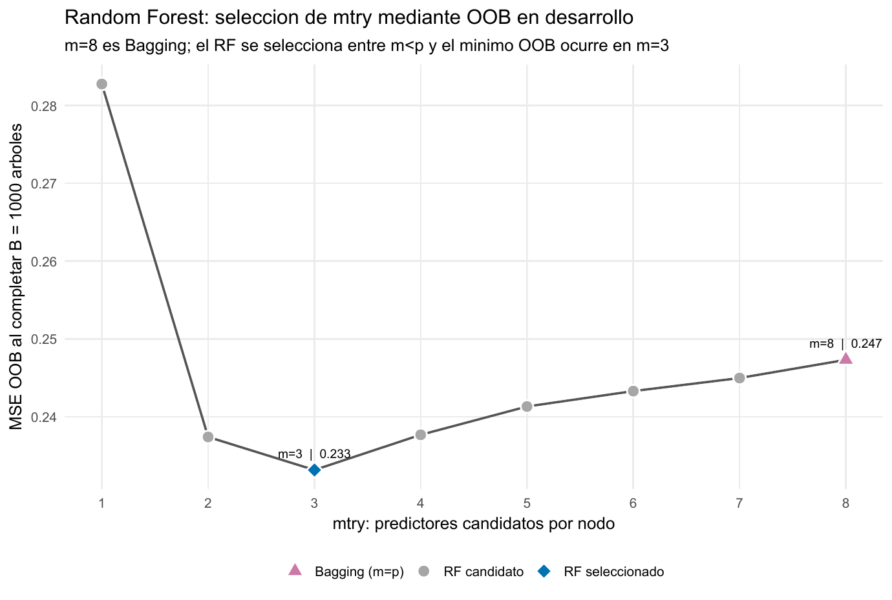
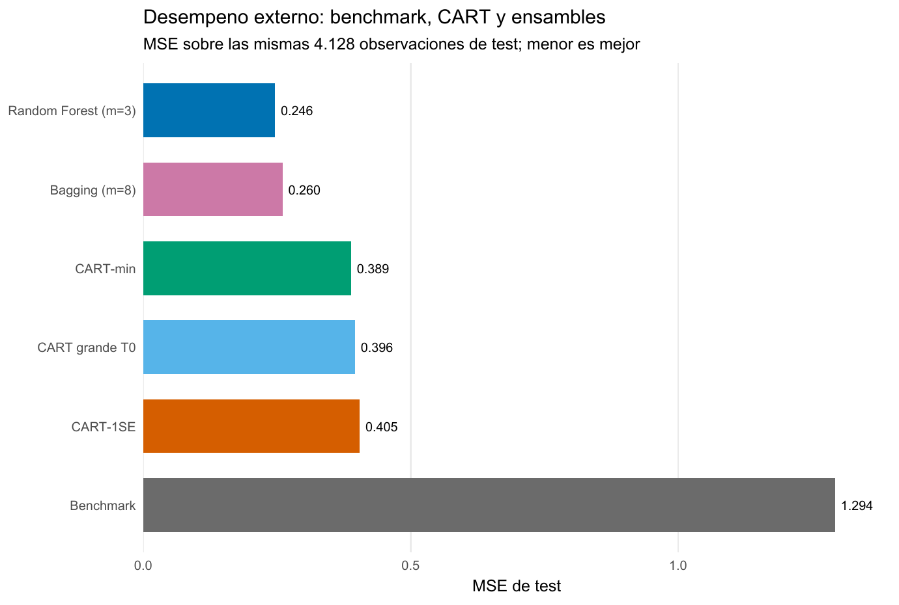

[Machine Learning](../index.qmd) / [Árboles y ensambles](../index.qmd#arboles-y-ensambles)

Regresión · CART · Bagging · Random Forest

::: {.hero-box}
::: {.hero-title}
Un árbol podado predice bien y se puede recorrer; Random Forest reduce todavía más el MSE al promediar y decorrelacionar árboles, a cambio de perder esa lectura única.
:::
::: {.hero-sub}
California Housing permite medir cuándo abandonar una regla interpretable compensa por la estabilidad de un ensamble.
:::
:::

:::: {.metric-grid}
::: {.metric-card}
::: {.metric-label}
Observaciones
:::
::: {.metric-value}
20.640
:::
::: {.metric-note}
Grupos censales; ocho predictores y valor mediano de vivienda.
:::
:::
::: {.metric-card}
::: {.metric-label}
Test protegido
:::
::: {.metric-value}
4.128
:::
::: {.metric-note}
El desarrollo reúne las 16.512 observaciones restantes.
:::
:::
::: {.metric-card}
::: {.metric-label}
MSE CART-min
:::
::: {.metric-value}
0,3886
:::
::: {.metric-note}
El subárbol elegido por mínimo de CV.
:::
:::
::: {.metric-card}
::: {.metric-label}
MSE RF
:::
::: {.metric-value}
0,2464
:::
::: {.metric-note}
36,6 % menos MSE que CART-min en el test común.
:::
:::
::::

## Predecir precios exige una referencia fuera de muestra

La tarea es predecir `MedHouseVal`, el valor mediano de vivienda de cada grupo censal de California, expresado en unidades de USD 100.000, a partir de ocho variables demográficas, habitacionales y geográficas. Una regla que repite para todos la media aprendida en desarrollo entrega el punto de comparación: en el test su MSE es 1,2935 y su RMSE equivale a unos USD 113.733.

El diseño reserva 4.128 observaciones antes de aprender cualquier estructura. Las otras 16.512 forman desarrollo: allí se crecen árboles, se selecciona la poda por validación cruzada y se elige `mtry` mediante observaciones *out-of-bag* (OOB). El test se abre una sola vez para comparar decisiones ya cerradas.

## Un árbol convierte el espacio en reglas locales

CART divide recursivamente el espacio de predictores y asigna a cada hoja la media de los casos que llegan a ella. La primera división resume bien el mecanismo: `MedInc < 5,07535` separa 13.091 observaciones con valor medio 1,739 de otras 3.421 con media 3,339. El corte reduce el RSS de la raíz en 6.944,0 porque crea dos grupos grandes con respuestas muy distintas.

Cada predicción puede recorrerse como una secuencia de condiciones, pero dentro de una hoja permanece constante. Esa transparencia tiene un costo: un cambio pequeño en la muestra puede alterar un corte temprano y, por propagación, muchas reglas posteriores.

## Crecer primero y podar después

Con guardas mínimas fijadas de antemano, el árbol grande $T_0$ alcanza 1.404 hojas y profundidad 23. Su RSS de entrenamiento cae de 22.143,6 a 2.878,9, una mejora que todavía no dice cuánto generaliza. $T_0$ funciona como árbol madre de una ruta de subárboles: la poda elimina ramas que aportan poco ajuste por unidad de complejidad.

La validación cruzada de cinco folds reconstruye el aprendizaje dentro de cada fold y selecciona sobre MSE. CART-min conserva 375 hojas y logra MSE-CV 0,3688. La regla 1SE acepta MSE-CV 0,3778 —por debajo del umbral 0,3779— y reduce el árbol a 194 hojas. Esa regla formaliza una preferencia por parsimonia; no prueba que ambos riesgos sean iguales.

En el test, CART-min obtiene MSE 0,3886. El árbol grande queda apenas detrás, con 0,3959, y CART-1SE llega a 0,4047. La poda mejora modestamente al árbol grande bajo la pérdida usada para seleccionar, mientras que la fuerte simplificación 1SE paga un costo pequeño y visible. Ninguno de esos resultados elimina la inestabilidad estructural de depender de un solo árbol.

## El ensamble trata la inestabilidad como materia prima

Bagging ajusta árboles profundos sobre muestras bootstrap y promedia sus predicciones. Así amortigua las variaciones particulares de cada árbol sin buscar una única estructura definitiva. Random Forest conserva ese promedio y añade otra perturbación: en cada nodo solo deja competir a `mtry` predictores elegidos al azar.

Con ocho variables, Bagging corresponde a $m=8$. La búsqueda OOB del bosque muestra el compromiso completo: restringir demasiado debilita los árboles ($m=1$, MSE-OOB 0,2828); permitir dos o tres variables reduce con fuerza el error ($m=2$, 0,2374; $m=3$, **0,2331**); al acercarse otra vez a Bagging, el error sube ($m=4$, 0,2377; $m=8$, 0,2473).

{#fig-california-mtry fig-alt="El MSE OOB baja desde mtry 1 a un mínimo de 0,233 en mtry 3 y aumenta gradualmente hasta 0,247 con Bagging mtry 8." width="100%"}

El mínimo en $m=3$ respalda una combinación concreta: árboles que todavía encuentran cortes informativos, pero que repiten algo menos las mismas jerarquías. El diagnóstico acompaña esa lectura: la correlación media entre predicciones de árboles individuales baja de 0,8797 en Bagging a 0,8730 en Random Forest. La diferencia es moderada; el bosque no necesita árboles independientes para beneficiarse.

Se utilizaron 1.000 árboles porque las curvas OOB ya estaban estables: entre 500 y 1.000 árboles, el MSE-OOB de RF pasa de 0,2328 a 0,2331 y el de Bagging permanece prácticamente en 0,2473. Esa meseta indica estabilidad del promedio frente a más realizaciones aleatorias; no reemplaza la evaluación externa.

## La comparación externa separa los dos saltos

::: {.table-box}
| Modelo | MSE test | RMSE test | MAE test | $R^2$ test |
|---|---:|---:|---:|---:|
| Media de desarrollo | 1,2935 | 1,1373 | 0,8996 | -0,0001 |
| CART grande | 0,3959 | 0,6292 | 0,4153 | 0,6939 |
| CART-min | 0,3886 | 0,6234 | 0,4184 | 0,6995 |
| CART-1SE | 0,4047 | 0,6361 | 0,4335 | 0,6871 |
| Bagging | 0,2603 | 0,5102 | 0,3287 | 0,7987 |
| Random Forest | **0,2464** | **0,4964** | **0,3222** | **0,8095** |
:::

{#fig-california-desempeno fig-alt="MSE de test: benchmark 1,294; CART-min 0,389; Bagging 0,260 y Random Forest 0,246." width="100%"}

El salto principal ocurre al agregar árboles: Bagging reduce 33,0 % el MSE de CART-min. Random Forest lleva la reducción a 36,6 % respecto de CART-min y mejora 5,35 % adicional frente a Bagging. La evidencia respalda dos mecanismos distintos: primero promediar estabiliza; después restringir predictores reduce algo más la similitud entre árboles.

La comparación entre $T_0$ y CART-min también evita una lectura demasiado simple. El primero obtiene un MAE apenas menor, aunque CART-min gana en MSE, la pérdida usada durante la selección. Distintas métricas penalizan de manera diferente los errores grandes; el criterio de decisión debe definirse antes de mirar cuál favorece a cada modelo.

## Qué información usa el bosque

La importancia por permutación del RF coloca primero a `MedInc`, seguida por `Latitude`, `Longitude` y `AveOccup`. Describe cuánto aumenta el error OOB al romper la información de cada variable. La geografía, por tanto, aporta señal predictiva además del ingreso; no es un simple atributo de visualización.

Esa jerarquía no identifica efectos de intervención. Predictores relacionados pueden sustituirse y repartirse importancia, y un bosque no ofrece una regla global única como la de CART. La ganancia de desempeño desplaza la interpretación desde un camino de cortes hacia diagnósticos agregados.

::: {.section-box}
### Decisión bajo el criterio fijado

Random Forest con `mtry = 3` y 1.000 árboles es la opción preferible si el objetivo es minimizar MSE en observaciones comparables a este test. CART-min conserva valor cuando explicar una regla individual compensa un RMSE mayor: aproximadamente USD 62.340 frente a USD 49.640 del bosque.
:::

La conclusión está condicionada a una única partición aleatoria de grupos censales. La respuesta acumula 965 casos en su máximo observado, el test no representa una región geográfica completamente nueva y los árboles no extrapolan suavemente fuera del soporte. Las métricas y las importancias son predictivas, no causales.

[Spam](t09b_spam.qmd) lleva la misma secuencia a clasificación: allí el score del ensamble debe convertirse explícitamente en una decisión y en tipos de error.

::: {.small-note}
**Fuente:** informe curado «Taller 09A: CART, Bagging y Random Forest con California Housing». Figuras originales del informe convertidas a PNG; no se generaron estimaciones nuevas.
:::
