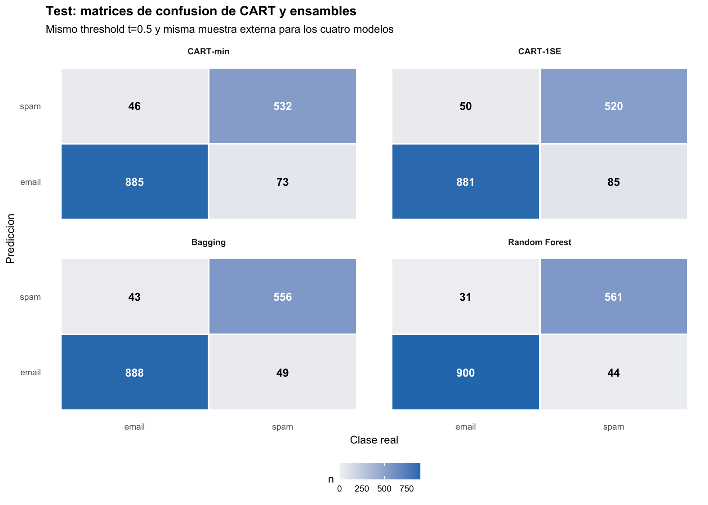
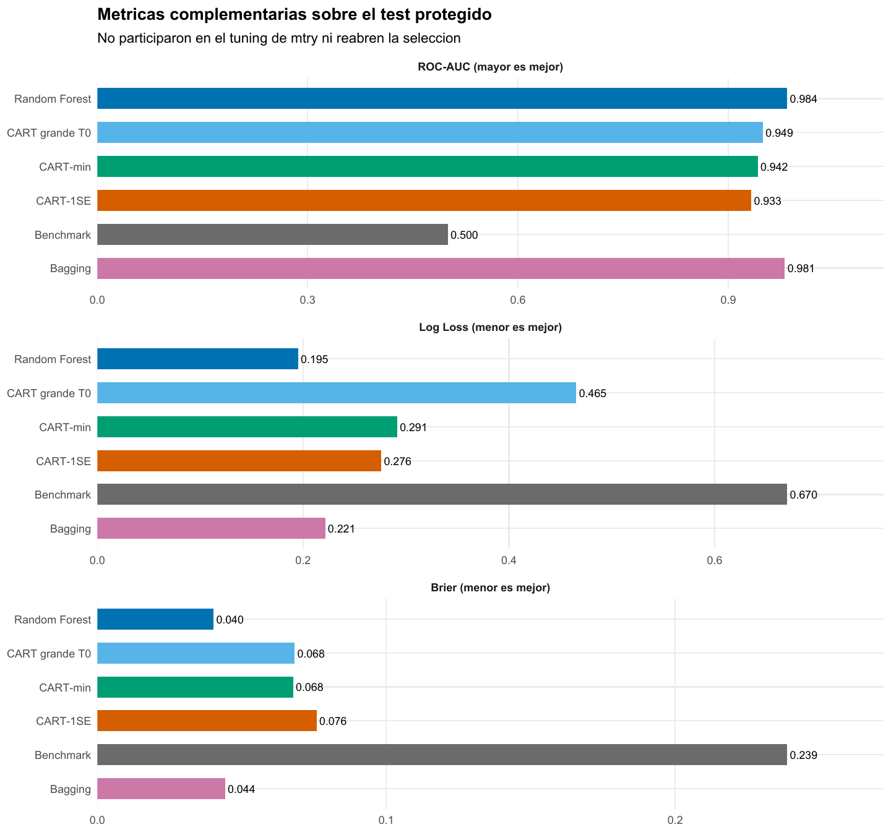

Clasificación binaria · CART · Bagging · Random Forest

::: {.hero-box}
::: {.hero-title}
Random Forest reduce falsos positivos y falsos negativos en el mismo test. El avance no es solo más accuracy: el ensamble mejora el score antes de que el umbral lo convierta en decisión.
:::
::: {.hero-sub}
Spam muestra cómo el promedio de árboles estabiliza un clasificador y por qué calidad probabilística, umbral y tipos de error deben leerse por separado.
:::
:::

:::: {.metric-grid}
::: {.metric-card}
::: {.metric-label}
Mensajes
:::
::: {.metric-value}
4.601
:::
::: {.metric-note}
57 predictores de palabras, caracteres y mayúsculas.
:::
:::
::: {.metric-card}
::: {.metric-label}
Test protegido
:::
::: {.metric-value}
1.536
:::
::: {.metric-note}
Desarrollo estratificado: 3.065 mensajes.
:::
:::
::: {.metric-card}
::: {.metric-label}
Error RF
:::
::: {.metric-value}
0,0488
:::
::: {.metric-note}
75 errores, frente a 119 de CART-min.
:::
:::
::: {.metric-card}
::: {.metric-label}
ROC-AUC RF
:::
::: {.metric-value}
0,9841
:::
::: {.metric-note}
El score separa spam y email antes del threshold.
:::
:::
::::

## El problema tiene dos salidas: score y decisión

La tarea es clasificar 4.601 mensajes como spam o email a partir de 57 frecuencias de palabras, caracteres y secuencias de mayúsculas. La partición estratificada reserva 1.536 correos para test —931 emails y 605 spam— y deja 3.065 para desarrollo. Allí se aprende toda la estructura antes de mirar las respuestas protegidas.

Un CART asigna a cada hoja la proporción de spam observada entre los correos que llegaron a ella. Esa proporción es un score; recién el umbral $t=0,5$ la transforma en clase. Separar ambos objetos permite preguntar dos cosas distintas: qué tan bien ordena el modelo los mensajes y qué errores produce una regla operativa concreta.

El benchmark muestra por qué accuracy no alcanza. Si se clasifica todo como email se acierta 60,6 % del test, pero no se detecta un solo spam: sensibilidad 0 y *balanced accuracy* 0,5.

## Un árbol legible también puede ser frágil

La primera partición de CART es `char_freq_dollar < 0,0555`. En desarrollo, el corte separa un grupo de 2.309 mensajes con 23,6 % de spam de otro de 756 con 87,8 %. La reducción de impureza Gini es 0,1535. El resultado hace visible cómo una regla local organiza las clases, aunque no implica que ese carácter sea una causa del spam.

El árbol grande $T_0$ llega a 51 hojas, profundidad 17 y error de entrenamiento 5,45 %. Su complejidad y su ajuste interno no bastan para adoptarlo. La validación cruzada estratificada de cinco folds reconstruye el aprendizaje en cada partición y elige cuánto podar mediante error 0–1:

::: {.table-box}
| Regla | Hojas | Profundidad | Error CV | Error test |
|---|---:|---:|---:|---:|
| CART grande $T_0$ | 51 | 17 | — | 0,0885 |
| CART-min | 25 | 9 | **0,0917** | **0,0775** |
| CART-1SE | 13 | 6 | 0,0940 | 0,0879 |
:::

CART-1SE reduce casi a la mitad las hojas de CART-min y permanece bajo el umbral 1SE de 0,0951. Es una elección de parsimonia, no evidencia de igualdad estadística. En test, CART-min logra el menor error de los árboles. $T_0$ detecta algo más de spam, pero a costa de 71 falsos positivos frente a 46 de CART-min; la poda cambia tanto el número como el tipo de errores.

## El criterio cambia el ranking de los CART

Con $t=0,5$, CART-min gana en error 0–1 y Brier. Sin fijar un umbral, $T_0$ obtiene el mayor AUC, 0,9494. CART-1SE registra la menor Log Loss, 0,2759, porque produce menos probabilidades extremas equivocadas. En $T_0$, 11 mensajes reciben score 0 o 1 y quedan mal clasificados; esas predicciones seguras y erróneas reciben una penalización especialmente alta.

No hay contradicción: error 0–1 evalúa la decisión, AUC el ordenamiento y Log Loss/Brier la calidad del score bajo pérdidas diferentes. La poda fue seleccionada con error 0–1; mirar después otra métrica del test no permite reabrir esa decisión.

## El umbral expresa el costo de equivocarse

En desarrollo, las probabilidades fuera de fold de CART-1SE permiten mover $t$ sin tocar el test. Con $t=0,5$ aparecen 108 falsos positivos y 180 falsos negativos. Si el umbral sube, bloquear un email legítimo se vuelve menos frecuente y dejar pasar spam más frecuente. Los tramos planos son propios de un árbol: todas las observaciones de una hoja comparten el mismo score.

El informe reconoce que un falso positivo puede ser especialmente costoso, pero no dispone de una relación cuantificada entre ambos errores. Por eso mantiene $t=0,5$ en lugar de inventar una matriz de costos. En producción, el modelo y el umbral serían dos decisiones separadas.

## Bagging estabiliza; Random Forest diversifica

Bagging ajusta 750 árboles profundos sobre muestras bootstrap y agrega sus votos. Su score es la proporción de árboles que vota spam: vive entre cero y uno, pero conceptualmente no es la proporción de spam de una hoja CART. Random Forest añade una restricción local: solo `mtry` variables sorteadas pueden competir en cada nodo.

El error OOB de desarrollo selecciona `mtry = 12`, frente a Bagging con las 57 variables disponibles. La trayectoria, sin embargo, es plana alrededor del mínimo:

::: {.table-box}
| `mtry` | Error OOB | AUC OOB | Lectura |
|---:|---:|---:|---|
| 1 | 0,0858 | 0,9723 | Restricción excesiva |
| 5 | 0,0542 | **0,9844** | 166 errores OOB |
| 12 | **0,0538** | 0,9830 | 165 errores; seleccionado |
| 24 | 0,0548 | 0,9801 | Zona aún cercana |
| 57 | 0,0607 | 0,9763 | Bagging |
:::

La regla preespecificada elige 12, pero un solo error separa ese valor de `mtry = 5`. Cuando el procedimiento se reajusta después con los 4.601 casos etiquetados, el mínimo operativo cambia precisamente a 5. Esto confirma que `mtry = 12` no es una constante estructural; la conclusión estable es que restringir bastante la competencia respecto de Bagging funciona bien en esta muestra.

La evidencia sobre el mecanismo va en la dirección esperada. El desacuerdo medio entre árboles sube de 0,0806 en Bagging a 0,0893 en RF y la correlación baja de 0,8311 a 0,8128. Con 750 árboles, la trayectoria OOB ya está en una meseta. Diversidad y estabilidad Monte Carlo son diagnósticos internos; el test sigue siendo la evaluación externa.

## El test muestra una mejora en ambas clases

::: {.table-box}
| Modelo | Error | Sens. spam | Espec. email | AUC | Log Loss | Brier |
|---|---:|---:|---:|---:|---:|---:|
| CART-min | 0,0775 | 0,8793 | 0,9506 | 0,9420 | 0,2913 | 0,0677 |
| CART-1SE | 0,0879 | 0,8595 | 0,9463 | 0,9328 | 0,2759 | 0,0759 |
| Bagging | 0,0599 | 0,9190 | 0,9538 | 0,9807 | 0,2214 | 0,0442 |
| Random Forest | **0,0488** | **0,9273** | **0,9667** | **0,9841** | **0,1950** | **0,0402** |
:::

{#fig-spam-confusion fig-alt="Random Forest registra 31 falsos positivos y 44 falsos negativos, frente a 46 y 73 en CART-min y 43 y 49 en Bagging." width="100%"}

Random Forest comete 75 errores, Bagging 92 y CART-min 119. Frente a CART-min, RF reduce 37,0 % el error total; frente a Bagging, 18,5 %. La mejora no sacrifica una clase: los falsos positivos bajan de 46 a 31 y los falsos negativos de 73 a 44. Con el umbral fijado, preserva más emails legítimos y detecta más spam.

## La mejora también aparece antes del umbral

{#fig-spam-metricas fig-alt="Random Forest logra AUC 0,984, Log Loss 0,195 y Brier 0,040; Bagging queda segundo con 0,981, 0,221 y 0,044." width="100%"}

Los ensambles producen muchos más niveles de score que un CART y separan mejor emails de spam. Random Forest presenta el mejor valor observado en error, sensibilidad, especificidad, AUC, Log Loss y Brier; Bagging queda segundo. La señal es más uniforme que entre los árboles individuales, cuyos rankings dependían de la pérdida elegida.

La importancia por permutación del RF distribuye la señal entre secuencias de mayúsculas y frecuencias como `word_freq_hp`, `char_freq_exclamation`, `word_freq_remove` y `char_freq_dollar`. El predictor del primer corte sigue siendo útil, pero ya no domina una única jerarquía. Estas importancias describen capacidad predictiva y pueden repartirse entre variables relacionadas.

::: {.section-box}
### Decisión bajo el criterio fijado

Random Forest es la opción preferible bajo el umbral y las métricas observadas. CART conserva una regla completa que puede recorrerse; el bosque cambia esa transparencia por scores y decisiones más estables. Una implementación real debería cuantificar el costo de bloquear un email legítimo frente a dejar pasar spam y elegir el threshold en consecuencia.
:::

La conclusión depende de una única partición estratificada y de un corpus cuyo lenguaje puede cambiar con usuarios, idiomas y tiempo. OOB participó en el tuning de `mtry`, el score de votos no fue calibrado mediante un procedimiento adicional y las diferencias observadas no incluyen inferencia sobre superioridad poblacional. El desempeño y las importancias son predictivos, no causales.

[California Housing](t09a_california.qmd) presenta el mismo mecanismo en regresión: promediar árboles reduce MSE, aunque no exista un umbral de decisión.

::: {.small-note}
**Fuente:** informe curado «Taller 09B: CART, Bagging y Random Forest con Spam». Figuras originales del informe convertidas a PNG; no se generaron estimaciones nuevas.
:::
