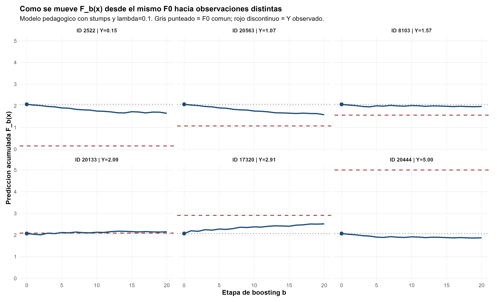
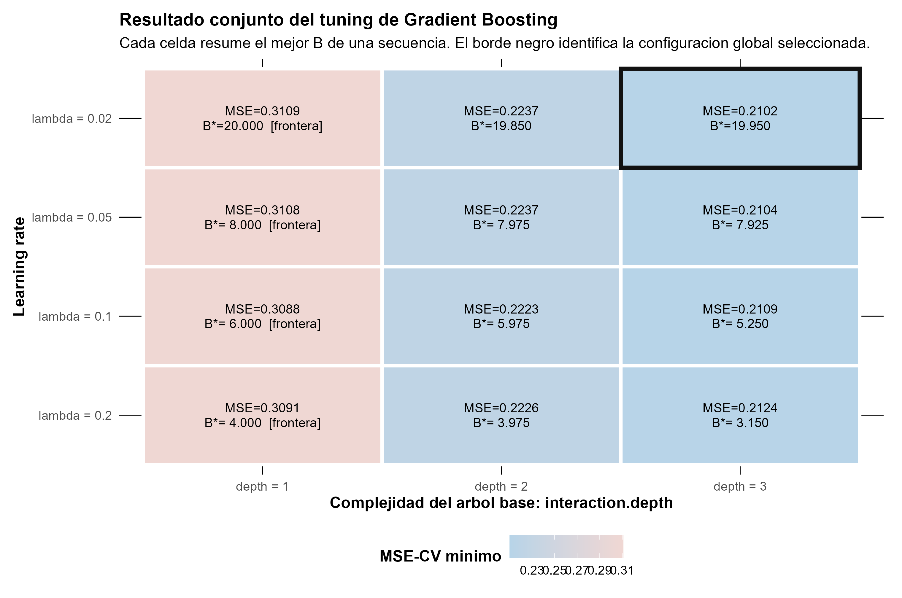
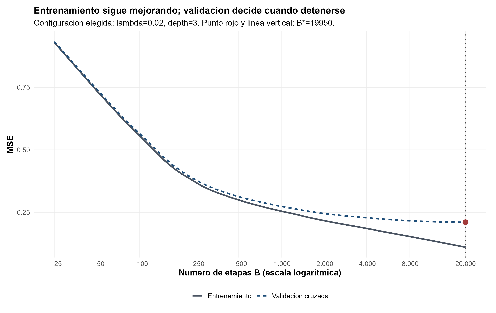
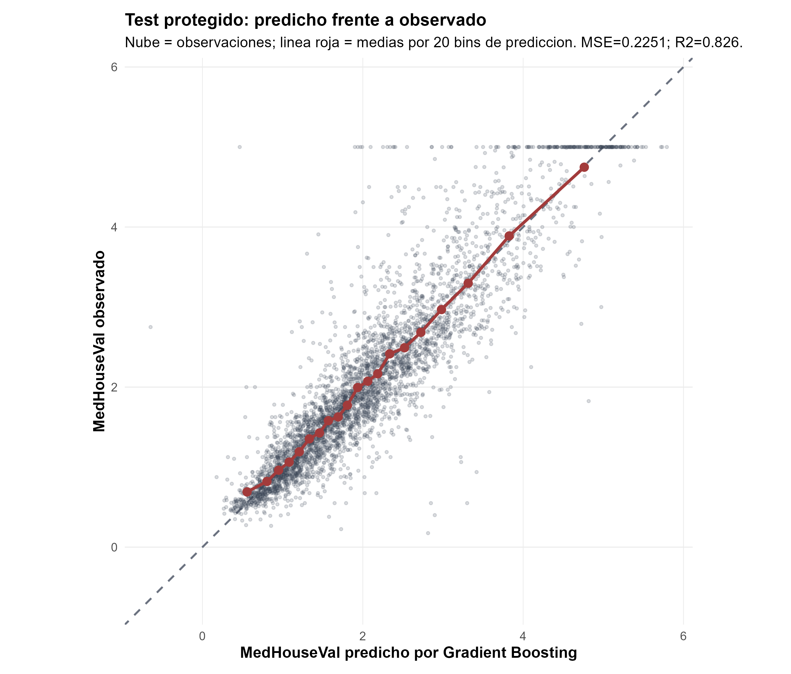
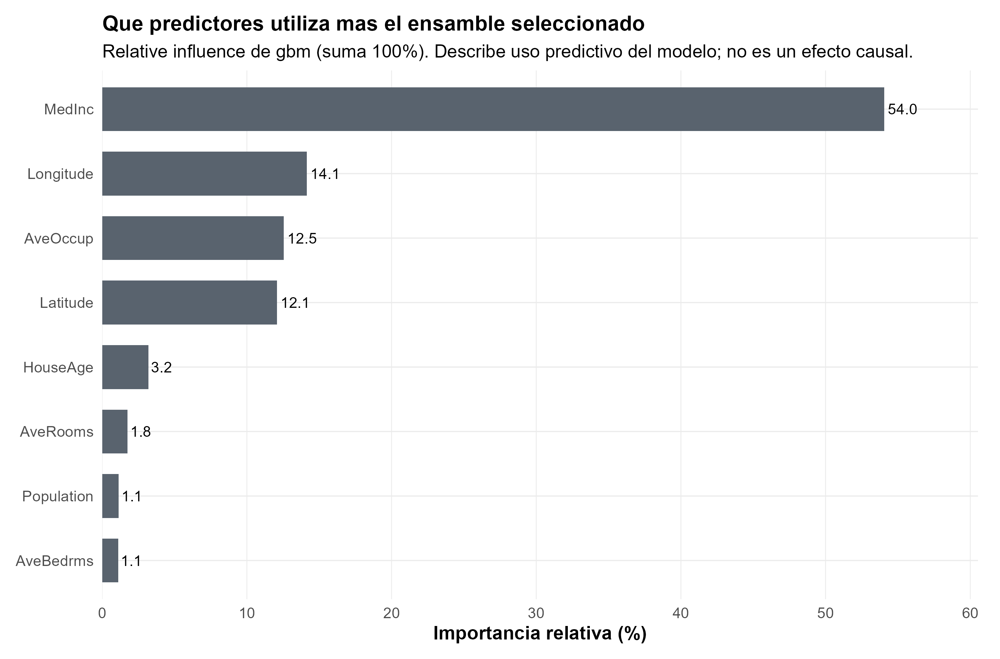
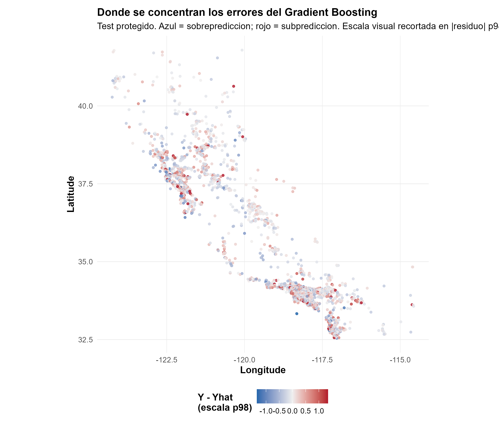

Regresión · Gradient Boosting · Validación cruzada

::: {.hero-box}
::: {.hero-title}
Gradient Boosting no promedia árboles independientes: cada etapa observa el error que todavía queda y añade una corrección pequeña. La validación decide cuándo esa secuencia deja de mejorar fuera de muestra.
:::
::: {.hero-sub}
California Housing permite ver por qué número de etapas, learning rate y complejidad del árbol base deben regularizarse en conjunto, sin convertir la configuración ganadora en una receta universal.
:::
:::

:::: {.metric-grid}
::: {.metric-card}
::: {.metric-label}
Observaciones
:::
::: {.metric-value}
20.640
:::
::: {.metric-note}
Grupos censales; ocho predictores y valor mediano de vivienda.
:::
:::
::: {.metric-card}
::: {.metric-label}
Test protegido
:::
::: {.metric-value}
4.128
:::
::: {.metric-note}
Las otras 16.512 observaciones forman desarrollo.
:::
:::
::: {.metric-card}
::: {.metric-label}
MSE test
:::
::: {.metric-value}
0,2251
:::
::: {.metric-note}
Frente a 1,2935 al predecir siempre la media de desarrollo.
:::
:::
::: {.metric-card}
::: {.metric-label}
$R^2$ test
:::
::: {.metric-value}
0,8259
:::
::: {.metric-note}
Resultado externo de la configuración cerrada en desarrollo.
:::
:::
::::

## La media es punto de partida y benchmark

La tarea es predecir `MedHouseVal`, el valor mediano de vivienda de cada grupo censal de California en unidades de USD 100.000, a partir de ocho variables demográficas, habitacionales y geográficas. Antes de construir árboles, el procedimiento separa 4.128 observaciones como test protegido y reserva 16.512 para aprender la secuencia completa.

Bajo pérdida cuadrática, el mejor predictor constante dentro de desarrollo es su media:

$$
F_0(x)=\bar y_{\mathrm{dev}}=2{,}0705.
$$

Ese mismo valor cumple dos funciones. Es el punto común desde el que comienza Gradient Boosting y es el benchmark ingenuo que se aplicará sin cambios al test. La comparación final pregunta cuánto valor predictivo agrega corregir sistemáticamente esa constante.

## Cada árbol corrige una parte del error pendiente

En la primera etapa, cada observación deja un residuo $r_i^{(1)}=y_i-F_0(x_i)$. Un árbol no memoriza esos residuos uno por uno: aprende regiones del espacio de predictores donde las correcciones se parecen. Su aporte se incorpora con un paso de tamaño $\lambda$:

$$
F_1(x)=F_0(x)+\lambda h_1(x).
$$

Luego se recalculan residuos contra $F_1$, otro árbol intenta aproximarlos y la secuencia continúa. La película conceptual es $F_0 \rightarrow$ residuo $\rightarrow$ árbol $\rightarrow$ corrección pequeña $\rightarrow$ nuevo residuo. El bloque demostrativo del informe usa stumps y $\lambda=0{,}10$ para hacer visible ese mecanismo sobre observaciones reales; está separado del tuning final.

{width="100%"}

Esta dependencia entre etapas distingue Boosting de los ensambles de la ficha anterior. En Bagging y Random Forest los árboles pueden construirse esencialmente en paralelo y después agregarse. En Boosting, el árbol $b$ necesita conocer qué error dejó el ensamble hasta $b-1$.

## Tres controles actúan en conjunto

La complejidad no se resume en contar árboles. Intervienen tres decisiones relacionadas:

- $B$ indica cuántas correcciones se acumulan.
- El learning rate $\lambda$ reduce el tamaño de cada paso; pasos pequeños suelen necesitar más etapas.
- `interaction.depth` determina qué estructura puede capturar cada árbol base: un stump solo introduce una división, mientras árboles más profundos pueden representar interacciones.

Por eso 19.950 árboles con $\lambda=0{,}02$ no significan lo mismo que 3.150 con $\lambda=0{,}20$. El tuning compara secuencias completas y selecciona su mejor prefijo mediante CV de cinco folds sobre desarrollo.

{width="100%"}

La configuración seleccionada es $\lambda=0{,}02$, profundidad 3 y $B=19.950$, con MSE-CV 0,2102. Pero el ganador exacto vive dentro de una meseta: con profundidad 3, $\lambda=0{,}05$ obtiene 0,2104 y $\lambda=0{,}10$, 0,2109. Las diferencias son mucho menores que los errores estándar descriptivos cercanos a 0,0042.

La señal más clara no está en una diezmilésima entre learning rates, sino en la profundidad. Los mejores árboles de profundidad 3 superan a los de profundidad 2, cuyo MSE-CV ronda 0,222, y con mayor claridad a los stumps, alrededor de 0,309-0,311. En esta grilla, cada etapa necesita suficiente capacidad para corregir patrones que una única división no representa.

## La validación decide cuándo dejar de corregir

El MSE de entrenamiento continúa bajando a medida que se agregan árboles y llega a 0,1103 en $B=20.000$. Si se eligiera $B$ por ajuste interno, la regla sería seguir sumando etapas dentro del rango explorado. La CV responde una pregunta distinta: hasta dónde las nuevas correcciones todavía ayudan a observaciones que no participaron en construirlas.

{width="100%"}

El mínimo formal ocurre en 19.950, apenas 50 árboles antes del techo de 20.000. El MSE-CV cambia solo en aproximadamente $5\times10^{-6}$ al llegar a 20.000. Esa planicie importa más que el número exacto: la evidencia respalda una región de aprendizaje lento con profundidad 3, no una cantidad mágica de árboles.

## El test confirma una mejora grande frente a la media

Una vez cerrados los hiperparámetros, el modelo se reajusta sobre todo desarrollo y el test se abre una sola vez.

::: {.table-box}
| Modelo | MSE test | RMSE test | MAE test | $R^2$ test |
|---|---:|---:|---:|---:|
| Media de desarrollo | 1,2935 | 1,1373 | 0,8996 | -0,0001 |
| Gradient Boosting | **0,2251** | **0,4745** | **0,3112** | **0,8259** |
:::

Gradient Boosting reduce 82,6 % el MSE respecto de repetir la media de desarrollo. El MSE externo es aproximadamente 7,1 % mayor que el MSE-CV usado para seleccionar, una diferencia esperable entre dos objetos distintos: CV elige dentro de desarrollo; test evalúa una configuración ya cerrada.

{width="100%"}

La mejora es grande en esta partición, pero no constituye una prueba de extrapolación a una región geográfica completamente nueva. Además, `MedHouseVal` acumula observaciones en su límite superior, una característica visible en el gráfico que condiciona el comportamiento en valores altos.

## Qué información termina utilizando el ensamble

La importancia relativa del modelo concentra 54,0 % en `MedInc`. Le siguen `Longitude` con 14,1 %, `AveOccup` con 12,5 % y `Latitude` con 12,1 %; juntas reúnen aproximadamente 92,8 % de la importancia total. La geografía y la ocupación aportan señal predictiva más allá del ingreso.

{width="100%"}

Estas importancias describen cuánto utiliza el ensamble cada variable; no son coeficientes ni efectos de intervención. Lo mismo vale para las dependencias parciales del informe: resumen cómo cambia la predicción del modelo al mover un predictor dentro del soporte observado, pero no responden qué ocurriría al intervenir sobre ingreso, localización u ocupación.

## El error conserva estructura geográfica

Para cada observación del test, el residuo se define como

$$
e_i=y_i-\widehat y_i.
$$

{width="100%"}

Los puntos rojos son residuos positivos —el modelo subpredice— y los azules, residuos negativos —el modelo sobrepredice—. El recorte en el percentil 98 afecta solo la escala cromática del mapa: las métricas se calcularon con los residuos originales, sin recorte.

Aunque el desempeño agregado es bueno, el mapa muestra agrupaciones locales de errores con signo y magnitud parecidos. `Latitude` y `Longitude` forman parte de los predictores, pero una partición aleatoria no es validación espacial: el test evalúa nuevas observaciones de la misma población muestreada, no extrapolación a una zona geográfica nueva. Este es un diagnóstico posterior al test; no intervino en la selección, el tuning ni el reajuste del modelo.

::: {.section-box}
### Una secuencia útil, no un hiperparámetro mágico

La evidencia favorece árboles base de profundidad 3 y una región de learning rates bajos o intermedios con desempeño muy parecido. La validación frena la secuencia en desarrollo y el test confirma una mejora predictiva sustantiva frente a la media. La decisión defendible es adoptar la configuración seleccionada por la regla preestablecida sin atribuir significado especial a 19.950 ni a $\lambda=0{,}02$ por sí solos.
:::

El alcance sigue siendo predictivo: una única partición aleatoria no representa deriva temporal ni una transferencia geográfica completa, los árboles no extrapolan suavemente fuera del soporte y los diagnósticos agregados no identifican mecanismos causales.

[California Housing con CART, Bagging y Random Forest](t09a_california.qmd) muestra la historia complementaria: primero una estructura interpretable y luego árboles construidos esencialmente en paralelo y agregados para estabilizar la predicción.

::: {.small-note}
**Fuente:** informe final «Taller 10A: California Housing - Gradient Boosting de regresión». Figuras originales del informe reutilizadas en PNG; las cifras se verificaron contra los outputs finales y no se generaron estimaciones nuevas.
:::
