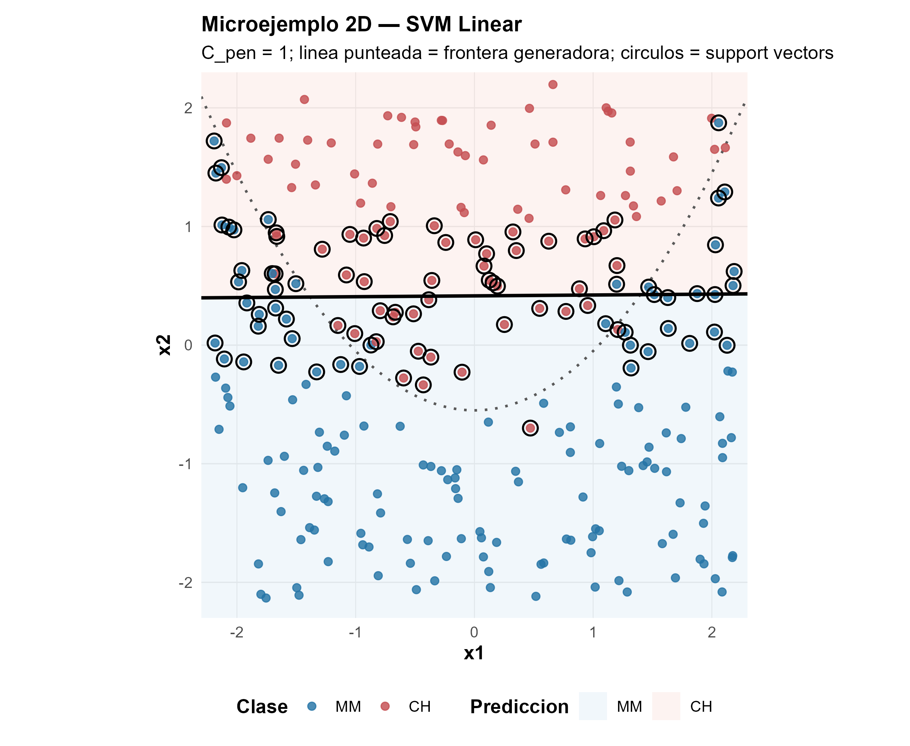
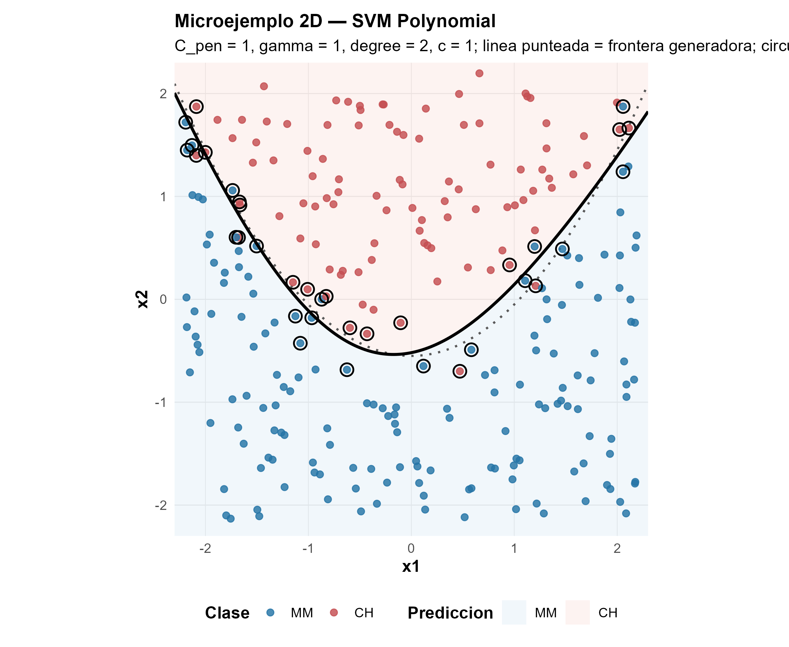
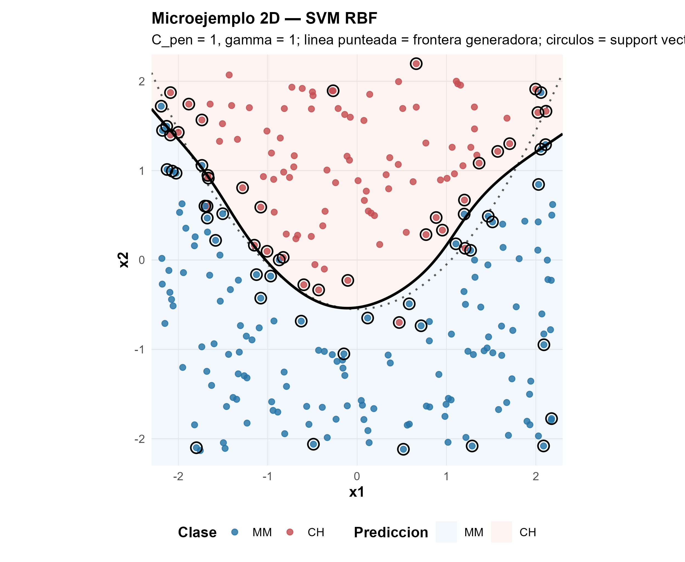
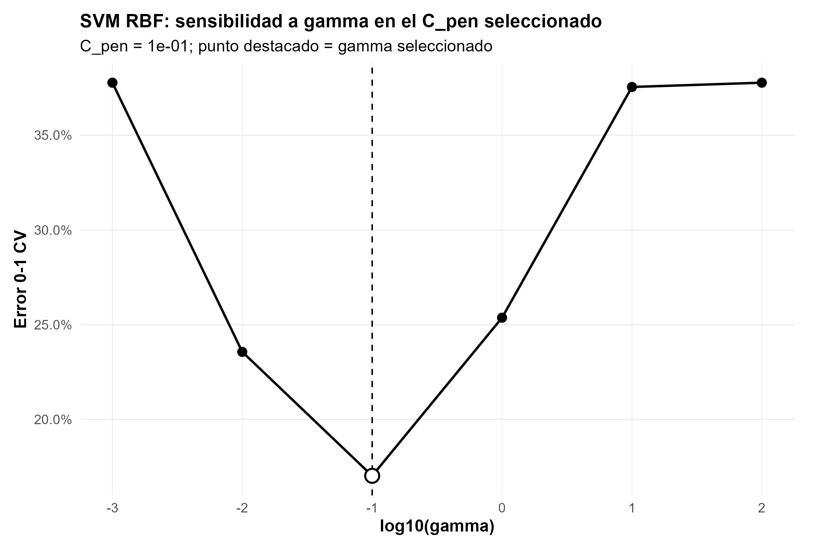
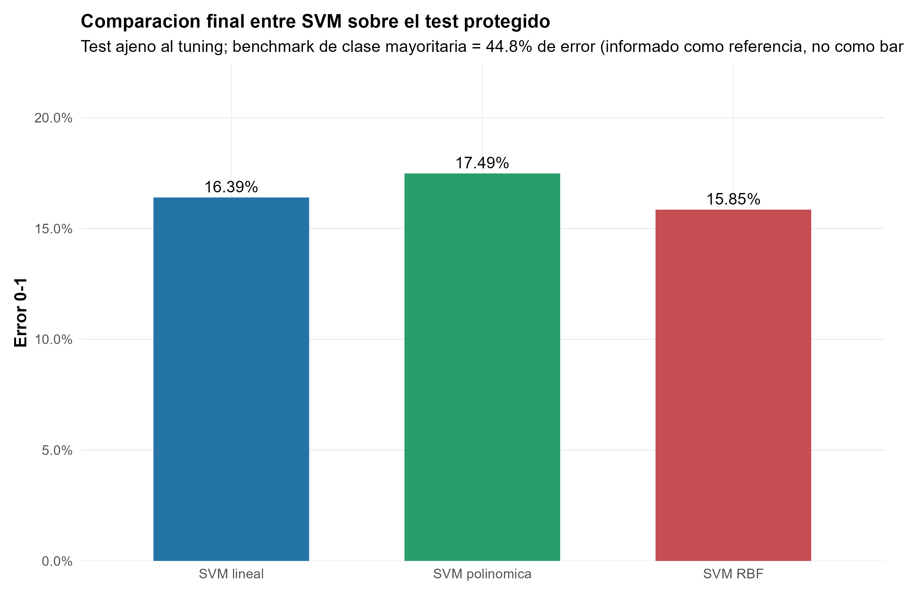
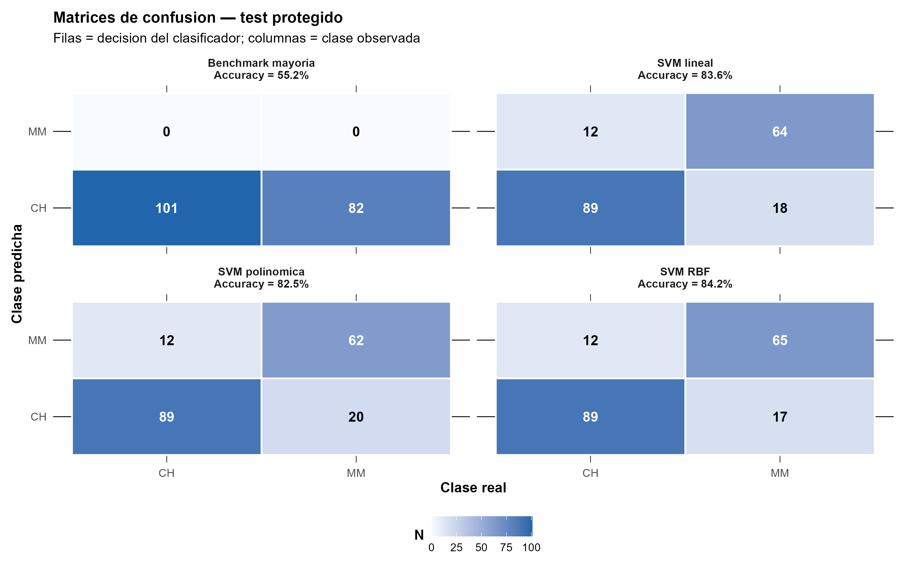
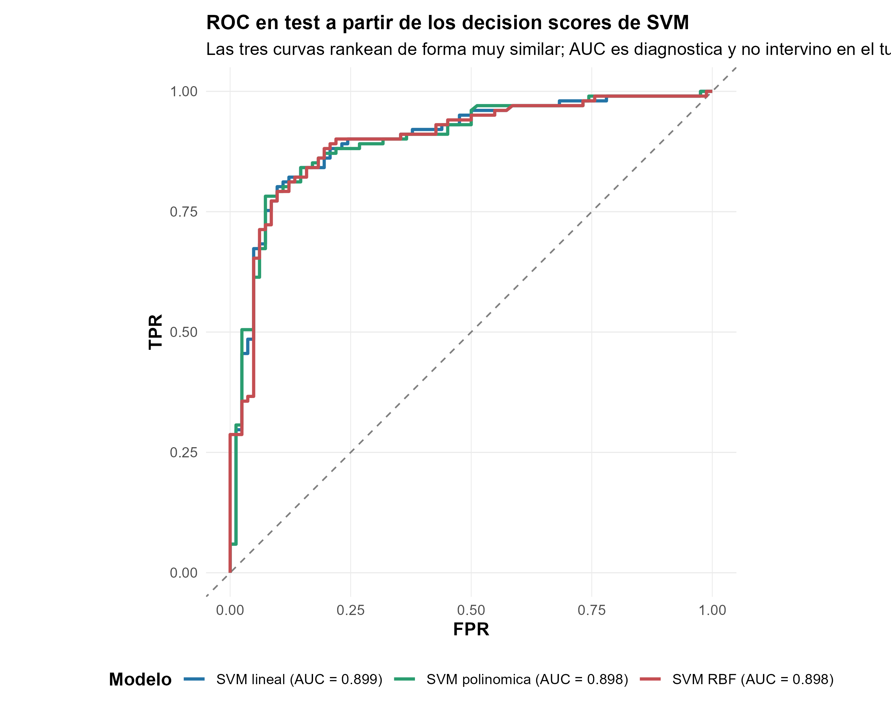

Clasificación binaria · SVM · Kernels · Decision scores

::: {.hero-box}
::: {.hero-title}
Los kernels amplían las fronteras que una SVM puede aprender, pero esa flexibilidad debe justificar su lugar fuera de muestra. En OJ, RBF mejora a la SVM lineal en una sola compra de 183.
:::
::: {.hero-sub}
La comparación mantiene información, grupos, folds y test constantes para separar una posibilidad geométrica más amplia de una mejora predictiva material.
:::
:::

:::: {.metric-grid}
::: {.metric-card}
::: {.metric-label}
Compras
:::
::: {.metric-value}
1.070
:::
::: {.metric-note}
653 Citrus Hill y 417 Minute Maid; CH es la clase positiva.
:::
:::
::: {.metric-card}
::: {.metric-label}
Grupos protegidos
:::
::: {.metric-value}
250
:::
::: {.metric-note}
Combinaciones `StoreID × WeekofPurchase` mantenidas intactas.
:::
:::
::: {.metric-card}
::: {.metric-label}
Error test RBF
:::
::: {.metric-value}
15,85 %
:::
::: {.metric-note}
29 errores sobre 183 compras del test protegido.
:::
:::
::: {.metric-card}
::: {.metric-label}
Ganancia vs lineal
:::
::: {.metric-value}
1 / 183
:::
::: {.metric-note}
Una compra adicional correctamente clasificada.
:::
:::
::::

## Una frontera, un margen y algunos casos decisivos

La tarea es clasificar cada compra de jugo de naranja como **Citrus Hill (CH)** o **Minute Maid (MM)**. Una SVM lineal construye un score $f(x)=\beta_0+\beta^\top x$ y ubica la frontera donde $f(x)=0$. El signo decide la clase; la magnitud indica posición respecto de esa frontera en la escala interna del clasificador.

El margen es la banda alrededor de la frontera. Una SVM de margen blando permite que algunas observaciones entren en esa banda o incluso queden del lado incorrecto, pero penaliza esas holguras. $C_{\mathrm{pen}}$ fija cuánto cuesta tolerarlas: un valor muy pequeño regulariza con fuerza y ensancha el margen; uno mayor cobra más por los casos difíciles y permite una frontera más ajustada.

Los vectores de soporte son las observaciones que participan activamente en definir la solución. No son sinónimo de errores: un caso puede estar bien clasificado y aun así ser soporte por caer sobre el borde o dentro del margen. En los ajustes seleccionados sobre desarrollo hay 480 soportes en la SVM lineal, 569 en la polinómica y 482 en RBF, frente a errores de entrenamiento mucho menores.

## Cuando una recta puede no alcanzar

Un kernel cambia la geometría disponible sin exigir construir explícitamente todas las nuevas variables. La SVM lineal conserva una frontera plana. El kernel polinómico permite curvaturas estructuradas por grado; RBF combina similitudes locales y puede formar fronteras más flexibles.

Los microejemplos 2D aíslan esa diferencia: los círculos negros señalan vectores de soporte y el fondo muestra la clase predicha.

:::: {.grid}
::: {.g-col-12 .g-col-lg-4}
{width="100%"}
:::
::: {.g-col-12 .g-col-lg-4}
{width="100%"}
:::
::: {.g-col-12 .g-col-lg-4}
{width="100%"}
:::
::::

Estas figuras son una ilustración conceptual independiente del tuning: no usan OJ ni constituyen evidencia empírica sobre esa aplicación. Muestran capacidad geométrica, no anticipan qué familia generalizará mejor.

## La misma prueba para las tres familias

Las tres SVM reciben exactamente los mismos seis bloques de información: `LoyalCH`, `PriceDiff`, `WeekofPurchase`, `StoreID`, `SpecialCH` y `SpecialMM`. Las 250 celdas tienda-semana permanecen completas durante toda la evaluación para evitar que compras del mismo contexto se filtren entre entrenamiento y validación.

El diseño reserva 183 compras de 43 grupos como test protegido y deja 887 compras de 207 grupos para desarrollo. Dentro de desarrollo, las tres familias comparten una CV agrupada de cinco folds y se seleccionan por error 0-1 agregado por observación.

Cada training fold reaprende el preprocesamiento: estandariza `LoyalCH`, `PriceDiff` y `WeekofPurchase`, crea las dummies de tienda y conserva los indicadores de promoción en escala 0/1. Así, ni medias, ni escalas, ni niveles de referencia se aprenden con el fold reservado. No hace falta nested CV porque el test independiente evalúa al final las configuraciones ya cerradas.

## La complejidad tiene controles distintos

En la SVM lineal, $C_{\mathrm{pen}}$ controla el compromiso entre margen y holguras. En la polinómica se agregan $\gamma$, el grado y el término $c=1$. En RBF, $\gamma$ gobierna la localidad de la similitud: valores muy pequeños producen una representación demasiado global; valores muy grandes vuelven la influencia extremadamente local.

::: {.table-box}
| Familia | Configuración seleccionada | Error CV |
|---|---|---:|
| Lineal | $C_{\mathrm{pen}}=0{,}01$ | 0,17475 |
| Polinómica | $C_{\mathrm{pen}}=0{,}1$; $\gamma=0{,}01$; grado 4; $c=1$ | 0,17136 |
| RBF | $C_{\mathrm{pen}}=0{,}1$; $\gamma=0{,}1$ | **0,17024** |
:::

Las diferencias de CV son pequeñas: entre lineal y RBF median cuatro errores de validación sobre 887. En RBF, el recorrido de $\gamma$ con el $C$ seleccionado presenta la relación tipo U esperada. Una escala intermedia generaliza mejor que similitudes demasiado amplias o demasiado locales.

{width="100%"}

## El test reduce la ventaja a una compra

Con la selección cerrada, cada modelo se reajusta sobre las 887 observaciones de desarrollo y el test se abre una sola vez.

::: {.table-box}
| Modelo | Error CV | Errores test | Error test | Accuracy test | AUC test |
|---|---:|---:|---:|---:|---:|
| SVM lineal | 0,17475 | 30 / 183 | 0,16393 | 0,8361 | **0,8990** |
| SVM polinómica | 0,17136 | 32 / 183 | 0,17486 | 0,8251 | 0,8976 |
| SVM RBF | **0,17024** | **29 / 183** | **0,15847** | **0,8415** | 0,8978 |
:::

{width="100%"}

{width="100%"}

El test contiene 101 compras CH y 82 MM. Las tres SVM tienen exactamente la misma sensibilidad para CH, 0,8812: registran 89 verdaderos positivos y 12 falsos negativos. Toda la diferencia proviene de unos pocos casos MM. La lineal obtiene 64 verdaderos negativos y 18 falsos positivos; la polinómica, 62 y 20; RBF, 65 y 17.

En este test protegido, por tanto, RBF clasifica correctamente una compra MM más que la lineal, mientras la polinómica clasifica correctamente dos menos. Eso explica los 29, 30 y 32 errores totales, respectivamente, pero no demuestra una ventaja general de RBF fuera de esta partición.

La conclusión no es que RBF gane con claridad. Su mejora frente a la frontera lineal equivale a **una sola compra de 183** en esta partición. La pequeña ventaja de desarrollo se conserva de forma mínima para RBF y se revierte para el kernel polinómico.

## Score y ranking no son probabilidades

LIBSVM entrega decision scores. Una vez orientados para que valores mayores indiquen mayor inclinación hacia CH, esos scores permiten ordenar compras y construir una curva ROC. No satisfacen por sí mismos $P(Y=\mathrm{CH}\mid X=x)$ y, sin calibración adicional, no corresponde evaluarlos con log-loss, Brier o gráficos de calibración como si fueran probabilidades.

{width="100%"}

La SVM lineal alcanza AUC 0,8990, ligeramente por encima de RBF con 0,8978, aunque RBF tenga menor error 0-1 al umbral implícito. No hay contradicción: el error 0-1 juzga una decisión concreta; AUC evalúa el ranking a través de múltiples umbrales. Clasificación, ranking y probabilidad son objetos relacionados, pero no intercambiables.

::: {.section-box}
### La flexibilidad debe justificar su lugar fuera de muestra

RBF obtiene el menor error bajo el criterio fijado, pero la diferencia frente a la SVM lineal es una observación. La elección práctica puede favorecer RBF si ese pequeño avance compensa su menor transparencia geométrica; también puede favorecer la lineal por parsimonia. La evidencia no respalda una historia de superioridad general de los kernels no lineales.
:::

El alcance se limita a esta partición agrupada, estas seis fuentes de información y costos simétricos. Los grupos tienda-semana protegen dependencia compartida, pero no sustituyen una prueba temporal futura. Las fronteras y sus scores son herramientas predictivas, no identifican efectos causales de cambiar precio, promociones o lealtad.

[OJ con Logit y GAM penalizado](t08b_oj.qmd) plantea la pregunta complementaria: allí la flexibilidad se evalúa por la calidad de probabilidades; aquí, los kernels se comparan por clasificación y ranking sin tratar el decision score como probabilidad.

::: {.small-note}
**Fuente:** informe final «Taller 11: Support Vector Machines con OJ». Figuras originales del informe reutilizadas en PNG; las cifras se verificaron contra los outputs finales y no se generaron estimaciones nuevas.
:::
