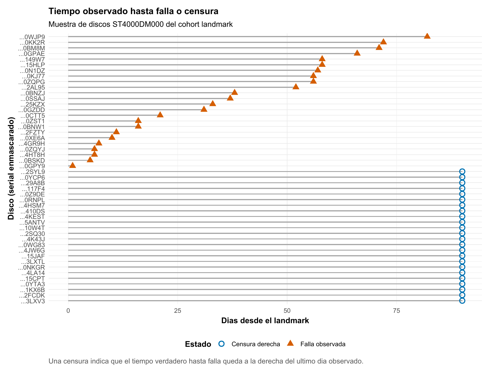
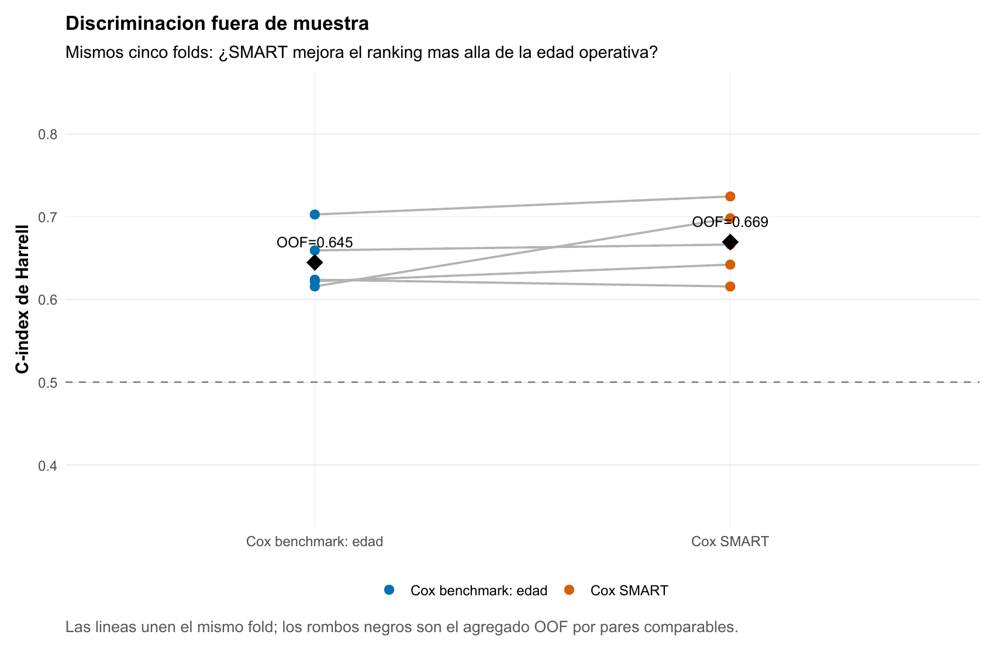
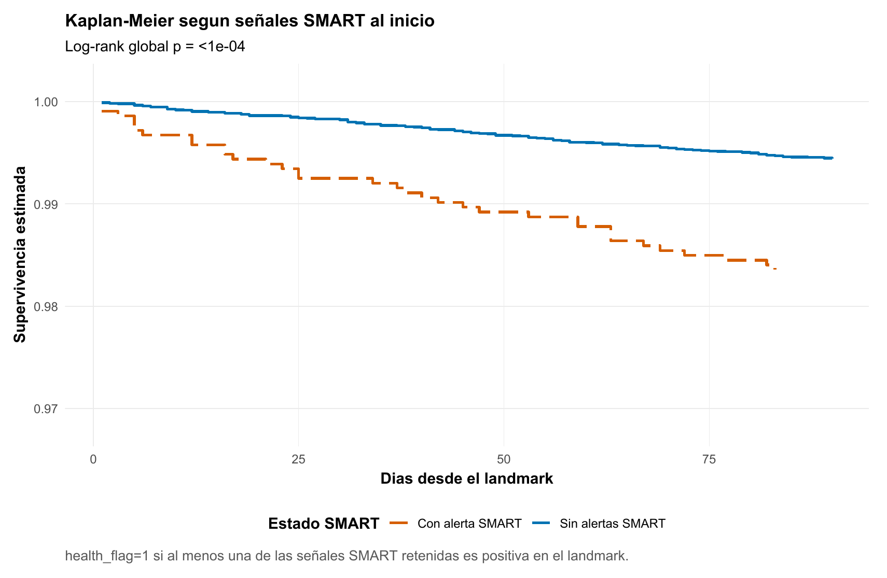
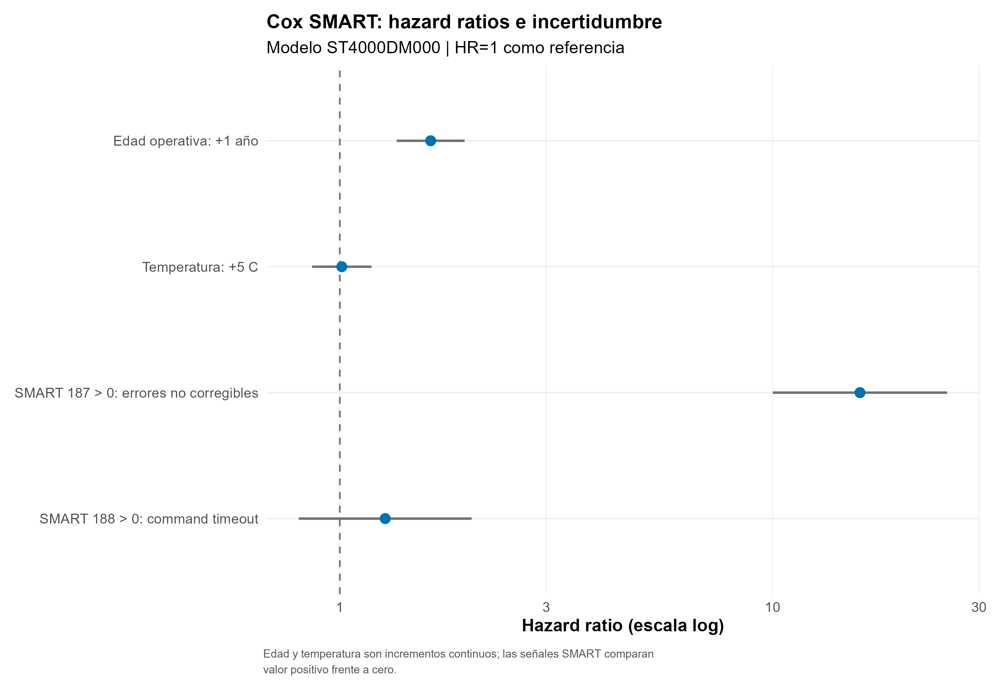
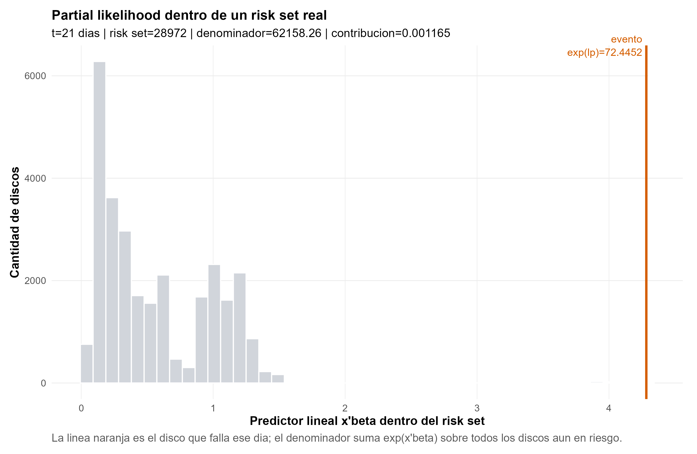
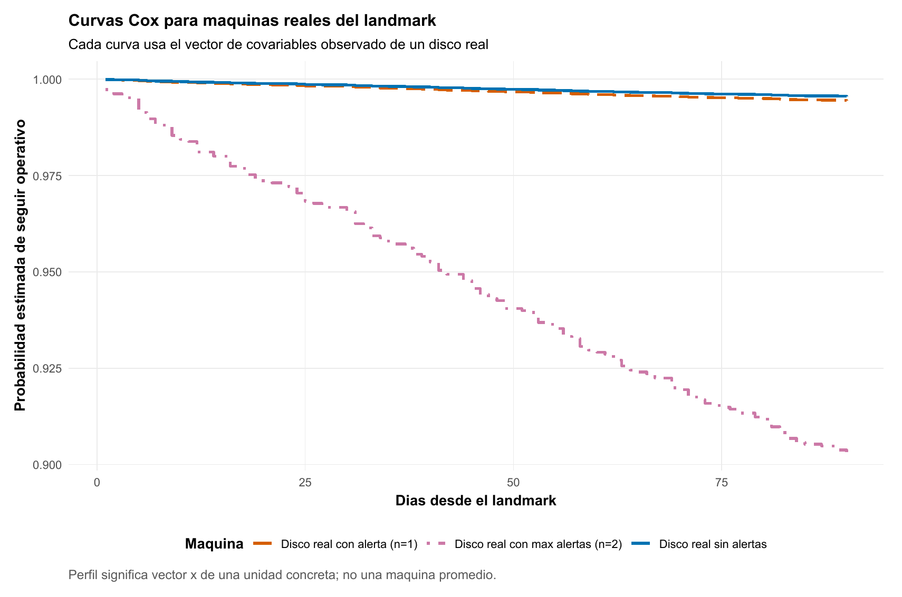
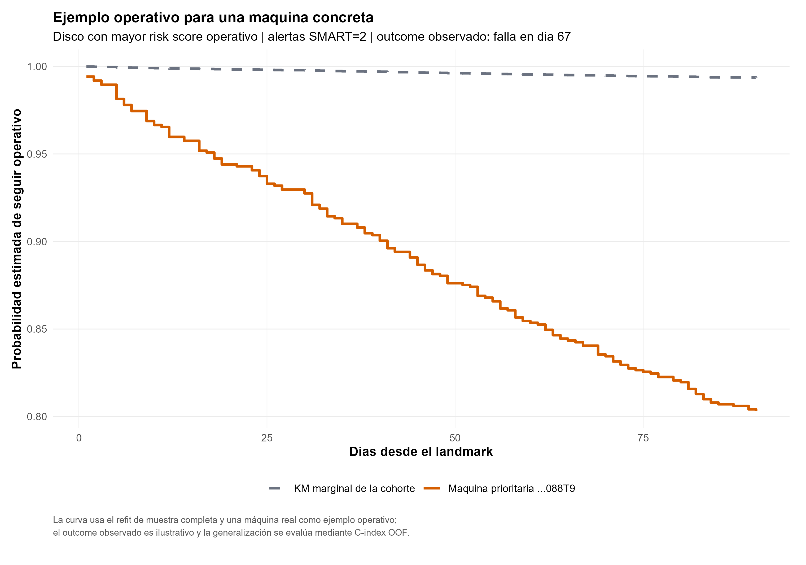

Supervivencia · Tiempo hasta falla · Mantenimiento predictivo

::: {.hero-box}
::: {.hero-title}
¿Podemos utilizar el estado conocido de un disco para estimar cuánto tiempo seguirá funcionando y priorizar las máquinas con mayor riesgo de falla?
:::
::: {.hero-sub}
En 29.021 discos de Backblaze, la telemetría SMART mejora de forma moderada el ranking fuera de muestra respecto de conocer solamente la edad operativa. El resultado no es una etiqueta aislada: es un score de riesgo y una curva de probabilidad para cada horizonte.
:::
:::

:::: {.metric-grid}
::: {.metric-card}
::: {.metric-label}
Cohorte landmark
:::
::: {.metric-value}
29.021
:::
::: {.metric-note}
Discos `ST4000DM000` operativos al inicio del seguimiento.
:::
:::
::: {.metric-card}
::: {.metric-label}
Fallas observadas
:::
::: {.metric-value}
185
:::
::: {.metric-note}
0,64 % en aproximadamente 90 días; 28.836 censuras administrativas.
:::
:::
::: {.metric-card}
::: {.metric-label}
C-index OOF
:::
::: {.metric-value}
0,669
:::
::: {.metric-note}
Discriminación del Cox con edad y señales SMART basales.
:::
:::
::: {.metric-card}
::: {.metric-label}
Ganancia vs. edad
:::
::: {.metric-value}
+0,0246
:::
::: {.metric-note}
2,46 puntos porcentuales de concordancia entre pares comparables.
:::
:::
::::

## El problema no es solamente clasificar

Para una decisión fija a 90 días podríamos construir

$$
Y_i=\mathbf{1}(T_i\leq 90)
$$

y entrenar un Logit, KNN, GAM, árbol, Random Forest o Boosting. En esta cohorte sería técnicamente válido: los discos sin falla permanecen observados hasta el cierre y toda la censura es administrativa en el día 90.

Pero esa etiqueta descarta **cuándo** ocurrió la falla. El día 2 y el día 89 pasan a ser el mismo resultado. Entrenar además modelos separados para 30, 60 y 90 días tampoco garantiza por sí solo una trayectoria temporal coherente. Supervivencia conserva el tiempo exacto, incorpora censura y estima con una sola estructura

$$
P(T>t\mid X=x)=S(t\mid x)
$$

para múltiples horizontes. El complemento $1-S(t\mid x)$ es la probabilidad acumulada de falla antes de $t$.

::: {.section-box}
### 99,36 % de accuracy puede no resolver nada

Como solamente fallan 185 de 29.021 discos, una regla que siempre respondiera «no falla» acertaría aproximadamente **99,36 %** de las etiquetas a 90 días y no detectaría una sola unidad riesgosa. La métrica debe representar la tarea: aquí importa ordenar tiempos de falla y luego convertir ese ranking en probabilidades por horizonte.
:::

## Qué sabemos hoy de cada máquina

El diseño utiliza un **landmark** común: el 1 de enero de 2016 se congela la información disponible de cada disco y después se observa su trayectoria hasta el 31 de marzo. Si falla, conocemos el tiempo al evento; si llega operativo al final del trimestre, sabemos que su tiempo de falla excede los 90 días y queda censurado a derecha.

{#fig-t12b-landmark fig-alt="Líneas de seguimiento de discos desde un landmark común, con fallas distribuidas durante 90 días y censuras al cierre" width="100%"}

La predicción es de **vida residual desde el landmark, condicional a que el disco llegó operativo hasta esa fecha**. No es vida útil total desde fabricación o instalación. Los discos que habían fallado antes no integran esta población predictiva.

Las covariables también quedan congeladas en el origen. El modelo principal utiliza edad operativa, temperatura y dos alertas SMART con cobertura y variación suficientes: SMART 187 (`reported_uncorrectable`) y SMART 188 (`command_timeout`). La telemetría posterior al 1 de enero no entra como predictor; hacerlo cambiaría el problema a uno con covariables dependientes del tiempo y produciría leakage si se incorporara sin ese diseño.

## ¿La telemetría agrega señal sobre la edad?

La comparación predictiva mantiene los mismos cinco folds estratificados por evento para dos reglas preespecificadas:

- **Benchmark:** Cox con edad operativa.
- **Modelo SMART:** Cox con edad, temperatura, SMART 187 y SMART 188 basales.

Cada ajuste produce scores para el fold que no participó en su entrenamiento. Harrell C pregunta si, entre pares temporales comparables, el disco con mayor score tiende a fallar antes. Un valor de 0,5 representa un ordenamiento aproximadamente aleatorio.

{#fig-t12b-cindex fig-alt="Comparación del C-index en cinco folds entre Cox con edad y Cox con señales SMART" width="100%"}

::: {.table-box}
| Modelo | C-index OOF | Lectura |
|---|---:|---|
| Cox benchmark: edad | 0,6447 | La edad ya ordena riesgo mejor que el azar. |
| Cox con SMART basal | **0,6693** | La telemetría añade señal de ranking. |
| Diferencia | **+0,0246** | Mejora en 4 de los 5 folds. |
:::

La mejora es real pero moderada. **+0,0246** significa aproximadamente 2,46 puntos porcentuales adicionales de concordancia entre pares comparables; no son puntos de accuracy ni de probabilidad de falla. Además, el C-index evalúa discriminación —quién debería fallar antes—, no calibración de las probabilidades absolutas.

## Qué señales distinguen mayor riesgo

Una primera comparación no ajustada separa los discos según presenten al menos una de las alertas SMART retenidas. Las curvas se distancian temprano: a 90 días, la supervivencia estimada es aproximadamente 0,9944 sin alertas y 0,9836 con alguna alerta.

{#fig-t12b-km-smart fig-alt="Curvas Kaplan-Meier con mayor caída para discos con alerta SMART basal" width="100%"}

El indicador agregado prepara la pregunta, pero no explica qué señal importa. SMART 187 aparece solamente en 183 discos; 21 fallan antes de 90 días. Su tasa observada es 11,48 %, frente a 0,57 % entre quienes no presentan esa alerta.

::: {.table-box}
| Estado de SMART 187 al inicio | Discos | Fallas | Tasa observada a 90 días |
|---|---:|---:|---:|
| Sin alerta | 28.838 | 164 | 0,57 % |
| Con alerta | 183 | 21 | **11,48 %** |
:::

El Cox multivariado mantiene las demás covariables constantes. Allí SMART 187 domina la separación relativa con $HR\approx15{,}9$; un año adicional de edad operativa presenta $HR\approx1{,}62$. Temperatura y SMART 188 aportan bastante menos en esta especificación.

{#fig-t12b-forest fig-alt="Forest plot con hazard ratio cercano a 16 para SMART 187 y cercano a 1,6 por año de edad" width="100%"}

Un $HR=15{,}9$ **no** significa 15,9 veces más probabilidad absoluta de fallar en 90 días. Compara tasas instantáneas condicionadas entre discos comparables. Para llegar a una probabilidad necesitamos combinar el score relativo con el riesgo basal. Tampoco hay una lectura causal: estas asociaciones sirven para predecir dentro del entorno observado, no para afirmar qué ocurriría al intervenir sobre una señal SMART.

## Cómo aprende Cox dentro de un conjunto de riesgo

Cox asigna a cada disco un predictor lineal $\widehat\eta_i=x_i^\top\widehat\beta$ y lo transforma en un score positivo $e^{\widehat\eta_i}$. Cuando ocurre una falla, la partial likelihood compara la máquina que falla con todas las que seguían operativas justo antes de ese momento:

$$
\frac{e^{\widehat\eta_i}}
{\sum_{j\in R(t)}e^{\widehat\eta_j}}.
$$

En el evento ilustrado del día 21 quedan 28.972 discos en riesgo. La máquina que falla tiene $\widehat\eta\approx4{,}283$ y $e^{\widehat\eta}\approx72{,}45$; el denominador completo es 62.158,26. Su contribución local es aproximadamente 0,00117.

{#fig-t12b-riskset fig-alt="Histograma de scores de casi 29 mil discos y línea del evento muy desplazada a la derecha" width="100%"}

El número parece pequeño porque compite contra casi 29 mil alternativas. Si todos fueran indistinguibles, cualquiera recibiría solamente

$$
\frac{1}{28.972}\approx3{,}45\times10^{-5}.
$$

La contribución del disco que falla es unas **33,8 veces** esa referencia uniforme. Esa es la intuición del aprendizaje: dentro de cada conjunto de máquinas todavía operativas, el modelo desplaza más riesgo hacia quienes se parecen a los eventos observados.

## Del ranking a probabilidades por horizonte

La partial likelihood aprende el ranking sin fijar la forma del hazard basal. Después, Breslow recupera ese baseline y permite construir una curva para una combinación concreta de covariables:

$$
\widehat S(t\mid x)
=\exp\{-\widehat H_0(t)e^{\widehat\eta(x)}\}.
$$

::: {.section-box}
### La cadena operativa

$$
x_{\text{máquina}}
\longrightarrow \widehat\eta(x)
\longrightarrow e^{\widehat\eta(x)}
\longrightarrow \widehat S(t\mid x)
\longrightarrow 1-\widehat S(t\mid x).
$$

Las dos primeras cantidades ordenan riesgo relativo. Las dos últimas responden cuál es la probabilidad estimada de seguir operando —o de fallar— antes de cada horizonte.
:::

Tres discos reales del landmark muestran que «perfil» significa un vector $x$ concreto, no una máquina promedio. El primero tiene 0,708 años, 26 °C y ninguna alerta; el segundo, 0,672 años, 26 °C y solamente SMART 188; el tercero, 0,951 años, 27 °C y ambas alertas, incluida SMART 187.

{#fig-t12b-curvas fig-alt="Tres curvas Cox: dos cercanas a supervivencia uno y otra con descenso claro cuando SMART 187 está activa" width="100%"}

La máquina con una sola alerta tiene activo SMART 188, cuya contribución incremental es modesta. La de dos alertas incorpora también SMART 187 y recibe una curva muy distinta. Contar alertas sin distinguirlas ocultaría el mecanismo del modelo.

## Una máquina concreta: convertir el score en una acción posible

Después de cerrar la evaluación OOF, el mismo Cox SMART se reajusta sobre toda la cohorte. Ese es el modelo operativo: aprovecha todos los datos etiquetados disponibles para generar predicciones futuras.

La máquina priorizada por mayor score tiene 2,533 años de edad, 28 °C y ambas alertas activas. El refit produce $\widehat\eta(x)=4{,}293$ y $e^{\widehat\eta(x)}=73{,}22$.

:::: {.metric-grid}
::: {.metric-card}
::: {.metric-label}
Falla antes de 30 días
:::
::: {.metric-value}
7,3 %
:::
::: {.metric-note}
$1-\widehat S(30\mid x)$
:::
:::
::: {.metric-card}
::: {.metric-label}
Falla antes de 60 días
:::
::: {.metric-value}
14,6 %
:::
::: {.metric-note}
$1-\widehat S(60\mid x)$
:::
:::
::: {.metric-card}
::: {.metric-label}
Falla antes de 90 días
:::
::: {.metric-value}
19,7 %
:::
::: {.metric-note}
$1-\widehat S(90\mid x)$
:::
:::
::::

{#fig-t12b-maquina fig-alt="Curva de supervivencia de una máquina prioritaria que cae hasta cerca de 0,80 a 90 días" width="100%"}

El disco efectivamente falla alrededor del día 67. Es un ejemplo operativo memorable, pero no evidencia de generalización: fue seleccionado con el modelo reajustado sobre toda la cohorte.

::: {.section-box}
### Tres tareas que no deben mezclarse

**Evaluar el procedimiento** usa predicciones OOF y produce el C-index 0,669. **Entrenar el modelo operativo** reajusta la regla sobre las 29.021 observaciones. **Aplicarlo a una máquina nueva** utiliza únicamente sus features conocidas en una nueva fecha de decisión. El futuro de esa máquina no participa en el cálculo.
:::

## De la predicción a una política de mantenimiento

La salida permite ordenar máquinas por $\widehat\eta(x)$, priorizar inspecciones, identificar candidatas a reemplazo preventivo y organizar mantenimiento según probabilidades a 30, 60 o 90 días. No determina por sí sola el umbral de intervención.

Para transformar el 7,3 %, 14,6 % o 19,7 % en «inspeccionar», «reemplazar» o «esperar» faltan costos y restricciones: costo de una falla, inspección y reemplazo preventivo; downtime; criticidad de la unidad; presupuesto y capacidad de mantenimiento. El flujo empresarial completo es

$$
\text{predicción}\;\longrightarrow\;\text{priorización}\;\longrightarrow\;
\text{decisión condicionada por costos}.
$$

::: {.section-box}
### Qué sostiene la evidencia

La telemetría SMART basal agrega señal sobre la edad operativa y mejora el ranking en cuatro de cinco folds. Cox entrega además una trayectoria temporal coherente y probabilidades por horizonte para cada máquina. La ganancia es útil, no espectacular: debe alimentar una decisión de mantenimiento, no venderse como certeza de falla.
:::

El alcance permanece acotado. La cohorte está condicionada a haber sobrevivido hasta el landmark; cubre solamente discos `ST4000DM000` en el entorno operativo de Backblaze y utiliza covariables basales, no SMART dinámicos. Cox impone riesgos proporcionales. El C-index valida discriminación, no calibración probabilística, y la máquina seleccionada no sustituye la evaluación OOF. Trasladar el modelo a otro hardware, período o contexto requiere una validación nueva.

::: {.small-note}
**Datos:** Backblaze Drive Stats, primer trimestre de 2016.
:::
